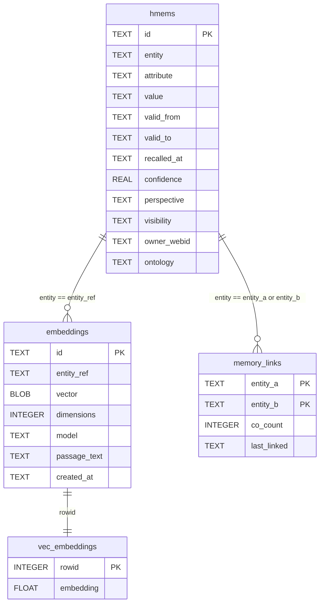

# Memory Store ERD — hmems + embeddings + vec_embeddings + memory_links

Entity-relationship diagram of the four SQLCipher tables that form the
unified `MemoryStore`. The `hmems` table holds the relational EAV lookup
(entity-attribute-value with confidence, decay, perspective, visibility,
ontology). The `embeddings` table holds embedding metadata (including
`passage_text` for corpus-written chunks). The `vec_embeddings` virtual
table (sqlite-vec `vec0`) holds the vector for KNN search. The
`memory_links` table holds co-occurrence counts for the connectedness
ranking signal. The join key between the relational and vector sides is
the `entity_ref` / `entity` string — the embedding's `entity_ref` MUST
equal the h_mem's `entity` for the recall path's KNN→text join to work.

<!-- DIAGRAM_ALIGNMENT
id: DIAG-PL-MEMORY-ERD
verified_date: 2026-08-28
verified_against: kask/crates/hkask-storage/src/core/sql/schema.sql:1 (hmems), :5 (embeddings incl. passage_text), :6 (vec_embeddings), :23-29 (memory_links)
status: VERIFIED
-->

## The entity_ref invariant

The embedding's `entity_ref` and the h_mem's `entity` are plain `TEXT`
columns — there is no foreign key constraint enforcing their equality. The
invariant is enforced by:

1. **The ingestion call site**
   (`kask/crates/kask_bridge/src/memory/ingest.rs:168`):
   `let embedding_entity = curator_entity.clone()` — the embedding is
   stored under the shared copy's entity (`curator:thread:{thread_id}`),
   which is written for every turn. The `chat:thread:` h_mem only exists
   for curator turns, so an embedding under it would join to nothing for
   zed-agent turns (`ingest.rs:160-167`).
2. **The regression test** `recall_context_finds_turn_by_embedding_only`
   (`kask/crates/kask_bridge/src/memory.rs:1681`) — fails if the
   entity_ref diverges.

A future `EntityRef(String)` newtype shared between `HMemStore` and
`EmbeddingStore` would make this compile-time-enforced, but that is a
cross-crate refactor deferred until a third embedding call site appears.

## Indexes

| Table | Index | Columns |
|-------|-------|---------|
| `hmems` | `idx_hmems_entity` | `entity` |
| `hmems` | `idx_hmems_attribute` | `attribute` |
| `hmems` | `idx_hmems_entity_attribute` | `entity, attribute` |
| `embeddings` | `idx_embeddings_entity_ref` | `entity_ref` |
| `vec_embeddings` | (implicit) | `rowid` (B-tree) + `embedding` (vec0 virtual) |
| `memory_links` | (implicit) | `PRIMARY KEY (entity_a, entity_b) WITHOUT ROWID` |

All index definitions live in `kask/crates/hkask-storage/src/core/sql/schema.sql:2-4`,
`:7`, `:23-29`.

## Related

- [Memory Recall Flow](./flowchart-memory-recall.md) — how `search_similar` + `query_deduped_untouched` join these tables
- [Memory Ingest Sequence](./sequence-memory-ingest.md) — how turns are written to these tables
- [hkask-storage Diataxis Reference](../diataxis/hkask-storage/reference.md) — the full schema (includes regulation, audit, kata tables)
- [Memory System Specification](../architecture/memory-system-specification.md) — the architecture spec
