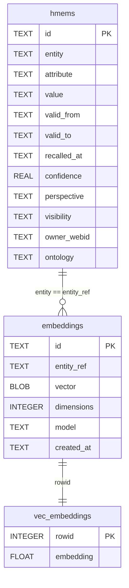

# Memory Store ERD — hmems + embeddings + vec_embeddings

Entity-relationship diagram of the three SQLCipher tables that form the
unified `MemoryStore`. The `hmems` table holds the relational EAV lookup
(entity-attribute-value with confidence, decay, perspective, visibility,
ontology). The `embeddings` table holds embedding metadata. The
`vec_embeddings` virtual table (sqlite-vec `vec0`) holds the vector for KNN
search. The join key between the relational and vector sides is the
`entity_ref` / `entity` string — the embedding's `entity_ref` MUST equal the
h_mem's `entity` for the recall path's KNN→text join to work.

## The entity_ref invariant

The embedding's `entity_ref` and the h_mem's `entity` are plain `TEXT`
columns — there is no foreign key constraint enforcing their equality. The
invariant is enforced by:

1. **The ingestion call site** (`kask_bridge/src/memory.rs:1202`):
   `let embedding_entity = entity.clone()` — the embedding is stored under
   the same string as the h_mem.
2. **The regression test** `recall_context_finds_turn_by_embedding_only`
   (`kask_bridge/src/memory.rs`) — fails if the entity_ref diverges.

A future `EntityRef(String)` newtype shared between `HMemStore` and
`EmbeddingStore` would make this compile-time-enforced, but that is a
cross-crate refactor deferred until a third embedding call site appears.

## Indexes

| Table | Index | Columns |
|-------|-------|---------|
| `hmems` | `idx_hmems_entity` | `entity` |
| `hmems` | `idx_hmems_attribute` | `attribute` |
| `hmems` | `idx_hmems_entity_attribute` | `entity, attribute` |
| `embeddings` | `idx_embeddings_entity_ref` | `entity_ref` |
| `vec_embeddings` | (implicit) | `rowid` (B-tree) + `embedding` (vec0 virtual) |

## Related

- [Memory Recall Flow](./flowchart-memory-recall.md) — how `search_similar` + `query_deduped_untouched` join these tables
- [Memory Ingest Sequence](./sequence-memory-ingest.md) — how turns are written to these tables
- [hkask-storage Diataxis Reference](../diataxis/hkask-storage/reference.md) — the full schema (includes regulation, audit, kata tables)
- [Memory System Specification](../architecture/memory-system-specification.md) — the architecture spec

<!-- DIAGRAM_ALIGNMENT
id: DIAG-PL-MEMORY-ERD
verified_date: 2026-08-10
verified_against: kask/crates/hkask-storage/src/core/sql/schema.sql
status: VERIFIED
-->
