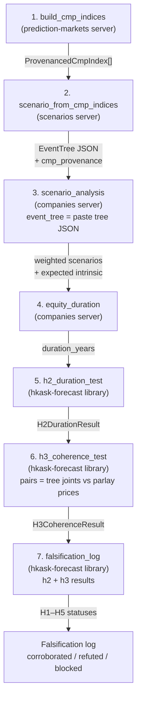
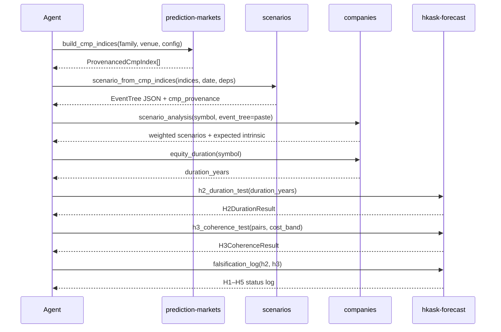

# CMP Tool Call Flow

The CMP research pipeline is accessible via MCP tools. The agent or panel calls
the tools in sequence: build CMP indices from catalogs, compose them into a
scenario tree, feed the tree into tree-weighted valuation, and run the
falsification tests. The integration seam between the scenarios server and the
companies server is caller-mediated — the caller pastes the tree JSON from
`scenario_from_cmp_indices` into the `event_tree` parameter of
`scenario_analysis`.

<!-- DIAGRAM_ALIGNMENT
id: DIAG-CMP-FLOW-001
verified_date: 2026-08-07
verified_against: kask/mcp-servers/hkask-mcp-prediction-markets/src/cmp_index_builder.rs:build_cmp_indices; kask/mcp-servers/hkask-mcp-scenarios/src/hkask_mcp_scenarios.rs:scenario_from_cmp_indices; kask/mcp-servers/hkask-mcp-companies/src/tools/analytics.rs:scenario_analysis; kask/crates/hkask-forecast/src/falsification.rs:falsification_log
status: VERIFIED
-->

## The caller-mediated seam

The scenarios server and the companies server do not depend on each other
directly. The integration is caller-mediated: the agent (or panel) takes the
tree JSON output from `scenario_from_cmp_indices` and pastes it into the
`event_tree` parameter of `scenario_analysis`. The `EventTreeProjection` struct
in the companies server is the documented contract of what the bridge consumes.

<!-- DIAGRAM_ALIGNMENT
id: DIAG-CMP-FLOW-002
verified_date: 2026-08-07
verified_against: kask/mcp-servers/hkask-mcp-scenarios/src/hkask_mcp_scenarios.rs:scenario_from_cmp_indices; kask/mcp-servers/hkask-mcp-companies/src/tools/analytics.rs:scenario_analysis; kask/crates/hkask-forecast/src/falsification.rs:falsification_log
status: VERIFIED
-->

## See also

- [CMP Research Pipeline Architecture](architecture-cmp-research-pipeline.md) — the full four-phase architecture with crate dependencies.
- [Research Plan (v2, CMP-first)](../../../tasks/bayesian-apt/plan.md) — the plan with acceptance criteria for each phase.
- [Falsification Log](../../../tasks/bayesian-apt/falsification-log.md) — the H1–H5 status table and falsifiers.
