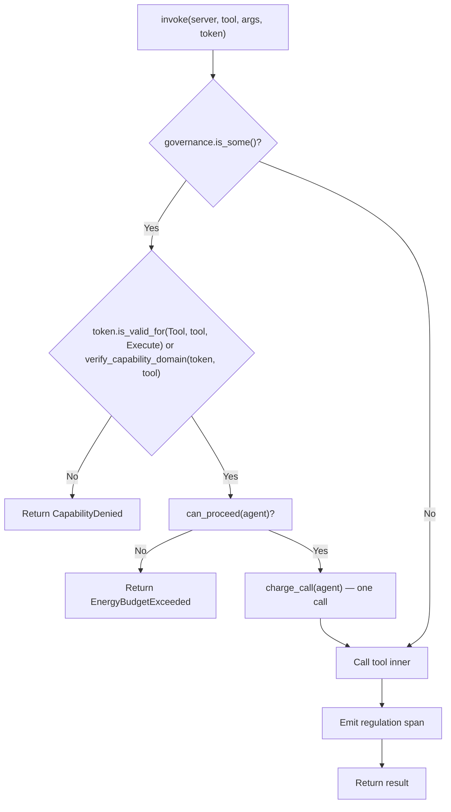

# MCP Runtime Invoke — Simplified Gate Flow

Flowchart of the `McpRuntime::invoke` tool-governance gate after the 2026-08-02 OCAP removal and the 2026-08-03 gas-to-call-cap refactor. The gate is a pure capability-match + per-agent call cap — no token expiry, no signature verification, no attenuation, no gas hold-settle. Tokens are minted in-process and never expire.

## What changed (2026-08-02)

- **Removed:** Token expiry check (`is_valid_for_at` with `now` parameter + `is_expired`), `new_with_expiry` token minting, `ocap.capability_expiry_seconds` manifest config, `OcapConfig` struct, `ocap:` manifest blocks (59 files)
- **Simplified:** The gate now does a pure capability-match (`is_valid_for` — triple match of resource/resource_id/action) OR `verify_capability_domain` (action hierarchy: Execute ⊇ Write ⊇ Read). No expiry branch. No signature verification (tokens are minted and consumed in-process).
> - **Unchanged:** Regulation span emission, tool dispatch (the 2026-08-03 refactor replaced the gas reserve/settle hold-settle with a per-agent `CallCap` — see "What changed" below)

## Related

- [hKask Capability Class Diagram](./class-hkask-capability.md) — the type system
- [Architecture Principles](../architecture/core/PRINCIPLES.md) — P4 Clear Boundaries
- [MDS](../architecture/core/MDS.md) — Trust category