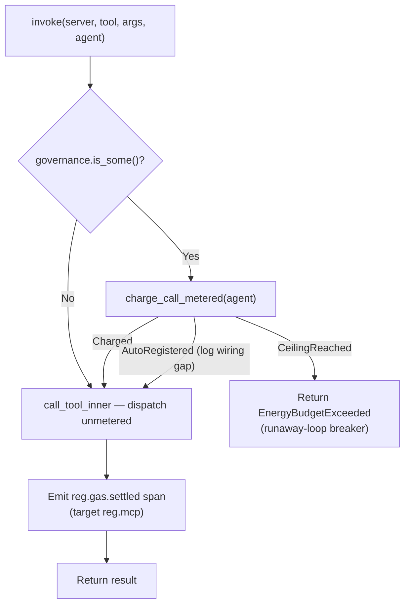

# MCP Runtime Invoke — Metering and Dispatch Flow

Flowchart of the `McpRuntime::invoke` path after the 2026-08-12 removal of the
per-call capability gate (RR-0056) and the fail-open correction to the call meter
(RR-0057). **`invoke` does not authorize.** It charges one call against the
agent's per-tick runaway ceiling, dispatches, and emits the outcome span. The
only pre-dispatch refusal is an exhausted ceiling.

## What changed (2026-08-12)

- **Removed:** the capability-match gate. `DelegationToken`, `is_valid_for`,
  `verify_capability_domain`, `capabilities_match`, `panel_default_token`, and
  `ToolPortError::CapabilityDenied` no longer exist. All three production mint
  sites derived the token's `resource_id` from the same tool name they passed to
  `invoke`, so the comparison was a caller-supplied value against itself and
  denied nothing (RR-0056). `invoke`'s fourth argument is now `agent: WebID`, an
  accounting identity.
- **Changed:** the call meter is fail-open on an *unregistered* agent. It
  auto-registers at `DEFAULT_RUNAWAY_CALL_CEILING` (10 000) and logs the wiring
  gap rather than refusing — a missing seed is a wiring omission, not an
  authorization decision (RR-0057). A runtime with no governance wired dispatches
  unmetered rather than failing closed.
- **Unchanged:** dispatch (with one bounded reconnect on a closed transport) and
  regulation span emission.

## Where authority is enforced instead

- the per-request `tool_allowlist` on the inference IPC `tool_invoke` dispatch
  (`kask/crates/kask_bridge/src/inference_ipc_server.rs`), fail-closed on a
  missing or empty allowlist
- each swarm agent card's declared `mcp_tools` allowlist
  (`kask/mcp-servers/hkask-mcp-swarm/src/agent_executor.rs`)
- the per-server MCP env/credential allowlists
  (`kask/crates/kask_bridge/src/mcp_servers.rs`, RR-0038)

## Related

- [hKask Capability Class Diagram](./class-hkask-tool-port.md) — the type system
- [Architecture Principles](../architecture/core/PRINCIPLES.md) — P4 Clear Boundaries
- [MDS](../architecture/core/MDS.md) — Trust category

<!-- DIAGRAM_ALIGNMENT
id: DIAG-CAP-002
verified_date: 2026-08-12
verified_against: kask/crates/hkask-mcp/src/runtime.rs (impl hkask_tool_port::ToolPort for McpRuntime, call_tool_inner); kask/crates/hkask-regulation/src/energy.rs (CallMeterOutcome); kask/crates/hkask-mcp/tests/invoke_gate.rs
status: VERIFIED
-->
