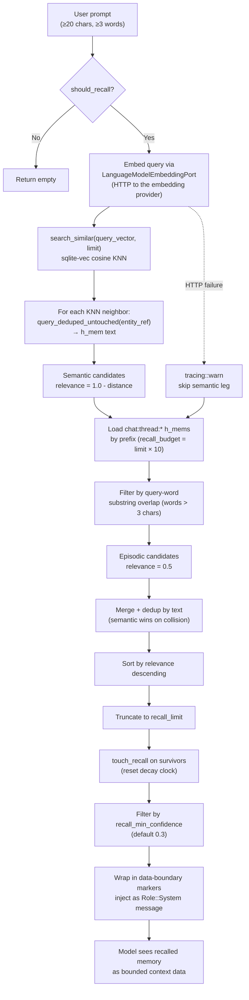

# Memory Recall — Query → embed → KNN + keyword → inject

Flowchart of `RealMemoryPort::recall_from` and `BridgeContextInjector::inject_context`
— the path from a user prompt to recalled memory snippets injected into the
model's context. This is the read side of the memory system. The write side is
[Memory Ingest Sequence](./sequence-memory-ingest.md).

Recall fires on every qualifying prompt (≥ 20 chars, ≥ 3 words) when
`kask.memory.auto_inject` is true. It has two legs that run in sequence:
(1) semantic KNN via the embedding vector, and (2) keyword overlap on
episodic h_mems. Results are merged, deduped by text, sorted by relevance,
and injected as a bounded `Role::System` message.

## The two recall legs

### Semantic leg (embedding KNN)

The query is embedded via the same `LanguageModelEmbeddingPort` used for
ingestion, then `EmbeddingStore::search` performs a KNN search over the
`vec_embeddings` sqlite-vec virtual table (cosine distance). For each
neighbor, the h_mem text is fetched by `query_deduped_untouched(entity_ref)`,
where `entity_ref` equals the h_mem's `entity` (`chat:thread:{thread_id}`).
Relevance is `1.0 - distance` (cosine distance ranges [0, 2], so relevance
ranges [-1, 1]).

### Keyword leg (episodic overlap)

All `chat:thread:*` h_mems for the user's perspective are loaded in a single
prefix query (capped at `limit × 10`, most-recent-first). Each h_mem's text
is checked for substring overlap with any query word > 3 chars. Relevance is
a constant `0.5` — keyword matches rank below strong semantic matches
(distance < 0.5) but above weak semantic matches (distance > 0.5).

## The entity_ref join (the fix)

Before 2026-08-10, the embedding was stored under
`embedding:thread:{thread_id}:user_input` while the h_mem text lived under
`chat:thread:{thread_id}`. The KNN neighbor's `entity_ref` joined to no
h_mem, so the semantic leg was silently dead code — only the keyword leg
returned snippets. The fix stores the embedding under the same
`chat:thread:{thread_id}` entity as the h_mem. See
[Memory Store ERD](./erd-memory-store.md) for the invariant.

## Latency

The embedding HTTP call adds ~100–300ms to recall on every qualifying
prompt. There is no query-embedding cache. Short prompts (< 20 chars or
< 3 words) skip recall entirely via the `should_recall` gate.

## Related

- [Memory Ingest Sequence](./sequence-memory-ingest.md) — the write side
- [Memory Store ERD](./erd-memory-store.md) — the storage schema
- [Memory System Specification](../architecture/memory-system-specification.md) — the architecture spec
- [Context Injector Source](../crates/kask_bridge/src/context_injector.rs) — `BridgeContextInjector`

<!-- DIAGRAM_ALIGNMENT
id: DIAG-PL-MEMORY-RECALL
verified_date: 2026-08-10
verified_against: kask/crates/kask_bridge/src/memory.rs:1411
status: VERIFIED
-->
