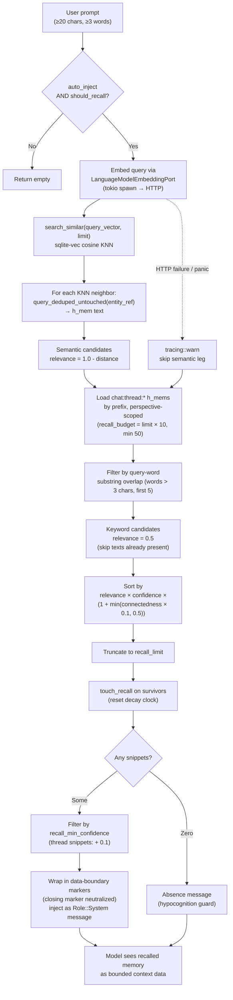

# Memory Recall — Query → embed → KNN + keyword → rank → inject

Flowchart of `RealMemoryPort::recall_from` (`kask/crates/kask_bridge/src/memory.rs:655-882`)
and `BridgeContextInjector::inject_context`
(`kask/crates/kask_bridge/src/context_injector.rs:185-345`) — the path from
a user prompt to recalled memory snippets injected into the model's
context. This is the read side of the memory system. The write side is
[Memory Ingest Sequence](./sequence-memory-ingest.md).

Recall is curator-scoped: the injector's curator variant calls
`recall_context_curator` / `recall_thread_curator` (inherent methods),
because the `MemoryPort` trait impls are no-ops (`memory.rs:499-519`).
Recall fires on every qualifying prompt (≥ 20 chars, ≥ 3 words) when
`kask.memory.auto_inject` is true. It has two legs that run in sequence:
(1) semantic KNN via the embedding vector, and (2) keyword overlap on
`chat:thread:*` h_mems. Results are merged, ranked by relevance ×
confidence × connectedness bonus, and injected as a bounded
`Role::System` message wrapped in data-boundary markers.

<!-- DIAGRAM_ALIGNMENT
id: DIAG-PL-MEMORY-RECALL
verified_date: 2026-08-28
verified_against: kask/crates/kask_bridge/src/context_injector.rs:38-42 (prompt gate), :85-90 (should_recall), :213-217 (auto_inject gate), :240-243 & :266-269 (confidence filters), :285-311 (absence message), :56-77 (data-boundary markers); kask/crates/kask_bridge/src/memory.rs:655-882 (recall_from: KNN leg 673-752, keyword leg 754-819, sort 821-850, touch 852-867), :499-519 (trait no-ops)
status: VERIFIED
-->

## The two recall legs

### Semantic leg (embedding KNN)

The query is embedded via the same `LanguageModelEmbeddingPort` used for
ingestion (spawned on the tokio runtime, `memory.rs:673-691`), then
`search_similar` performs a KNN search over the `vec_embeddings`
sqlite-vec virtual table (cosine distance). For each neighbor, the h_mem
text is fetched by `query_deduped_untouched(entity_ref)`, where
`entity_ref` equals the h_mem's `entity` (`curator:thread:{thread_id}` for
ingested turns). Relevance is `1.0 - distance` (cosine distance ranges
[0, 2], so relevance ranges [-1, 1]). A failed embed degrades recall to
keyword-only with a `tracing::warn!` — the operator can distinguish "no
memory found" from "embedding endpoint down" (`memory.rs:693-716`).

### Keyword leg (prefix + word overlap)

All `chat:thread:*` h_mems for the curator's perspective are loaded in a
single prefix query (capped at `limit × 10`, minimum 50, most-recent-first
— `memory.rs:787-793`). Each h_mem's text is checked for substring overlap
with any query word > 3 chars (first 5 words). Relevance is a constant
`0.5` — keyword matches rank below strong semantic matches (distance <
0.5) but above weak semantic matches (distance > 0.5). Texts already
present in the semantic candidates are skipped, so the semantic candidate
wins on collision (`memory.rs:804-807`).

## Ranking and decay

Candidates are sorted by `relevance × confidence × (1 +
min(connectedness × 0.1, 0.5))` — confidence is the decayed
Wozniak-Gorzelanczyk value, and connectedness is the co-occurrence count
from `memory_links` capped at a 1.5× bonus (`memory.rs:821-850`). Only
the survivors of truncation are `touch_recall`-ed, resetting their decay
clocks without a write storm (`memory.rs:852-867`).

## Thread-scoped recall (parallel path)

`inject_context` also calls `recall_thread_curator(thread_id)` per turn —
exact entity match on `chat:thread:{id}` (perspective-scoped) plus
`curator:thread:{id}`, no embedding KNN, relevance 1.0, truncated by
recency (`memory.rs:884-991`). Thread snippets are filtered at
`recall_min_confidence + 0.1` (`context_injector.rs:196`, `:266-269`).

## Latency

The embedding HTTP call adds ~100–300ms to recall on every qualifying
prompt. There is no query-embedding cache. Short prompts (< 20 chars or
< 3 words) skip recall entirely via the `should_recall` gate.

## Related

- [Memory Ingest Sequence](./sequence-memory-ingest.md) — the write side
- [Memory Store ERD](./erd-memory-store.md) — the storage schema
- [Memory System Specification](../architecture/memory-system-specification.md) — the architecture spec
- [Memory System — Why It Works This Way](../explanation/memory-system.md) — the design rationale
