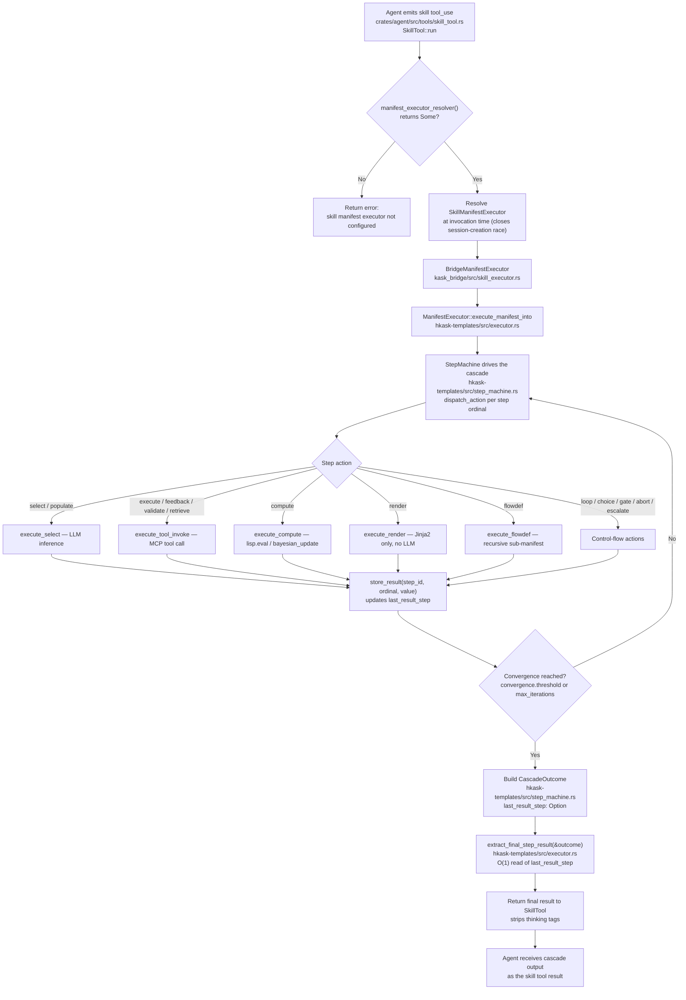

# Skill Invocation — Cascade and Final-Result Extraction Flow

Reference-quadrant flowchart of the `skill` tool call path: the agent's
`SkillTool` resolves the `SkillManifestExecutor` at invocation time (not
session-creation time), the bridge's `BridgeManifestExecutor` drives the
`ManifestExecutor` cascade, and the final result is extracted in O(1) via
`extract_final_step_result` reading the machine-tracked `last_result_step`.
Every node traces to a grep-verified symbol.

## The flow

## Why the resolver pattern (not a cached field)

`SkillTool` holds a `manifest_executor_resolver:
Arc<dyn Fn() -> Option<Arc<dyn SkillManifestExecutor>> + Send + Sync>` rather
than a cached `Option<Arc<...>>`. This fixes the session-creation race: if a
session is created before the deferred post-login task wires the global
executor, a cached field would stay `None` for the session's entire lifetime.
By reading the global at invocation time, sessions created before wiring pick
up the executor once `set_manifest_executor` runs.

The global itself is a `OnceLock<Option<Arc<dyn SkillManifestExecutor>>>` in
`crates/agent/src/agent.rs` (`MANIFEST_EXECUTOR`), set by
`set_manifest_executor` during the deferred post-login task. The
`set_manifest_executor` hook warns on a second wiring attempt (re-login,
multi-window, retry) and drops the rejected payload — the previously-wired
executor remains active.

## Why `last_result_step` (not a string-key scan)

`extract_final_step_result` reads `CascadeOutcome.last_result_step` — the
highest `StepId` that stored a result during the cascade, tracked by the
machine in `apply_effect`. This is O(1) and deterministic by construction
(no randomized HashMap order). The prior ordinal-keyed HashMap scan was
retired (K5). The typed `CascadeOutcome` is returned directly to callers;
they extract the final result via `extract_final_step_result(&outcome)`, not
by scanning a string-keyed map.

`extract_final_step_result` is re-exported at the crate root
(`hkask_templates::extract_final_step_result` in
`hkask-templates/src/hkask_templates.rs:36`) — downstream crates must match
on `hkask_templates::extract_final_step_result`, not the longer submodule
path. `ExitKind` is similarly re-exported (`pub use step_graph::ExitKind` at
`hkask_templates.rs:38`).

## Convergence and exit

The cascade iterates until the convergence metric ≤ `convergence.threshold`
or `max_iterations` is exhausted. `CascadeOutcome` carries:
- `context: StepContext` — the typed step results
- `iterations: u32`
- `exit_kind: ExitKind` — `Converged` / `MaxOut` / `Escalated` / ...
- `last_result_step: Option<StepId>` — the final-result pointer
- `budget_snapshot: BudgetSnapshot` — gas/rjoule usage
- `resume_text: Option<String>` — resume instruction from `on_failure`
  (set only when the exit was caused by an `on_failure` action:
  halt/escalate/report)

`extract_final_step_result` strips `<think>...` tags from the result
value before returning it.

## Related

- [Skill ↔ MCP ↔ Lisp Architecture](./architecture-skill-mcp-lisp-seam.md) — the three-surface seam
- [MCP Tool Call Sequence](./sequence-mcp-tool-call.md) — the `execute` step's dispatch path
- [Skills and Composition](../explanation/skills-and-composition.md) — skill anatomy and authoring
- [Skill ↔ MCP Tool Integration](../explanation/skill-mcp-integration.md) — flowdef-native MCP invocation

<!-- DIAGRAM_ALIGNMENT
id: DIAG-FLOW-SKILL-INVOCATION-001
verified_date: 2026-08-15
verified_against: crates/agent/src/tools/skill_tool.rs (SkillTool, SkillManifestExecutor, manifest_executor_resolver); crates/agent/src/agent.rs (MANIFEST_EXECUTOR OnceLock, set_manifest_executor, manifest_executor, manifest_executor_cloned); kask/crates/hkask-templates/src/executor.rs (ManifestExecutor::execute_manifest_into, extract_final_step_result); kask/crates/hkask-templates/src/step_machine.rs (StepMachine, last_result_step, CascadeOutcome, apply_effect); kask/crates/hkask-templates/src/step_context.rs (store_result, store_named, last_result); kask/crates/hkask-templates/src/hkask_templates.rs (pub use executor::extract_final_step_result, pub use step_graph::ExitKind); kask/crates/kask_bridge/src/skill_executor.rs (BridgeManifestExecutor)
status: VERIFIED
-->
