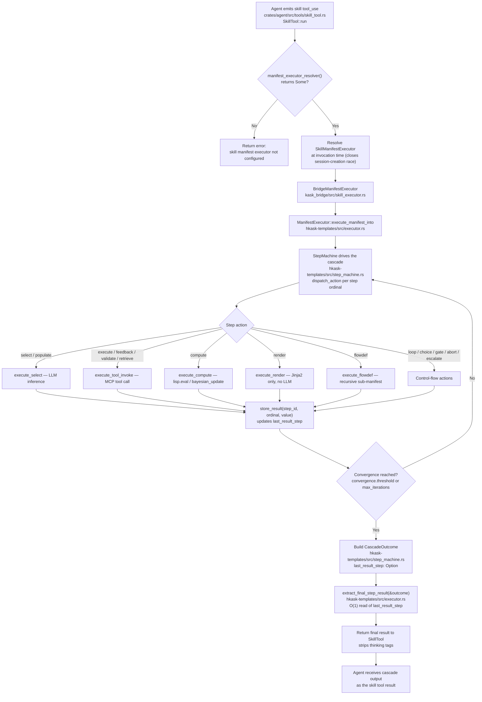

# Skill Invocation — Cascade and Final-Result Extraction Flow

> **⚠️ DEPRECATED 2026-08-20.** This diagram documents the **deleted**
> manifest-cascade skill invocation model. The entire cascade machinery
> (`SkillManifestExecutor` → `BridgeManifestExecutor` →
> `ManifestExecutor::execute_manifest_into` → `StepMachine` →
> `extract_final_step_result`) was removed when the `hkask-templates` crate
> was deleted (commit `5f4cf5f10d`). The `kask_bridge/src/skill_executor.rs`
> and `kask_bridge/src/cascade_context.rs` modules are deleted.
>
> **Current model — upstream-Zed body injection:** `SkillTool::run`
> (`crates/agent/src/tools/skill_tool.rs:266`) reads the `SKILL.md` body from
> disk via `agent_skills::read_skill_body` and injects it into the agent
> context via `render_skill_envelope`. The model reads the body and follows
> the instructions. PDCA loops are **model-coordinated**: the `SKILL.md` body
> describes convergence criteria, and the model self-iterates using the
> `lisp_eval` tool (sandboxed Lisp, `hkask_lisp::eval_sandboxed_with_budget`)
> for deterministic checks and the `render_template` tool (minijinja,
> `kask/registry/templates/`) for structured prompt scaffolding.
>
> This diagram is retained for historical reference only. For the current
> architecture, see
> [`architecture-skill-mcp-lisp-seam.md`](./architecture-skill-mcp-lisp-seam.md).

## The flow (historical — deleted machinery)

## Why the resolver pattern (not a cached field) — historical

`SkillTool` held a `manifest_executor_resolver:
Arc<dyn Fn() -> Option<Arc<dyn SkillManifestExecutor>> + Send + Sync>` rather
than a cached `Option<Arc<...>>`. This fixed the session-creation race: if a
session was created before the deferred post-login task wired the global
executor, a cached field would stay `None` for the session's entire lifetime.
By reading the global at invocation time, sessions created before wiring picked
up the executor once `set_manifest_executor` ran.

The global itself was a `OnceLock<Option<Arc<dyn SkillManifestExecutor>>>` in
`crates/agent/src/agent.rs` (`MANIFEST_EXECUTOR`), set by
`set_manifest_executor` during the deferred post-login task. The
`set_manifest_executor` hook warned on a second wiring attempt (re-login,
multi-window, retry) and dropped the rejected payload — the previously-wired
executor remained active.

> All of the above is deleted. `SkillTool::new(skills, fs)` now matches the
> upstream Zed constructor; there is no `manifest_executor_resolver`, no
> `MANIFEST_EXECUTOR` OnceLock, no `set_manifest_executor` hook.

## Why `last_result_step` (not a string-key scan) — historical

`extract_final_step_result` read `CascadeOutcome.last_result_step` — the
highest `StepId` that stored a result during the cascade, tracked by the
machine in `apply_effect`. This was O(1) and deterministic by construction
(no randomized HashMap order). The prior ordinal-keyed HashMap scan was
retired (K5). The typed `CascadeOutcome` was returned directly to callers;
they extracted the final result via `extract_final_step_result(&outcome)`, not
by scanning a string-keyed map.

`extract_final_step_result` was re-exported at the crate root
(`hkask_templates::extract_final_step_result` in
`hkask-templates/src/hkask_templates.rs:36`) — downstream crates matched
on `hkask_templates::extract_final_step_result`, not the longer submodule
path. `ExitKind` was similarly re-exported (`pub use step_graph::ExitKind` at
`hkask_templates.rs:38`).

> All of the above is deleted with `hkask-templates`. There is no
> `CascadeOutcome`, no `extract_final_step_result`, no `ExitKind`, no
> `last_result_step`. The skill tool result is the model's own output after
> following the injected `SKILL.md` body.

## Convergence and exit — historical

The cascade iterated until the convergence metric ≤ `convergence.threshold`
or `max_iterations` was exhausted. `CascadeOutcome` carried:
- `context: StepContext` — the typed step results
- `iterations: u32`
- `exit_kind: ExitKind` — `Converged` / `MaxOut` / `Escalated` / ...
- `last_result_step: Option<StepId>` — the final-result pointer
- `budget_snapshot: BudgetSnapshot` — gas/rjoule usage
- `resume_text: Option<String>` — resume instruction from `on_failure`
  (set only when the exit was caused by an `on_failure` action:
  halt/escalate/report)

`extract_final_step_result` stripped `thinking...` tags from the result
value before returning it.

> Convergence is now model-coordinated. The `SKILL.md` body describes
> convergence criteria in natural language; the model self-iterates and uses
> `lisp_eval` for deterministic convergence signals. There is no
> `BudgetSnapshot`, no `gas`/`rjoule` tracking — tool-call bounding is solely
> the per-agent `CallCap`.

## Related

- [Skill ↔ MCP ↔ Lisp Architecture](./architecture-skill-mcp-lisp-seam.md) — the current three-surface seam (body-injection model)
- [MCP Tool Call Sequence](./sequence-mcp-tool-call.md) — the `LazyToolRouter` → `McpRuntime::invoke` path
- [Skills and Composition](../explanation/skills-and-composition.md) — skill anatomy and authoring (current model)
- [Skill ↔ MCP Tool Integration](../explanation/skill-mcp-integration.md) — model-coordinated tool invocation

<!-- DIAGRAM_ALIGNMENT
id: DIAG-FLOW-SKILL-INVOCATION-001
verified_date: 2026-08-20
verified_against: (n/a — the entire manifest cascade machinery documented here was deleted with hkask-templates, commit 5f4cf5f10d. SkillManifestExecutor, BridgeManifestExecutor, ManifestExecutor, StepMachine, CascadeOutcome, extract_final_step_result, ExitKind, MANIFEST_EXECUTOR OnceLock, set_manifest_executor, skill_executor.rs, cascade_context.rs — all deleted. Retained for historical reference.)
status: DEPRECATED
-->
