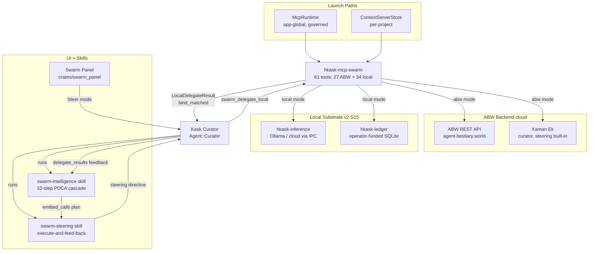

# Swarm MCP Server Architecture

The swarm server (`hkask-mcp-swarm`) exposes 61 tools (27 ABW + 34 local) across two substrates selected by `kask.swarm.mode`. It is launched by two independent paths — `McpRuntime` (app-global, governed dispatch for the skill cascade) and `ContextServerStore` (per-project, for the agent tool picker) — both correct by design. The `swarm-intelligence` skill composes/steers swarms via a 10-step PDCA cascade; the `swarm-steering` skill codifies the local execute-and-feed-back loop for the Kask Curator. See the [Swarm MCP Server Reference](../reference/mcp-servers/swarm.md) and the [Cybernetic Swarm Plan](../plans/cybernetic-swarm-plan.md).

<!-- DIAGRAM_ALIGNMENT
id: DIAG-DIA-SWARM-001
verified_date: 2026-08-20
verified_against: kask/mcp-servers/hkask-mcp-swarm/src/hkask_mcp_swarm.rs (tool_surface_is_exactly_53_registered_tools pins the registered surface; 61 pub(crate) async fn swarm_ fns across src/); crates/swarm_panel/src/swarm_panel.rs; .agents/skills/swarm-intelligence/SKILL.md; .agents/skills/swarm-steering/SKILL.md; kask/mcp-servers/hkask-mcp-swarm/src/local_runtime.rs (check_bind)
status: VERIFIED
-->
