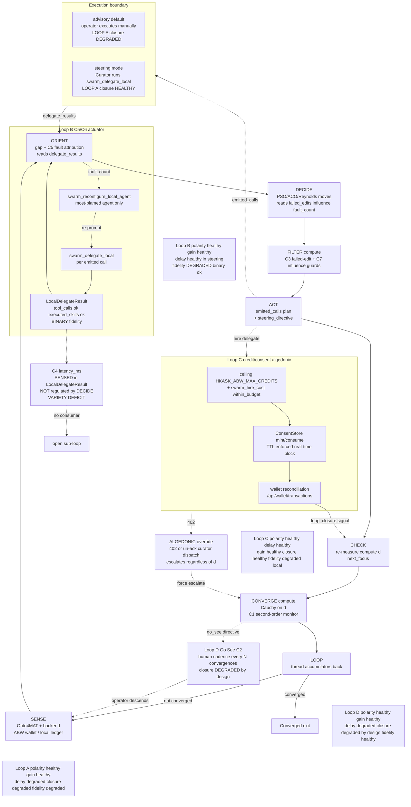

# Swarm Feedback Loops — Cybernetic Map

The swarm system runs four coupled feedback loops. **Loop A** (PDCA
convergence) is the planner's inner loop; **Loop B** (C5/C6 steering execution)
closes only when the `swarm-steering` skill or the Curator in steering mode
feeds `delegate_results` back; **Loop C** (credit/consent algedonic) is the
strongest — the 402 / un-acknowledged curator dispatch escalates regardless of
the swarm-state distance `d` (the "never read as no deviation" invariant);
**Loop D** (Go See) is the intentionally-human outer meta-loop. The diagram
annotates each loop with its 5-property health (polarity, delay, gain, closure,
fidelity) and marks the two structural gaps found in the audit: Loop B's binary
`ok` fidelity (no task-success sensing for open tasks) and the C4 latency
sub-loop that is sensed but not regulated. See the [Swarm Cybernetics/Semantics Audit](../audits/swarm-cybernetics-semantics-audit.md) for the full per-property evidence and the [PDCA Cascade](flowchart-swarm-pdca-cascade.md) for the step decomposition.

<!-- DIAGRAM_ALIGNMENT
id: DIAG-DIA-SWARM-008
verified_date: 2026-08-04
verified_against: .agents/skills/swarm-intelligence/SKILL.md:62,96,104,105,122,124,182; .agents/skills/swarm-steering/SKILL.md:59; kask/mcp-servers/hkask-mcp-swarm/src/consent.rs:77,184; kask/mcp-servers/hkask-mcp-swarm/src/spend_gate.rs:83; crates/swarm_panel/src/swarm_panel.rs:191
status: VERIFIED
-->