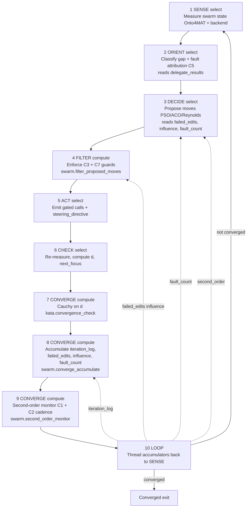

# Swarm Intelligence PDCA Cascade

The `swarm-intelligence` skill runs a 10-step PDCA cascade that composes and steers swarms. Steps 4, 7, 8, 9 are deterministic `compute` steps (no LLM) — the cybernetic accumulators and guards live in the math layer, not in LLM templates, because an LLM cannot reliably maintain a running set/sum across LOOP iterations. The FILTER (step 4) deterministically enforces the C3 failed-edit and C7 influence guards. The CONVERGE steps (7–9) check convergence, accumulate iteration_log/failed_edits/influence_scores/fault_count, and run the second-order monitor (C1 reasoning-loop + sensor-truth-divergence + C2 Go See cadence). The LOOP (step 10) threads the accumulators back. See the [Cybernetic Swarm Plan](../plans/cybernetic-swarm-plan.md) and the [Swarm MCP Server Reference](../reference/mcp-servers/swarm.md).

<!-- DIAGRAM_ALIGNMENT
id: DIAG-DIA-SWARM-009
verified_date: 2026-08-04
verified_against: .agents/skills/swarm-intelligence/SKILL.md:63,66,120,130
status: VERIFIED
-->