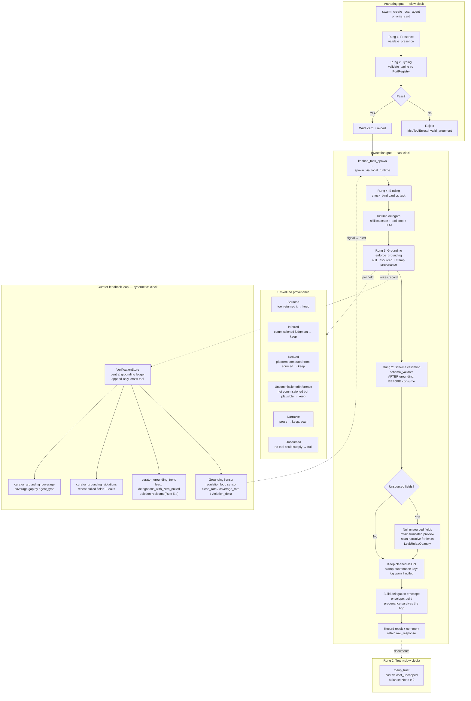

# Verification Ladder — Agent Ecology Grounding Flow

> **⚠️ DEPRECATED 2026-08-20.** The `hkask-verification` crate — which
> provided the entire grounding enforcement surface documented in this
> diagram (`enforce_grounding`, `VerificationStore`, `ProvenanceTag`,
> `LeakRule`, `NARRATIVE_LEAK_RULES`, `provenance_stamp`,
> `task_agent_contract`, `card_contract`, `schema_validate`, `envelope::build`,
> `rollup_trust`, `GroundingTrendReport`, `enforce_for_agent`,
> `enforce_and_stamp`, `enforce_narrative`, `grounding_trend`,
> `grounding_violations`, `grounding_coverage`) — was deleted (commit
> `9e9c41ef3c`). The companion architecture doc
> `architecture/verification-for-agent-ecologies.md` was also deleted.
>
> **What survives:** Rung 1 (Presence) and Rung 2 (Typing) validation live in
> `hkask-mcp-swarm/src/local_registry.rs` (`validate_presence`,
> `validate_typing`) and `hkask-mcp-swarm/src/port_registry.rs` (`PortRegistry`,
> `validate_output`). Rung 4 (Binding) via `check_bind` lives in
> `hkask-mcp-swarm/src/local_runtime.rs`. The `GroundingSensor` regulation-loop
> sensor and the curator grounding MCP tools
> (`curator_grounding_trend`/`_violations`/`_coverage`) were part of the
> deleted crate or depended on it. Rung 3 (Grounding) — the null-unsourced-fields
> control — is gone with the crate.
>
> This diagram is retained for historical reference only. The four-rung
> ladder is now a two-rung ladder (Presence + Typing at authoring, Binding at
> invocation); Grounding and the curator feedback loop are not wired.

Flowchart of the four-rung verification ladder applied to `kanban-task-*`
agent delegations. Rungs 1 (Presence) and 2 (Typing) run at authoring time
(slow clock); Rungs 3 (Grounding) and 4 (Binding) run at invocation time
(fast clock). The grounding check nulls unsourced fields before the response
persists — it is a control, not a metric. The curator feedback loop (cybernetics
clock) senses grounding health from the central ledger and surfaces trends,
violations, and coverage gaps to the operator. See [Verification for Agent
Ecologies](../architecture/verification-for-agent-ecologies.md) (also deleted).

> The `I4` (Rung 3 Grounding), `I5` (schema_validate), `I7`/`I8` (null
> unsourced), `I9` (envelope::build), the entire `feedback` subgraph, the
> `vocabulary` subgraph, and the `truth` subgraph all depend on the deleted
> `hkask-verification` crate. Only `A1`–`A6` (authoring gate with Presence +
> Typing) and `I1`–`I3` + `I10` (invocation with Binding) survive.

## The three clocks — historical

Verification runs on three independent schedules. The authoring gate
(slow clock) prevents bad cards from entering the catalogue. The invocation
gate (fast clock) catches what the authoring gate cannot know — that this
particular output, on this particular run, contains something no tool could
have supplied. The curator feedback loop (cybernetics clock) senses grounding
health from the central `VerificationStore` ledger via `GroundingSensor` and
surfaces trends, violations, and coverage gaps to the operator via the
curator MCP tools.

> The cybernetics clock is gone with `hkask-verification`. The authoring and
> invocation clocks survive in reduced form (no grounding, no schema_validate,
> no envelope provenance).

## What the grounding check catches — historical

The paper's headline defect: an agent that claims "I wrote the file at
`/src/main.rs`" without ever calling a file-writing tool. The
`deliverable_path` field is nulled, the narrative leak is detected if the
agent restates the path in prose, and the operator sees a `warn!` log naming
the nulled field.

> This control is gone with `hkask-verification`. Unsourced fields are no
> longer nulled; narrative leaks are no longer scanned for.

## What it does not catch (paper §6) — historical

- Semantic hallucination inside a sourced field (needs outcome scoring)
- Prose output (grounding is a no-op for non-JSON)
- Fields the contract doesn't declare (marked UncommissionedInference, not nulled)

## Related

- [Verification for Agent Ecologies](../architecture/verification-for-agent-ecologies.md) — **deleted** (full architecture doc, removed with `hkask-verification`)
- [Swarm Steering Loop](./sequence-swarm-steering-loop.md) — where delegations run
- [Architecture Principles](../architecture/core/PRINCIPLES.md) — P8.2 Agent Output Grounding

<!-- DIAGRAM_ALIGNMENT
id: DIAG-FLOW-VERIFICATION-LADDER-001
verified_date: 2026-08-20
verified_against: kask/mcp-servers/hkask-mcp-swarm/src/local_registry.rs (validate_presence, validate_typing — SURVIVES); kask/mcp-servers/hkask-mcp-swarm/src/port_registry.rs (PortRegistry, validate_output, task_result_schema — SURVIVES); kask/mcp-servers/hkask-mcp-swarm/src/local_runtime.rs (check_bind, raw_response — SURVIVES); kask/crates/hkask-verification/src/grounding.rs (enforce_grounding, ProvenanceTag, task_agent_contract, LeakRule, NARRATIVE_LEAK_RULES, provenance_stamp — DELETED, commit 9e9c41ef3c); kask/crates/hkask-verification/src/card_contract.rs (validate, register_if_valid — DELETED); kask/crates/hkask-verification/src/schema_validate.rs (validate — DELETED); kask/crates/hkask-verification/src/envelope.rs (build — DELETED); kask/crates/hkask-verification/src/rollup_trust.rs (ROLLUP_CONTRACTS — DELETED); kask/crates/hkask-verification/src/ledger.rs (VerificationStore, enforce_for_agent, enforce_and_stamp, enforce_narrative, grounding_trend, grounding_violations, grounding_coverage — DELETED); kask/crates/hkask-verification/src/trend.rs (GroundingTrendReport, delegations_with_zero_nulled — DELETED); kask/crates/hkask-regulation/src/sensor_provider.rs (GroundingSensor, GroundingSensorMetric — DELETED/STALE); kask/mcp-servers/hkask-mcp-curator/src/hkask_mcp_curator.rs (curator_grounding_trend, curator_grounding_violations, curator_grounding_coverage — STALE, depended on deleted crate); kask/mcp-servers/hkask-mcp-kata-kanban/src/hkask_mcp_kata_kanban.rs (spawn_via_local_runtime grounding wiring via VerificationStore::enforce_and_stamp — DELETED); kask/mcp-servers/hkask-mcp-swarm/src/a2a_tools.rs (swarm_a2a_send, swarm_a2a_broadcast grounding wiring — DELETED); kask/mcp-servers/hkask-mcp-swarm/src/a2a_http.rs (A2A HTTP gateway grounding wiring — DELETED); kask/mcp-servers/hkask-mcp-swarm/src/local_tools.rs (validate_produces, all delegation paths enforce_and_stamp — DELETED)
status: DEPRECATED
-->
