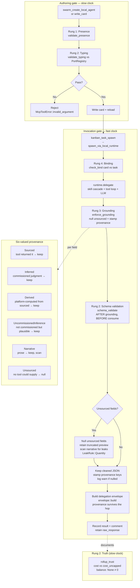

# Verification Ladder — Agent Ecology Grounding Flow

Flowchart of the four-rung verification ladder applied to `kanban-task-*`
agent delegations. Rungs 1 (Presence) and 2 (Typing) run at authoring time
(slow clock); Rungs 3 (Grounding) and 4 (Binding) run at invocation time
(fast clock). The grounding check nulls unsourced fields before the response
persists — it is a control, not a metric. See [Verification for Agent
Ecologies](../architecture/verification-for-agent-ecologies.md).

## The two clocks

Verification runs on two independent schedules. The authoring gate
(slow clock) prevents bad cards from entering the catalogue. The invocation
gate (fast clock) catches what the authoring gate cannot know — that this
particular output, on this particular run, contains something no tool could
have supplied.

## What the grounding check catches

The paper's headline defect: an agent that claims "I wrote the file at
`/src/main.rs`" without ever calling a file-writing tool. The
`deliverable_path` field is nulled, the narrative leak is detected if the
agent restates the path in prose, and the operator sees a `warn!` log naming
the nulled field.

## What it does not catch (paper §6)

- Semantic hallucination inside a sourced field (needs outcome scoring)
- Prose output (grounding is a no-op for non-JSON)
- Fields the contract doesn't declare (marked UncommissionedInference, not nulled)

## Related

- [Verification for Agent Ecologies](../architecture/verification-for-agent-ecologies.md) — full architecture doc
- [Swarm Steering Loop](./sequence-swarm-steering-loop.md) — where delegations run
- [Architecture Principles](../architecture/core/PRINCIPLES.md) — P8.2 Agent Output Grounding

<!-- DIAGRAM_ALIGNMENT
id: DIAG-FLOW-VERIFICATION-LADDER-001
verified_date: 2026-08-16
verified_against: kask/mcp-servers/hkask-mcp-swarm/src/local_registry.rs (validate_presence, validate_typing); kask/mcp-servers/hkask-mcp-swarm/src/port_registry.rs (PortRegistry); kask/mcp-servers/hkask-mcp-swarm/src/local_runtime.rs (check_bind, classify_request, raw_response); kask/mcp-servers/hkask-mcp-kata-kanban/src/grounding.rs (enforce_grounding, ProvenanceTag, task_agent_contract, LeakRule, NARRATIVE_LEAK_RULES, provenance_stamp); kask/mcp-servers/hkask-mcp-kata-kanban/src/card_contract.rs (validate); kask/mcp-servers/hkask-mcp-kata-kanban/src/schema_validate.rs (validate); kask/mcp-servers/hkask-mcp-kata-kanban/src/envelope.rs (build); kask/mcp-servers/hkask-mcp-kata-kanban/src/rollup_trust.rs (ROLLUP_CONTRACTS); kask/mcp-servers/hkask-mcp-kata-kanban/src/hkask_mcp_kata_kanban.rs (spawn_via_local_runtime grounding wiring, build_task_agent_card system prompt)
status: VERIFIED
-->
