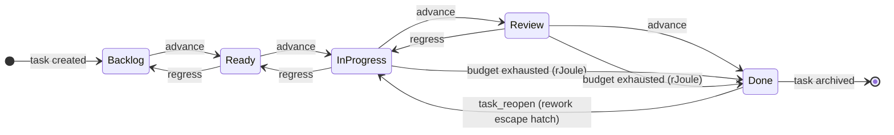
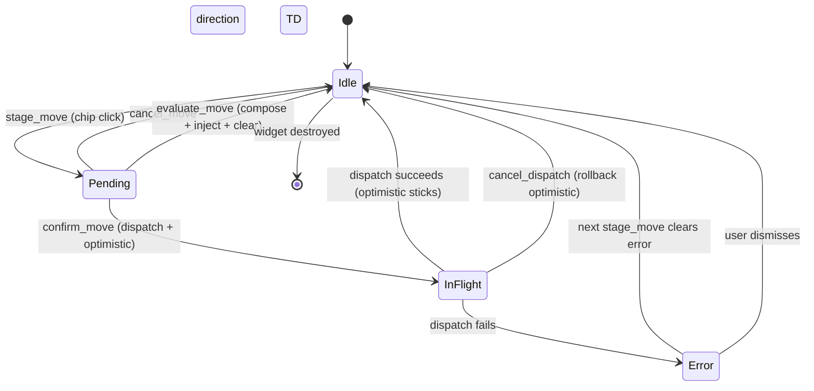

# Kanban Diagrams

Consolidated state diagrams for the kanban system: the task-status wire
lifecycle shared by the `hkask-mcp-kata-kanban` MCP server and the
`hkask-kanban-widget` GPUI view, and the widget's move-dispatch state
machine. Unique `DIAGRAM_ALIGNMENT` IDs are preserved from the originals.

## Task Status Lifecycle

`TaskStatus` (`kask/crates/hkask-types/src/kanban_status.rs`) is the single
source of truth for the five standard kanban task-status wire strings. Both
the `hkask-mcp-kata-kanban` MCP server and the `hkask-kanban-widget` GPUI
view import it, so the wire strings and transition rules cannot drift
between them.

Column ordering is strict: transitions may only advance forward or regress
one step backward (`can_transition_to`). Skipping columns is prohibited. The
one exception is `KanbanService::task_reopen`, which moves Done→InProgress
directly (skipping Review) as an explicit rework escape hatch — the only
sanctioned multi-step transition.

Budget exhaustion (`task_gas_exhaust` / `task_rjoule_exhaust`) moves a task
to Done from InProgress or Review regardless of the one-step rule, stamping a
failed verification.

**Correction (2026-08-28):** `task_reopen` moved from
`kanban/service_impl/dejam.rs` to `kanban/service_impl/service.rs` — the
diagram itself is unchanged.

<!-- DIAGRAM_ALIGNMENT
id: DIAG-STATE-TASK-STATUS
verified_date: 2026-08-28
verified_against: kask/crates/hkask-types/src/kanban_status.rs (TaskStatus L24, can_transition_to L65); kask/mcp-servers/hkask-mcp-kata-kanban/src/kanban/service_impl/service.rs (task_reopen L704)
status: VERIFIED
-->

## Kanban Move Controller

`KanbanMoveController` (`crates/hkask-kanban-widget/src/move_controller.rs`)
owns the kanban move dispatch state machine. The widget delegates move
lifecycle calls to it and renders the dispatch-status banner by reading
controller state via accessors (`pending_move`, `dispatch_in_flight`,
`dispatch_error`). The controller is a pure state machine — it does not
render.

The lifecycle is: `stage_move` (user clicks a move chip) stages a pending
move and shows a Confirm/Cancel/Evaluate banner. `confirm_move` takes the
pending move and dispatches it via `shared_tool_invoker()` (metered against
the panel persona's call ceiling; not capability-gated — RR-0056), applying
an optimistic local mutation first. `cancel_move` drops the pending move
without dispatch. `cancel_dispatch` rolls back the optimistic move if the
dispatch is still in flight. `evaluate_move` composes an evaluation request
from the pending move and injects it into the active conversation, then
clears the pending move (no double-evaluate). Verified current.

<!-- DIAGRAM_ALIGNMENT
id: DIAG-STATE-KANBAN-MOVE
verified_date: 2026-08-28
verified_against: crates/hkask-kanban-widget/src/move_controller.rs (dispatch_in_flight L61, optimistic_move L65, dispatch_error L69, pending_move L73, accessors L96-121); crates/hkask-kanban-widget/src/view.rs (render_dispatch_status L260, evaluate_move L974)
status: VERIFIED
-->

## See also

- [UI widget diagrams](./ui-widgets.md) — the `KanbanWidget` class diagram
- [Architecture diagrams](./architecture.md) — the tool-port metering the move dispatch flows through
