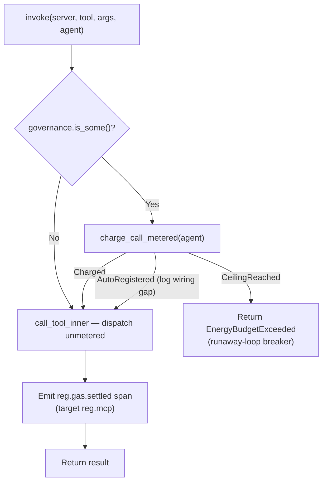
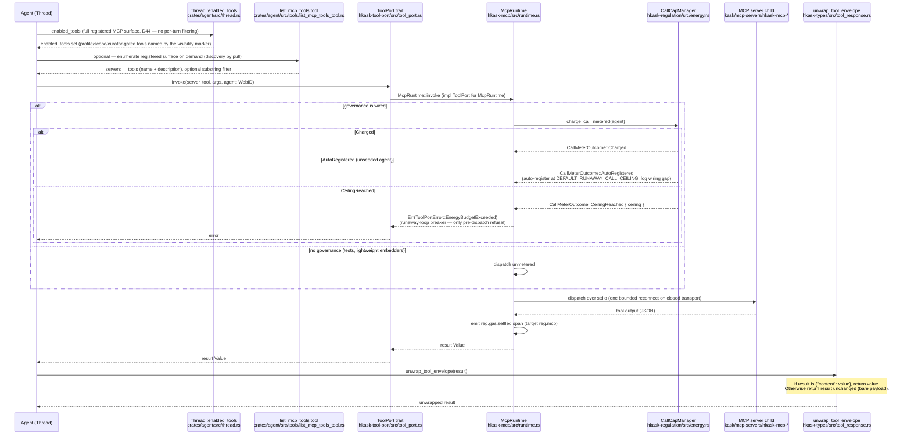
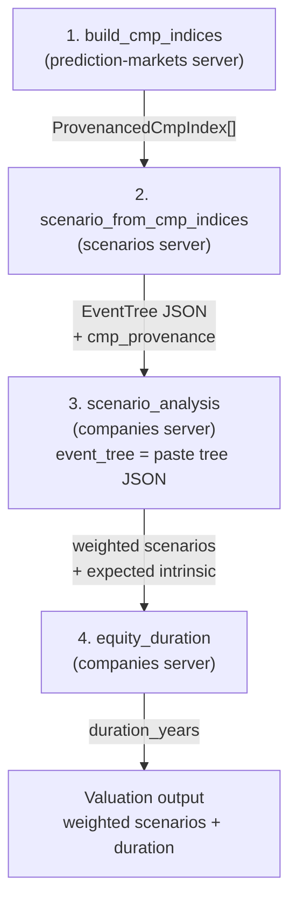
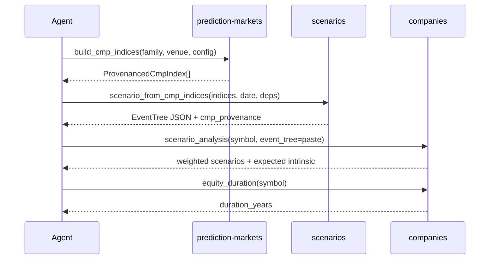

# MCP Dispatch Diagrams

Consolidated diagrams for the MCP dispatch path: the `McpRuntime::invoke`
metering flow, the end-to-end tool-call sequence from the agent's tool-use
loop, and the CMP research tool-call flow across servers. Unique
`DIAGRAM_ALIGNMENT` IDs are preserved from the originals.

## MCP Runtime Invoke — Metering and Dispatch Flow

**`invoke` does not authorize.** It charges one call against the agent's
per-tick runaway ceiling, dispatches, and emits the outcome span. The only
pre-dispatch refusal is an exhausted ceiling. Verified current (unchanged
since the 2026-08-12 RR-0056/RR-0057 corrections).

The call meter is fail-open on an *unregistered* agent: it auto-registers at
`DEFAULT_RUNAWAY_CALL_CEILING` (10 000) and logs the wiring gap rather than
refusing — a missing seed is a wiring omission, not an authorization
decision (RR-0057). A runtime with no governance wired dispatches unmetered
rather than failing closed.

Where authority is enforced instead:

- the per-request `tool_allowlist` on the inference IPC `tool_invoke`
  dispatch (`kask/crates/kask_bridge/src/inference_ipc_server.rs`),
  fail-closed on a missing or empty allowlist
- each swarm agent card's declared `mcp_tools` allowlist
  (`kask/mcp-servers/hkask-mcp-swarm/src/agent_executor.rs`)
- the per-server MCP env/credential allowlists
  (`kask/crates/kask_bridge/src/mcp_servers.rs`, RR-0038)

<!-- DIAGRAM_ALIGNMENT
id: DIAG-CAP-002
verified_date: 2026-08-28
verified_against: kask/crates/hkask-mcp/src/runtime.rs (impl hkask_tool_port::ToolPort for McpRuntime, call_tool_inner); kask/crates/hkask-regulation/src/energy.rs (CallMeterOutcome L30-40, DEFAULT_RUNAWAY_CALL_CEILING L26); kask/crates/hkask-mcp/tests/invoke_gate.rs
status: VERIFIED
-->

## MCP Tool Call — enabled_tools to McpRuntime::invoke to unwrap_tool_envelope

The full registered MCP surface is presented every turn (D44, 2026-08-30 —
the LazyToolRouter that once pruned it per turn was removed); tools hidden
by the remaining filter layers (profile allowlists, server scope, curator
gating) are named by the system-prompt visibility marker, and the
`list_mcp_tools` meta-tool enumerates the registered surface on demand.
The enabled set reaches `McpRuntime::invoke`, which meters one call against
the agent's per-tick runaway ceiling and dispatches — it does **not**
authorize. The result is unwrapped from its `{"content": value}` envelope
by `unwrap_tool_envelope`. Verified current.

`apply_router_bypassing_built_ins` (in the removed
`crates/agent/src/tool_router.rs`) was the seam that once pruned the MCP
surface per turn; the LazyToolRouter was removed entirely (D44, 2026-08-30)
— the full registered surface is presented every turn, tools hidden by the
remaining filter layers (profile allowlists, server scope, curator gating)
are named by the system-prompt visibility marker, and the `list_mcp_tools`
meta-tool lets the model enumerate the registered surface on demand.

Every MCP tool response is a `{"content": <value>}` envelope.
`unwrap_tool_envelope` (`hkask-types/src/tool_response.rs:61`) is the single
seam that extracts the inner value; the property
`unwrap_tool_envelope({"content": P}) == P` for all JSON payloads `P` is
pinned by proptest in `hkask-types/src/tool_response.rs`.

<!-- DIAGRAM_ALIGNMENT
id: DIAG-SEQ-MCP-TOOL-CALL-001
verified_date: 2026-08-30
verified_against: crates/agent/src/thread.rs (enabled_tools — full surface, count_hidden_mcp_tools, D44 removal comment); crates/agent/src/tools/list_mcp_tools_tool.rs (ListMcpToolsTool, enumerate_tool_listing); crates/agent/src/templates/system_prompt.hbs (D44 visibility marker); kask/crates/hkask-tool-port/src/tool_port.rs (ToolPort, ToolPortError::EnergyBudgetExceeded); kask/crates/hkask-mcp/src/runtime.rs (impl ToolPort for McpRuntime, charge_call_metered); kask/crates/hkask-regulation/src/energy.rs (CallMeterOutcome L30-40, DEFAULT_RUNAWAY_CALL_CEILING L26); kask/crates/hkask-types/src/tool_response.rs (unwrap_tool_envelope L61); kask/crates/kask_bridge/src/inference_ipc_server.rs (tool_allowlist gate); kask/mcp-servers/hkask-mcp-swarm/src/agent_executor.rs (mcp_tools allowlist); kask/crates/kask_bridge/src/mcp_servers.rs (BuiltinMcpServer.credentials)
status: VERIFIED
-->

## CMP Tool Call Flow

The CMP research pipeline is accessible via MCP tools. The agent or panel
calls the tools in sequence: build CMP indices from catalogs, compose them
into a scenario tree, and feed the tree into tree-weighted valuation. The
integration seam between the scenarios server and the companies server is
caller-mediated — the caller pastes the tree JSON from
`scenario_from_cmp_indices` into the `event_tree` parameter of
`scenario_analysis`.

**Corrections (2026-08-28):** the falsification tail of the flow (steps 5–7:
`h2_duration_test`, `h3_coherence_test`, `falsification_log`) was deleted
from `hkask-forecast` — the flow now ends at `equity_duration`. The
`EventTreeProjection` contract is unchanged.

<!-- DIAGRAM_ALIGNMENT
id: DIAG-CMP-FLOW-001
verified_date: 2026-08-28
verified_against: kask/mcp-servers/hkask-mcp-prediction-markets/src/cmp_index_builder.rs (build_cmp_indices_from_lines L488); kask/mcp-servers/hkask-mcp-scenarios/src/hkask_mcp_scenarios.rs (scenario_from_cmp_indices L626); kask/mcp-servers/hkask-mcp-companies/src/tools/analytics.rs (scenario_analysis L686); kask/mcp-servers/hkask-mcp-companies/src/tools/valuation.rs (equity_duration L481); falsification tail deleted — h2_duration_test / h3_coherence_test / falsification_log no longer exist in kask/crates/hkask-forecast/src/
status: VERIFIED
-->

### The caller-mediated seam

The scenarios server and the companies server do not depend on each other
directly. The integration is caller-mediated: the agent (or panel) takes the
tree JSON output from `scenario_from_cmp_indices` and pastes it into the
`event_tree` parameter of `scenario_analysis`. The `EventTreeProjection`
struct in the companies server is the documented contract of what the bridge
consumes.

<!-- DIAGRAM_ALIGNMENT
id: DIAG-CMP-FLOW-002
verified_date: 2026-08-28
verified_against: kask/mcp-servers/hkask-mcp-scenarios/src/hkask_mcp_scenarios.rs (scenario_from_cmp_indices L626-687); kask/mcp-servers/hkask-mcp-companies/src/tools/analytics.rs (scenario_analysis L686); kask/mcp-servers/hkask-mcp-companies/src/superforecast.rs (EventTreeProjection L219); kask/mcp-servers/hkask-mcp-companies/src/tools/valuation.rs (equity_duration L481)
status: VERIFIED
-->

## See also

- [Architecture diagrams](./architecture.md) — tool port type system, skill/MCP/lisp seam, credential chain
- [Swarm diagrams](./swarm.md) — the swarm server dispatch surface
