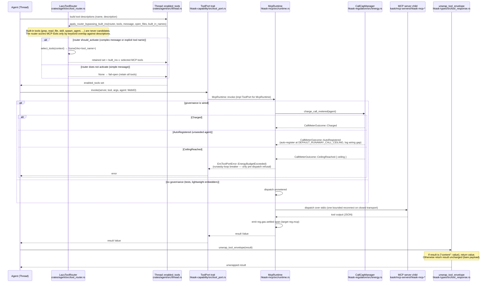

# MCP Tool Call — LazyToolRouter to McpRuntime::invoke to unwrap_tool_envelope

Reference-quadrant sequence diagram of an MCP tool call from the agent's
tool-use loop. The `LazyToolRouter` filters MCP candidates by keyword score
but **bypasses built-in tools** (they are never candidates). The retained
tool set reaches `McpRuntime::invoke`, which meters one call against the
agent's per-tick runaway ceiling and dispatches — it does **not** authorize
(the per-call capability gate was removed 2026-08-12, RR-0056). The result is
unwrapped from its `{"content": value}` envelope by `unwrap_tool_envelope`.
Every participant and message traces to a grep-verified symbol.

## The sequence

## The built-in bypass

`apply_router_bypassing_built_ins` (in `crates/agent/src/tool_router.rs`) is
the single seam that protects built-in tools. It builds the router's
candidate set from MCP tools only — built-in tools (`grep`, `read_file`,
`skill`, `spawn_agent`, `edit_file`, `write_file`, `fetch`, `web_search`,
...) are passed through unconditionally via the `built_in_names` set. The
router never scores them, so it can never drop them. This is the canonical
pattern: built-in tools bypass the `LazyToolRouter`; MCP tools are filtered.

`LazyToolRouter::select_tools` activates only when the message is complex
(≥ `complex_word_threshold` = 6 words) or explicitly mentions a tool name.
For simple greetings or short questions it returns `None` (fail-open — retain
all tools). The thresholds (`threshold: 0.30`, `complex_word_threshold: 6`)
are pinned by `default_thresholds_are_the_documented_values` and must match
`KaskToolRouterSettings::default()` in `kask_bridge`.

## The metering gate (not an authorization gate)

`McpRuntime::invoke` performs **no per-call authorization**. The prior
`DelegationToken` gate compared a caller-supplied tool name against itself
and denied nothing (RR-0056); it was removed. The only pre-dispatch refusal
is `ToolPortError::EnergyBudgetExceeded`, returned when
`CallMeterOutcome::CeilingReached` is reached — the runaway-loop breaker.

The meter is fail-open on an **unregistered** agent: it auto-registers at
`DEFAULT_RUNAWAY_CALL_CEILING` (10 000) and logs the wiring gap rather than
refusing (RR-0057). A missing seed is a wiring omission, not an
authorization decision. A runtime with no governance wired dispatches
unmetered rather than failing closed.

## Where authority is actually enforced

`McpRuntime::invoke`'s metering is not the authorization surface. Tool
authority is enforced at three allowlist boundaries:
- the per-request `tool_allowlist` on the inference IPC `tool_invoke`
  dispatch (`kask/crates/kask_bridge/src/inference_ipc_server.rs`), fail-closed
  on a missing or empty allowlist
- each swarm agent card's declared `mcp_tools` allowlist
  (`kask/mcp-servers/hkask-mcp-swarm/src/agent_executor.rs`)
- the per-server MCP env/credential allowlists
  (`kask/crates/kask_bridge/src/mcp_servers.rs`, `BuiltinMcpServer.credentials`)

## The envelope seam

Every MCP tool response is a `{"content": <value>}` envelope.
`unwrap_tool_envelope` (`hkask-types/src/tool_response.rs:61-63`) is the
single seam that extracts the inner value: if the payload is an object with
a `content` key, it returns that key's value; otherwise it returns the
payload unchanged. `parse_tool_response` composes JSON parse + unwrap. The
property `unwrap_tool_envelope({"content": P}) == P` for all JSON payloads
`P` is pinned by proptest in `hkask-types/src/tool_response.rs` and
`hkask-templates/tests/executor_properties.rs`.

## Related

- [Skill ↔ MCP ↔ Lisp Architecture](./architecture-skill-mcp-lisp-seam.md) — the three-surface seam
- [MCP Runtime Invoke — Metering and Dispatch Flow](./flowchart-mcp-runtime-invoke.md) — the metering detail
- [Skill Invocation Flowchart](./flowchart-skill-invocation.md) — the `execute` step's caller path
- [Credential Resolution ERD](./erd-credential-resolution.md) — the credential chain that feeds `McpRuntime`

<!-- DIAGRAM_ALIGNMENT
id: DIAG-SEQ-MCP-TOOL-CALL-001
verified_date: 2026-08-15
verified_against: crates/agent/src/tool_router.rs (LazyToolRouter, apply_router_bypassing_built_ins, ToolRouter trait, select_tools, should_activate, default_thresholds_are_the_documented_values); crates/agent/src/thread.rs (enabled_tools calls apply_router_bypassing_built_ins); kask/crates/hkask-capability/src/tool_port.rs (ToolPort trait, ToolPortError::EnergyBudgetExceeded, invoke); kask/crates/hkask-mcp/src/runtime.rs (impl ToolPort for McpRuntime, charge_call_metered, CallMeterOutcome branches); kask/crates/hkask-regulation/src/energy.rs (CallMeterOutcome, CallCapManager::charge_metered, DEFAULT_RUNAWAY_CALL_CEILING); kask/crates/hkask-types/src/tool_response.rs (unwrap_tool_envelope, parse_tool_response); kask/crates/kask_bridge/src/inference_ipc_server.rs (tool_allowlist gate); kask/mcp-servers/hkask-mcp-swarm/src/agent_executor.rs (mcp_tools allowlist); kask/crates/kask_bridge/src/mcp_servers.rs (BuiltinMcpServer.credentials)
status: VERIFIED
-->
