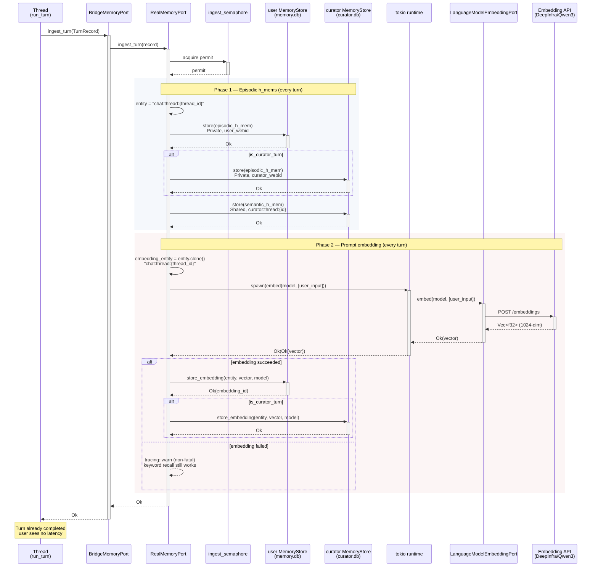

# Memory Ingest — Turn → h_mem + embedding

Sequence diagram of `RealMemoryPort::ingest_turn` — the path from a completed
thread turn to stored episodic h_mems + a stored prompt embedding. This is
the write side of the memory system. The read side is
[Memory Recall Flow](./flowchart-memory-recall.md).

The ingestion is fire-and-forget from the thread's perspective: the turn has
already completed and the user sees no latency. An ingestion semaphore
serializes concurrent ingestions so they don't contend with the recall path
for the SQLite pool.

## Key invariants

1. **The embedding's `entity_ref` equals the h_mem's `entity`**
   (`chat:thread:{thread_id}`). This is the join key for recall. See
   [Memory Store ERD](./erd-memory-store.md).

2. **Both user and curator stores receive the embedding** for curator turns,
   so the curator can recall its own turns by similarity.

3. **Embedding failure is non-fatal.** The episodic h_mem is still stored;
   recall degrades to keyword-only for that turn.

4. **Consolidation is decoupled.** It runs on a background timer, not in the
   ingestion path. See `start_consolidation_timer` in `RealMemoryPort`.

## Related

- [Memory Recall Flow](./flowchart-memory-recall.md) — the read side
- [Memory Store ERD](./erd-memory-store.md) — the storage schema
- [Memory System Specification](../architecture/memory-system-specification.md) — the architecture spec
- [D6: Thread → memory](../../DIVERGENCE.md) — the divergence seam

<!-- DIAGRAM_ALIGNMENT
id: DIAG-PL-MEMORY-INGEST
verified_date: 2026-08-10
verified_against: kask/crates/kask_bridge/src/memory.rs:1000
status: VERIFIED
-->
