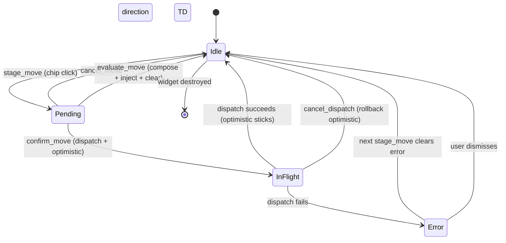

# Kanban Move Controller (State)

`KanbanMoveController` (`crates/hkask-kanban-widget/src/move_controller.rs`)
owns the kanban move dispatch state machine. The widget delegates move
lifecycle calls to it and renders the dispatch-status banner by reading
controller state via accessors (`pending_move`, `dispatch_in_flight`,
`dispatch_error`). The controller is a pure state machine — it does not render.

The lifecycle is: `stage_move` (user clicks a move chip) stages a pending move
and shows a Confirm/Cancel/Evaluate banner. `confirm_move` takes the pending
move and dispatches it via `shared_tool_invoker()` (metered against the panel
persona's call ceiling; not capability-gated — RR-0056),
applying an optimistic local mutation first. `cancel_move` drops the pending
move without dispatch. `cancel_dispatch` rolls back the optimistic move if the
dispatch is still in flight. `evaluate_move` composes an evaluation request
from the pending move and injects it into the active conversation, then clears
the pending move (no double-evaluate). See the [Kanban Widget Class
Diagram](class-hkask-kanban-widget.md) and the [Task Status State
Diagram](state-task-status.md).

<!-- DIAGRAM_ALIGNMENT
id: DIAG-STATE-KANBAN-MOVE
verified_date: 2026-08-09
verified_against: crates/hkask-kanban-widget/src/move_controller.rs; crates/hkask-kanban-widget/src/view.rs
status: VERIFIED
-->
