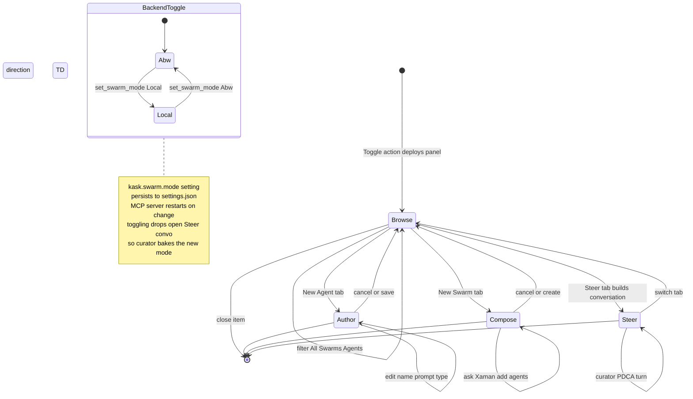

# Swarm Panel Modes (State)

The `SwarmPanel` (`crates/swarm_panel/src/swarm_panel.rs:574`) has four
`PanelMode` states (`:289`), exposed as a header tab bar. The user can switch
freely between any of the four at any time via `set_mode` (`:1798`), which
also moves focus to the target mode's first field (the M5 fix). Entering
`Steer` lazily constructs the curator `ConversationView` via
`ensure_steer_conversation` (`:1870`), baking the current backend mode into its
system prompt. A backend toggle (`set_swarm_mode`, `:1834`) drops any open
Steer conversation so the next entry rebuilds it with the new mode — otherwise
the curator would pass a stale `context.mode` to the skill cascade. The panel
opens to `Browse` via the `Toggle` action (`:230`); `ToggleFocus` only focuses
an existing item. See the [Swarm Systems How-to](../diataxis/swarm_system/how-to.md) and the [Swarm Cybernetics/Semantics Audit](../audits/swarm-cybernetics-semantics-audit.md).

<!-- DIAGRAM_ALIGNMENT
id: DIAG-DIA-SWARM-007
verified_date: 2026-08-04
verified_against: crates/swarm_panel/src/swarm_panel.rs:230,261,289,1798,1834,1870; crates/swarm_panel/src/panel_button.rs:13
status: VERIFIED
-->