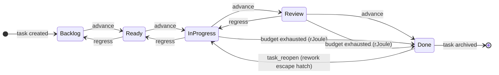

# Task Status Lifecycle (State)

`TaskStatus` (`kask/crates/hkask-types/src/kanban_status.rs`) is the single
source of truth for the five standard kanban task-status wire strings. Both the
`hkask-mcp-kata-kanban` MCP server and the `hkask-kanban-widget` GPUI view
import it, so the wire strings and transition rules cannot drift between them.

Column ordering is strict: transitions may only advance forward or regress one
step backward (`can_transition_to`). Skipping columns is prohibited. The one
exception is `KanbanService::task_reopen`, which moves Done→InProgress directly
(skipping Review) as an explicit rework escape hatch — the only sanctioned
multi-step transition.

Budget exhaustion (`task_gas_exhaust` / `task_rjoule_exhaust`) moves a task to
Done from InProgress or Review regardless of the one-step rule, stamping a
failed verification. See the [Kanban Widget Class
Diagram](class-hkask-kanban-widget.md) and the [Move Controller State
Diagram](state-kanban-move-controller.md).

<!-- DIAGRAM_ALIGNMENT
id: DIAG-STATE-TASK-STATUS
verified_date: 2026-08-09
verified_against: kask/crates/hkask-types/src/kanban_status.rs; kask/mcp-servers/hkask-mcp-kata-kanban/src/kanban/service_impl/dejam.rs
status: VERIFIED
-->
