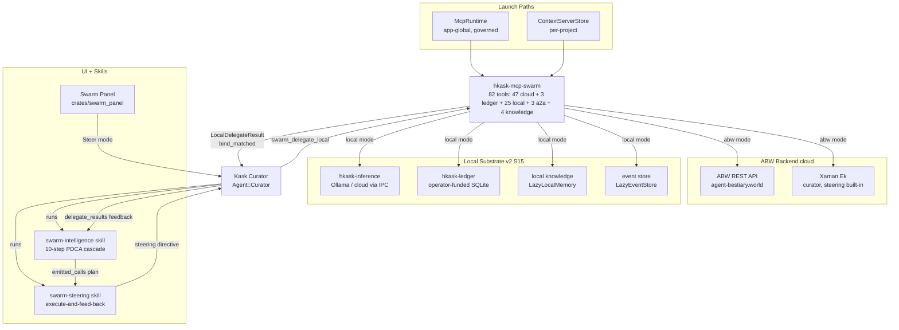
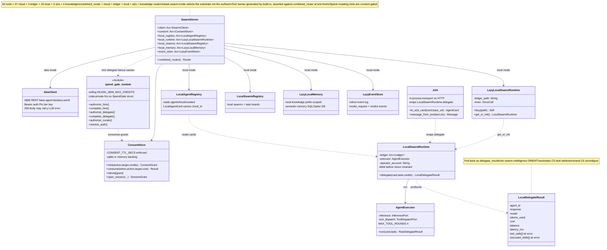
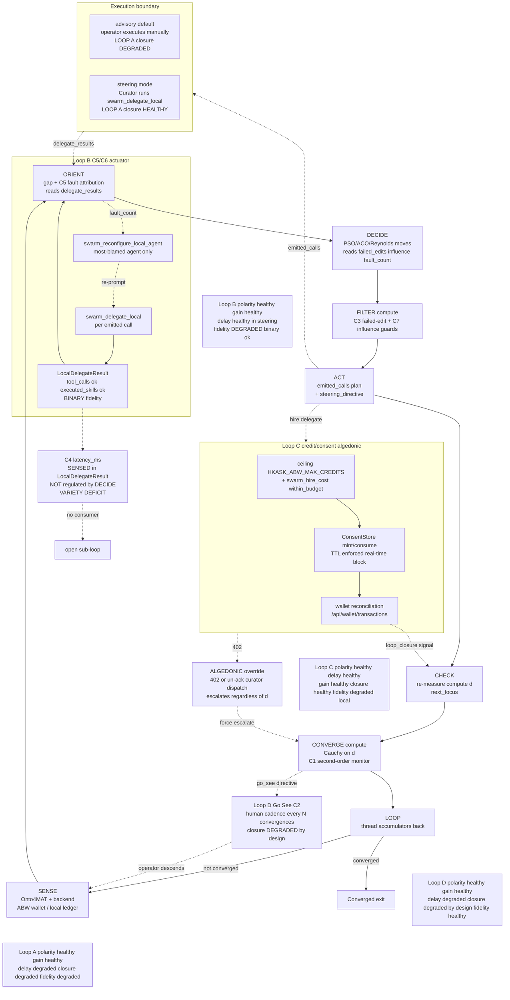
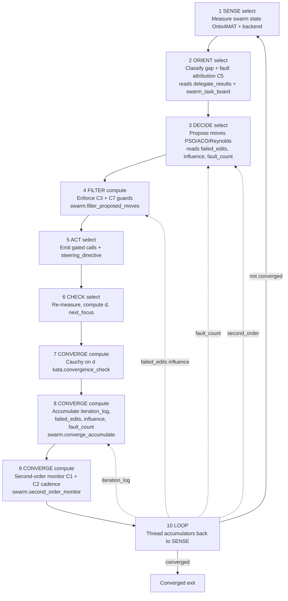

# Swarm Diagrams

Consolidated diagrams for the swarm system: the `hkask-mcp-swarm` server
(architecture + class), the swarm panel modes, the cybernetic feedback-loop
map, the `swarm-intelligence` PDCA cascade, and the steering loop. Unique
`DIAGRAM_ALIGNMENT` IDs are preserved from the originals. Every diagram was
re-verified against current code on 2026-08-28.

## Swarm MCP Server Architecture

The swarm server (`hkask-mcp-swarm`) exposes **82 tools** across five
routers, selected by `kask.swarm.mode`. It is launched by two independent
paths — `McpRuntime` (app-global, governed dispatch for the skill cascade)
and `ContextServerStore` (per-project, for the agent tool picker) — both
correct by design, and both compute the same consent-store path so consent
tokens are consumable across processes.

**Corrections (2026-08-28):** the tool surface grew from 61 (27 ABW + 34
local) to **82** (47 cloud + 3 ledger + 25 local + 3 A2A + 4 knowledge); the
router composition is now `cloud_swarm_router + ledger_router + local_router
+ a2a_router + knowledge_router`; the tool-name list is generated by
`build.rs` from `pub(crate) async fn swarm_*` signatures and asserted against
the live `combined_router()` surface at test time.



<!-- DIAGRAM_ALIGNMENT
id: DIAG-DIA-SWARM-001
verified_date: 2026-08-28
verified_against: kask/mcp-servers/hkask-mcp-swarm/src/hkask_mcp_swarm.rs (combined_router L165-171 = cloud_swarm_router + ledger_router + local_router + a2a_router + knowledge_router; build.rs-generated tool_names.gen.rs L106-113; resolve_consent_store_path L186-199 — both launch paths); tool count: 82 unique pub(crate) async fn swarm_* across src/cloud_swarm_tools.rs (47), src/ledger_tools.rs (3), src/local_tools.rs (25), src/a2a_tools.rs (3), src/knowledge_tools.rs (4); crates/swarm_panel/src/swarm_panel.rs; .agents/skills/swarm-intelligence/SKILL.md; .agents/skills/swarm-steering/SKILL.md
status: VERIFIED
-->

## Swarm Server Class Diagram

`SwarmServer` composes seven collaborators: the ABW REST client, the consent
store (real-time spend gate with TTL), the local agent registry, the
lazily-initialized local runtime, the local swarm registry, the local
knowledge memory, and the event store. The spend gate consumes consent
grants before any debit; the local runtime owns the debit-before-return
invariant (it debits the ledger, then `AgentExecutor` returns the result so
a failed delegation still costs credits). The A2A layer wraps the existing
`delegate` in protocol-compliant types over the in-process transport (no
HTTP server required).

**Corrections (2026-08-28):** 82 tools (was 61); three new collaborators
(`local_swarms`, `local_memory`, `event_store`); the router is the sum of
five routers; the tool surface is pinned by the build.rs-generated
`tool_names.gen.rs` asserted against the live `combined_router()` at test
time (the former `tool_surface_is_exactly_53_registered_tools` pin was
replaced by the generated-list assertion).



<!-- DIAGRAM_ALIGNMENT
id: DIAG-DIA-SWARM-006
verified_date: 2026-08-28
verified_against: kask/mcp-servers/hkask-mcp-swarm/src/hkask_mcp_swarm.rs (mcp_server! struct block L152-162 — 7 collaborators; combined_router L165-171; tool_names.gen.rs include L113); kask/mcp-servers/hkask-mcp-swarm/src/consent.rs; kask/mcp-servers/hkask-mcp-swarm/src/spend_gate.rs; kask/mcp-servers/hkask-mcp-swarm/src/local_runtime.rs (check_bind L721, LazyEventStore re-export L140-143); kask/mcp-servers/hkask-mcp-swarm/src/agent_executor.rs (MAX_TOOL_ROUNDS L22); kask/mcp-servers/hkask-mcp-swarm/src/a2a_tools.rs; kask/mcp-servers/hkask-mcp-swarm/src/local_swarms.rs; kask/mcp-servers/hkask-mcp-swarm/src/local_knowledge.rs
status: VERIFIED
-->

## Swarm Panel Modes

The `SwarmPanel` (`crates/swarm_panel/src/swarm_panel.rs`) has **five**
`PanelMode` states, exposed as a header tab bar. The user can switch freely
between any of them at any time via `set_mode`, which also moves focus to
the target mode's first field.

**Corrections (2026-08-28):** `AppAuthor` was added as the fifth mode (App
authoring/detail — edit an existing App's manifest or create a new App;
entered via an App card click or the Author toggle when the Apps filter is
active; always cloud — ABW catalogue, no target toggle). `kask.swarm.mode`
is **not a capability gate** — both cloud and local backends are always
available (the swarm MCP server registers both tool sets in either mode; the
setting only selects a startup warning). Backend choice is now a per-form
`CreateTarget` (cloud/local), seeded from `kask.swarm.mode`. A
`kask.swarm.mode` change still tears down any open Steer conversation (the
Steer system prompt bakes the mode in at construction via
`ensure_steer_conversation`) and re-syncs open forms' targets.

```mermaid
stateDiagram-v2
    direction TD
    [*] --> Browse : Toggle action deploys panel
    Browse --> Browse : filter All Swarms Agents Apps
    Browse --> Author : New Agent tab
    Browse --> Compose : New Swarm tab
    Browse --> AppAuthor : App card click or Author toggle with Apps filter
    Browse --> Steer : Steer tab builds conversation
    Author --> Browse : cancel or save
    Author --> Author : edit name prompt type
    Compose --> Browse : cancel or create
    Compose --> Compose : ask Xaman add agents
    AppAuthor --> Browse : cancel or save
    AppAuthor --> AppAuthor : edit App manifest
    Steer --> Browse : switch tab
    Steer --> Steer : curator PDCA turn
    Browse --> [*] : close item
    Author --> [*]
    Compose --> [*]
    AppAuthor --> [*]
    Steer --> [*]

    state BackendChoice {
        [*] : per-form CreateTarget Cloud or Local
        note right of BackendChoice
            kask.swarm.mode setting (abw or local)
            NOT a capability gate — both tool sets
            always registered; selects startup warning
            seeds active_backend and the Steer prompt
            mode change tears down open Steer convo
            and re-syncs open form targets
        end note
    }
```

<!-- DIAGRAM_ALIGNMENT
id: DIAG-DIA-SWARM-007
verified_date: 2026-08-28
verified_against: crates/swarm_panel/src/swarm_panel.rs (PanelMode enum L494-506 — Browse, Author, Compose, AppAuthor, Steer; CreateTarget doc L388-399 — kask.swarm.mode not a capability gate; target_on_surface_entry L434-445 — AppAuthor always cloud; set_mode L1176-1193; current_swarm_mode L1290; ensure_steer_conversation L1302; last_swarm_mode observer L716-722, L897-929; Toggle action L91, L321-325; SwarmEntry::App L515-519)
status: VERIFIED
-->

## Swarm Feedback Loops — Cybernetic Map

The swarm system runs four coupled feedback loops. **Loop A** (PDCA
convergence) is the planner's inner loop; **Loop B** (C5/C6 steering
execution) closes only when the `swarm-steering` skill or the Curator in
steering mode feeds `delegate_results` back; **Loop C** (credit/consent
algedonic) is the strongest — the 402 / un-acknowledged curator dispatch
escalates regardless of the swarm-state distance `d` (the "never read as no
deviation" invariant); **Loop D** (Go See) is the intentionally-human outer
meta-loop. The diagram annotates each loop with its 5-property health and
marks the two structural gaps found in the audit: Loop B's binary `ok`
fidelity and the C4 latency sub-loop that is sensed but not regulated.
Verified current (skill files and consent/spend-gate code unchanged in
role).



<!-- DIAGRAM_ALIGNMENT
id: DIAG-DIA-SWARM-008
verified_date: 2026-08-28
verified_against: .agents/skills/swarm-intelligence/SKILL.md (10-phase cascade L67-76, C0/C2 rows L123-125); .agents/skills/swarm-steering/SKILL.md; kask/mcp-servers/hkask-mcp-swarm/src/consent.rs; kask/mcp-servers/hkask-mcp-swarm/src/spend_gate.rs; crates/swarm_panel/src/swarm_panel.rs
status: VERIFIED
-->

## Swarm Intelligence PDCA Cascade

The `swarm-intelligence` skill runs a 10-step PDCA cascade that composes and
steers swarms. Steps 4, 7, 8, 9 are deterministic `compute` steps (no LLM) —
the cybernetic accumulators and guards live in the math layer, not in LLM
templates, because an LLM cannot reliably maintain a running set/sum across
LOOP iterations. The FILTER (step 4) deterministically enforces the C3
failed-edit and C7 influence guards. The CONVERGE steps (7–9) check
convergence, accumulate iteration_log/failed_edits/influence_scores/
fault_count, and run the second-order monitor (C1 reasoning-loop +
sensor-truth-divergence + C2 Go See cadence). The LOOP (step 10) threads the
accumulators back. Verified current — the SKILL.md 10-phase table matches.



<!-- DIAGRAM_ALIGNMENT
id: DIAG-DIA-SWARM-009
verified_date: 2026-08-28
verified_against: .agents/skills/swarm-intelligence/SKILL.md (Phase 1-10 cascade L67-76; ORIENT reads swarm_task_board + delegate_results reasoning_steps L68; accumulator content L74)
status: VERIFIED
-->

## Swarm Steering Loop

The steering loop closes the C5/C6 feedback boundary. The swarm-intelligence
cascade plans (emits `emitted_calls`); the executor (the Kask Curator in
steering mode, or the operator in advisory mode) runs the delegations via
`swarm_delegate_local`, collects `LocalDelegateResult` objects, and feeds
them back as `delegate_results` on the next swarm-intelligence invocation —
activating C5 (fault attribution from `tool_calls[].ok`/`executed_skills[].ok`)
and C6 (reconfigure the most-blamed agent). The `swarm-steering` skill
codifies the execute-and-feed-back directive. Verified current.

```mermaid
sequenceDiagram
    participant Curator as Kask Curator
    participant SI as swarm-intelligence
    participant SS as swarm-steering
    participant Swarm as hkask-mcp-swarm

    Note over Curator,Swarm: advisory mode operator executes manually; steering mode Curator executes
    Curator->>SI: invoke with task + swarm_id + steering_mode
    SI->>SI: 10-step PDCA cascade plans
    SI-->>Curator: emitted_calls plan + steering_directive

    alt steering mode
        Curator->>SS: invoke with emitted_calls
        SS-->>Curator: steering directive execution_sequence + collection_shape
        loop each delegate emitted call
            Curator->>Swarm: swarm_delegate_local agent task credits
            Swarm->>Swarm: Rung 4 Binding check_bind<br/>Rung 1-2 admission already passed at authoring
            Swarm->>Swarm: skill cascade + tool loop + ledger debit
            Swarm-->>Curator: LocalDelegateResult agent_id response tool_calls bind_matched
        end
        Curator->>Curator: collect LocalDelegateResults into delegate_results array
        Curator->>SI: re-invoke with delegate_results + steering_mode
        Note right of SI: ORIENT attributes fault C5; fault_count accumulates; C6 reconfigures
        SI->>SI: next PDCA iteration with real telemetry
    else advisory mode
        Curator-->>Curator: plan is final output; operator executes manually
        Note over Curator: operator feeds delegate_results back on next invocation
    end
```

<!-- DIAGRAM_ALIGNMENT
id: DIAG-DIA-SWARM-010
verified_date: 2026-08-28
verified_against: .agents/skills/swarm-steering/SKILL.md; .agents/skills/swarm-intelligence/SKILL.md (L67-76, L147, L156, L184); kask/mcp-servers/hkask-mcp-swarm/src/local_runtime.rs (check_bind L721); swarm_delegate_local registered in src/local_tools.rs
status: VERIFIED
-->

## See also

- [Architecture diagrams](./architecture.md) — tool port, event store, credential chain
- [UI widget diagrams](./ui-widgets.md) — the `SwarmWidget` class diagram
- [Swarm MCP Server Reference](../reference/mcp-servers/swarm.md)
