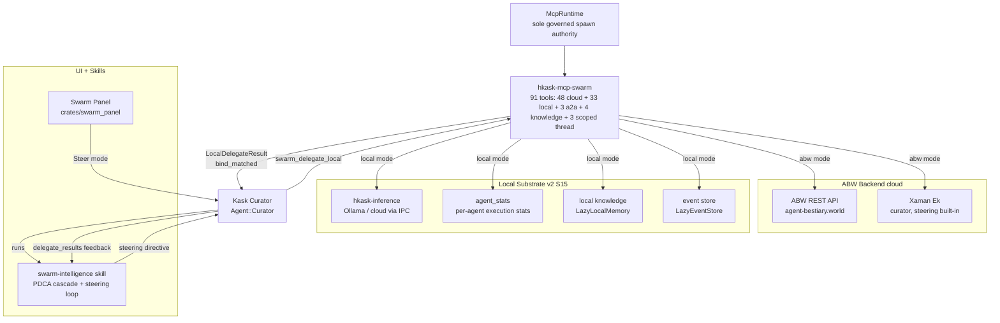
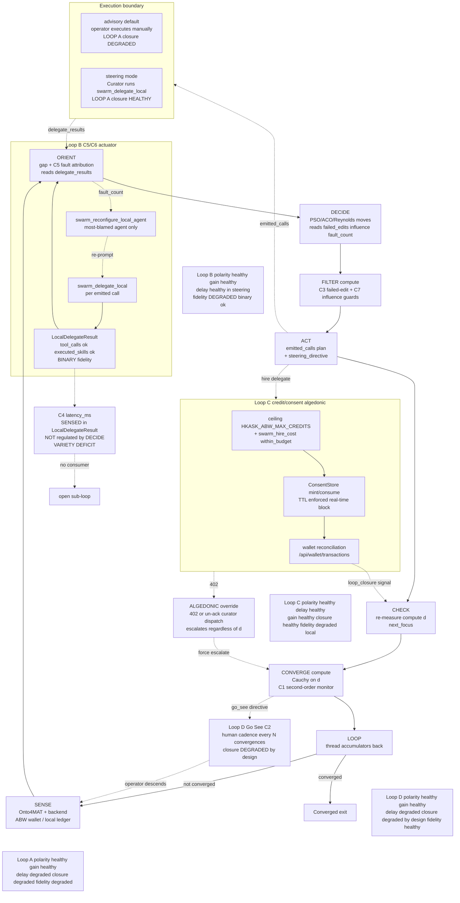
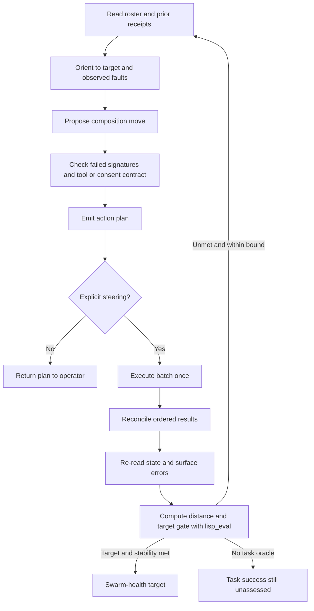

# Swarm Diagrams

Consolidated diagrams for the swarm system: the `hkask-mcp-swarm` server
(architecture + class), the swarm panel modes, the cybernetic feedback-loop
map, the `swarm-intelligence` PDCA cascade, and the steering loop. Unique
`DIAGRAM_ALIGNMENT` IDs are preserved from the originals. Every diagram was
re-verified against current code on 2026-09-28; the class diagram was
regenerated for the ninth collaborator and the expanded `LocalDelegateResult`.

## Swarm MCP Server Architecture

The swarm server (`hkask-mcp-swarm`) exposes **91 tools** across four
routers. The governed `McpRuntime` is the sole Kask MCP spawn authority;
`kask.swarm.mode` selects the execution substrate, not the tool surface.
The agent tool picker reads from that runtime, not a second per-project
`ContextServerStore` child (`crates/zed/src/main.rs:1019-1021`, the single
spawn authority).

**Current router (2026-09-23):** **91** tools (48 cloud + 33 local + 3 A2A
+ 4 knowledge + 3 swarm-scoped thread tools); the router composition is
`cloud_swarm_router + local_router + a2a_router + knowledge_router`
(`hkask_mcp_swarm.rs:160-166`) — the former `ledger_router` was removed with
`hkask-ledger` and the local budget system (2026-09-08); `swarm_fleet_digest_local`
and `swarm_select_agent_local` were added 2026-09-09 with the fermi absorption
(`256f87307c`). The tool-name list is generated by `build.rs` from
`pub(crate) async fn swarm_*` signatures and asserted against the live
`combined_router()` surface at test time.

```mermaid
flowchart TD
    MR[McpRuntime<br/>sole governed spawn authority]
    SWARM[hkask-mcp-swarm<br/>91 tools: 48 cloud + 33 local + 3 a2a + 4 knowledge + 3 scoped thread]
    MR --> SWARM

    subgraph abw[ABW Backend cloud]
        ABW_API[ABW REST API<br/>agent-bestiary.world]
        XAMAN[Xaman Ek<br/>curator, steering built-in]
    end

    subgraph local[Local Substrate v2 S15]
        INF[hkask-inference<br/>Ollama / cloud via IPC]
        STATS[agent_stats<br/>per-agent execution stats]
        MEMORY[local knowledge<br/>LazyLocalMemory]
        EVENTS[event store<br/>LazyEventStore]
    end

    SWARM -->|abw mode| ABW_API
    SWARM -->|abw mode| XAMAN
    SWARM -->|local mode| INF
    SWARM -->|local mode| STATS
    SWARM -->|local mode| MEMORY
    SWARM -->|local mode| EVENTS

    subgraph ui[UI + Skills]
        PANEL[Swarm Panel<br/>crates/swarm_panel]
        SI[swarm-intelligence skill<br/>PDCA cascade + steering loop]
    end
    PANEL -->|Steer mode| CURATOR[Kask Curator<br/>Agent::Curator]
    CURATOR -->|runs| SI
    SI -->|steering directive| CURATOR
    CURATOR -->|swarm_delegate_local| SWARM
    SWARM -->|LocalDelegateResult<br/>bind_matched| CURATOR
    CURATOR -->|delegate_results feedback| SI
```

<!-- DIAGRAM_ALIGNMENT
id: DIAG-DIA-SWARM-001
verified_date: 2026-09-28
verified_against: kask/mcp-servers/hkask-mcp-swarm/src/hkask_mcp_swarm.rs (combined_router four-router composition L160-166, tool_surface_is_exactly_90_registered_tools L1031-1035, partition comment L1008-1023); crates/zed/src/main.rs (single spawn authority L1019-1021, L1420-1421); crates/swarm_panel/src/swarm_panel.rs; .agents/skills/swarm-intelligence/SKILL.md
status: VERIFIED
-->

## Swarm Server Class Diagram

`SwarmServer` composes nine collaborators: the ABW REST client, the consent
store (real-time spend gate with TTL), the local agent registry, the
lazily-initialized local runtime, the local swarm registry, the local
knowledge memory, the per-agent stats store, the event store, and the
encrypted member-conversation thread store. The spend
gate consumes consent grants before any debit (cloud delegation only); the
local runtime measures the run (tokens, latency, per-agent stats) — there is
no spending policy on the local substrate: local agents run on the
operator's own substrate, so nothing is priced or gated
(`local_runtime.rs:161-164`). The A2A layer wraps the existing `delegate`
in protocol-compliant types over the in-process transport (no HTTP server
required).

**Regenerated (2026-10-10):** `GateCounterStore` is the tenth collaborator
(the per-agent grounding-gate counter store behind
`swarm_gate_readings` — fermi's gate-account readings, aggregate pattern
visibility only per the operator's 2026-10-10 ruling; the runtime counts
at both `grade()` sites, the tool surfaces the readings), alongside the
ninth, `SwarmThreadStore` (the encrypted member-conversation store behind
the swarm-scoped thread tools). `LocalDelegateResult` carries the
fermi-absorption trust fields (`rollout_id`, `reasoning_steps`,
`input_contract_check`, `output_contract_check`, `grounding`,
`completeness`, `reliance`, `memory`) alongside the C4 `latency_ms` and C5
`task_success`/`bind_matched` fields. The 91-tool pin and the
build.rs-generated `tool_names.gen.rs` asserted against the live
`combined_router()` at test time are unchanged in mechanism.

```mermaid
classDiagram
    direction TD
    class SwarmServer {
        +client: Arc~SwarmClient~
        +consent: Arc~ConsentStore~
        +local_registry: Arc~LocalAgentRegistry~
        +local_runtime: Arc~LazyLocalSwarmRuntime~
        +local_swarms: Arc~LocalSwarmRegistry~
        +local_memory: Arc~LazyLocalMemory~
        +agent_stats: Arc~AgentStatsStore~
        +event_store: Arc~LazyEventStore~
        +thread_store: Arc~SwarmThreadStore~
        +combined_router() Router
    }
    class SwarmClient {
        ABW REST base agent-bestiary.world
        Bearer auth Pro tier key
        200 body may carry LLM error
    }
    class ConsentStore {
        +mint(action,target,credits) ConsentGrant
        +consume(token,action,target,cost) Result
        +refund(grant)
        +open_session(...) SessionGrant
        -CONSENT_TTL_SECS enforced
        -sqlite or memory backing
    }
    class spend_gate_module {
        <<module>>
        +authorize_hire()
        +complete_hire()
        +authorize_delegate()
        +complete_delegate()
        +authorize_curate()
        +resolve_auth()
        ceiling HKASK_ABW_MAX_CREDITS
        crate-private fns no SpendGate struct
    }
    class LazyLocalSwarmRuntime {
        -agent_stats: Arc~AgentStatsStore~
        -default_agent_model: String
        -inner: OnceCell
        +lazy(agent_stats, model) Self
        +get_or_init() LocalSwarmRuntime
    }
    class LocalSwarmRuntime {
        -executor: AgentExecutor
        -capture_drops: Arc~AtomicUsize~
        -agent_stats: Arc~AgentStatsStore~
        +delegate(card,task) LocalDelegateResult
        measures the run no spending policy
    }
    class AgentExecutor {
        -inference: InferencePort
        -tool_dispatch: ToolDispatchPort
        +run(card,task) RawDelegateResult
        MAX_TOOL_ROUNDS 4
    }
    class LocalAgentRegistry {
        reads agents/local/curated
        LocalAgentCard carries cloud_id
    }
    class LocalSwarmRegistry {
        local swarms + task boards
    }
    class LazyLocalMemory {
        local knowledge prefix-scoped
        semantic memory SQLCipher DB
    }
    class AgentStatsStore {
        per-agent execution stats
        reads swarm_get_local_agent
    }
    class LazyEventStore {
        rollout event log
        model_request + verdict events
    }
    class SwarmThreadStore {
        encrypted member conversations
        ThreadTurn sequence-ordered
        lock(swarm_id) ThreadLock
    }
    class A2A {
        +to_a2a_card(card,base_url) AgentCard
        +message_from_text(text,ctx) Message
        in-process transport no HTTP
        wraps LocalSwarmRuntime.delegate
    }
    class LocalDelegateResult {
        agent_id
        response
        model
        tokens_used
        latency_ms
        tool_calls[] ok error
        task_success verdict optional
        bind_matched optional
        rollout_id optional
        reasoning_steps[]
        input_contract_check optional
        output_contract_check optional
        grounding report optional
        completeness report optional
        reliance one-token verdict
        memory ingestion report
    }

    SwarmServer --> SwarmClient : abw mode
    SwarmServer --> ConsentStore
    SwarmServer --> LocalAgentRegistry : local mode
    SwarmServer --> LazyLocalSwarmRuntime : local mode
    SwarmServer --> LocalSwarmRegistry : local mode
    SwarmServer --> LazyLocalMemory : local mode
    SwarmServer --> AgentStatsStore : local mode
    SwarmServer --> LazyEventStore : local mode
    SwarmServer --> SwarmThreadStore : scoped threads
    spend_gate_module ..> ConsentStore : consumes grants
    SwarmServer ..> spend_gate_module : hire delegate fanout xaman
    LazyLocalSwarmRuntime ..> LocalSwarmRuntime : get_or_init
    LocalSwarmRuntime --> AgentExecutor : run
    LocalSwarmRuntime ..> LocalDelegateResult : produces
    A2A ..> LocalSwarmRuntime : wraps delegate
    LocalAgentRegistry ..> LocalSwarmRuntime : reads cards

    note for SwarmServer "90 tools = 48 cloud + 32 local + 3 a2a + 4 knowledge + 3 scoped thread\ncombined_router = cloud + local + a2a + knowledge routers\nkask.swarm.mode selects the substrate not the surface\nTool names generated by build.rs, asserted against combined_router at test time\nSpend mutating tools are consent gated"
    note for LocalDelegateResult "Fed back as delegate_results\nto swarm-intelligence ORIENT\nactivates C5 fault attribution\nand C6 reconfigure"
```

<!-- DIAGRAM_ALIGNMENT
id: DIAG-DIA-SWARM-006
verified_date: 2026-09-28
verified_against: kask/mcp-servers/hkask-mcp-swarm/src/hkask_mcp_swarm.rs (SwarmServer struct L148-158 — nine collaborators incl. thread_store, combined_router L160-166, 90-tool pin L1031-1035); kask/mcp-servers/hkask-mcp-swarm/src/consent.rs (CONSENT_TTL_SECS L76, mint L221, consume L255); kask/mcp-servers/hkask-mcp-swarm/src/spend_gate.rs (resolve_auth L50, authorize_hire L130, complete_hire L287, authorize_delegate L380, complete_delegate L468, authorize_curate L544); kask/mcp-servers/hkask-mcp-swarm/src/local_runtime.rs (LazyLocalSwarmRuntime L46-53, lazy L134, LocalSwarmRuntime L164, delegate L318, LocalDelegateResult L658-750 — no cost/balance fields, no-spending-policy doc L161-164); kask/mcp-servers/hkask-mcp-swarm/src/agent_executor.rs (MAX_TOOL_ROUNDS L21); kask/mcp-servers/hkask-mcp-swarm/src/a2a_tools.rs; kask/mcp-servers/hkask-mcp-swarm/src/local_swarms.rs; kask/mcp-servers/hkask-mcp-swarm/src/local_knowledge.rs; kask/mcp-servers/hkask-mcp-swarm/src/agent_stats.rs; kask/mcp-servers/hkask-mcp-swarm/src/thread_store.rs (SwarmThreadStore L17, ThreadTurn L9, lock L38)
status: VERIFIED
-->

## Swarm Panel Modes

The `SwarmPanel` (`crates/swarm_panel/src/swarm_panel.rs`) has **five**
`PanelMode` states, exposed as a header tab bar. The user can switch freely
between any of them at any time via `set_mode`, which also moves focus to
the target mode's first field.

**Corrections (2026-08-28):** `AppAuthor` was added as the fifth mode (App
authoring/detail — edit an existing App's manifest or create a new App;
entered via an App card click or the Author toggle when the Apps filter is
active; always cloud — ABW catalogue, no target toggle). `kask.swarm.mode`
is **not a capability gate** — both cloud and local backends are always
available (the swarm MCP server registers both tool sets in either mode; the
setting only selects a startup warning). Backend choice is now a per-form
`CreateTarget` (cloud/local), seeded from `kask.swarm.mode`. A
`kask.swarm.mode` change still tears down any open Steer conversation (the
Steer system prompt bakes the mode in at construction via
`ensure_steer_conversation`) and re-syncs open forms' targets.

```mermaid
stateDiagram-v2
    direction TD
    [*] --> Browse : Toggle action deploys panel
    Browse --> Browse : filter All Swarms Agents Apps
    Browse --> Author : New Agent tab
    Browse --> Compose : New Swarm tab
    Browse --> AppAuthor : App card click or Author toggle with Apps filter
    Browse --> Steer : Steer tab builds conversation
    Author --> Browse : cancel or save
    Author --> Author : edit name prompt type
    Compose --> Browse : cancel or create
    Compose --> Compose : ask Xaman add agents
    AppAuthor --> Browse : cancel or save
    AppAuthor --> AppAuthor : edit App manifest
    Steer --> Browse : switch tab
    Steer --> Steer : curator PDCA turn
    Browse --> [*] : close item
    Author --> [*]
    Compose --> [*]
    AppAuthor --> [*]
    Steer --> [*]

    state BackendChoice {
        [*] : per-form CreateTarget Cloud or Local
        note right of BackendChoice
            kask.swarm.mode setting (abw or local)
            NOT a capability gate — both tool sets
            always registered; selects startup warning
            seeds active_backend and the Steer prompt
            mode change tears down open Steer convo
            and re-syncs open form targets
        end note
    }
```

<!-- DIAGRAM_ALIGNMENT
id: DIAG-DIA-SWARM-007
verified_date: 2026-09-28
verified_against: crates/swarm_panel/src/swarm_panel.rs (PanelMode enum L433-445 — Browse, Author, Compose, AppAuthor, Steer; CreateTarget L368-370 — per-form Cloud/Local; target_on_surface_entry L395 — AppAuthor always cloud; set_mode L821; current_swarm_mode L874; ensure_steer_conversation L887; last_swarm_mode observer L615, L708-722; Toggle action L92, registered L297; SwarmEntry::App L454-458)
status: VERIFIED
-->

## Swarm Feedback Loops — Cybernetic Map

The swarm system runs four coupled feedback loops. **Loop A** (PDCA
convergence) is the planner's inner loop; **Loop B** (C5/C6 steering
execution) closes only when swarm-intelligence's steering loop (the Curator
or a human in steering mode) feeds `delegate_results` back; **Loop C** (credit/consent
algedonic) is the strongest — the 402 / un-acknowledged curator dispatch
escalates regardless of the swarm-state distance `d` (the "never read as no
deviation" invariant); **Loop D** (Go See) is the intentionally-human outer
meta-loop. The diagram annotates each loop with its 5-property health and
marks the two structural gaps found in the audit: Loop B's binary `ok`
fidelity and the C4 latency sub-loop that is sensed but not regulated.
Verified current (skill files and consent/spend-gate code unchanged in
role).

```mermaid
flowchart TD
    SENSE["SENSE<br/>Onto4MAT + backend<br/>ABW wallet / local ledger"]
    ORIENT["ORIENT<br/>gap + C5 fault attribution<br/>reads delegate_results"]
    DECIDE["DECIDE<br/>PSO/ACO/Reynolds moves<br/>reads failed_edits influence fault_count"]
    FILTER["FILTER compute<br/>C3 failed-edit + C7 influence guards"]
    ACT["ACT<br/>emitted_calls plan<br/>+ steering_directive"]
    CHECK["CHECK<br/>re-measure compute d<br/>next_focus"]
    CONV["CONVERGE compute<br/>Cauchy on d<br/>C1 second-order monitor"]
    LOOP["LOOP<br/>thread accumulators back"]

    SENSE --> ORIENT --> DECIDE --> FILTER --> ACT --> CHECK --> CONV --> LOOP
    LOOP -->|not converged| SENSE
    LOOP -->|converged| DONE[Converged exit]

    subgraph exec["Execution boundary"]
        direction LR
        ADV["advisory default<br/>operator executes manually<br/>LOOP A closure DEGRADED"]
        STEER["steering mode<br/>Curator runs swarm_delegate_local<br/>LOOP A closure HEALTHY"]
    end
    ACT -.->|emitted_calls| exec
    exec -.->|delegate_results| ORIENT

    subgraph c6["Loop B C5/C6 actuator"]
        direction LR
        DL["swarm_delegate_local<br/>per emitted call"]
        RES["LocalDelegateResult<br/>tool_calls ok executed_skills ok<br/>BINARY fidelity"]
        RC["swarm_reconfigure_local_agent<br/>most-blamed agent only"]
        DL --> RES --> ORIENT
        ORIENT -.->|fault_count| RC
        RC -.->|re-prompt| DL
    end

    subgraph cred["Loop C credit/consent algedonic"]
        direction LR
        CEIL["ceiling HKASK_ABW_MAX_CREDITS<br/>+ swarm_hire_cost within_budget"]
        CONSENT["ConsentStore mint/consume<br/>TTL enforced real-time block"]
        WALLET["wallet reconciliation<br/>/api/wallet/transactions"]
        CEIL --> CONSENT --> WALLET
    end
    ACT -.->|hire delegate| cred
    WALLET -.->|loop_closure signal| CHECK

    ALG["ALGEDONIC override<br/>402 or un-ack curator dispatch<br/>escalates regardless of d"]
    cred -.->|402| ALG
    ALG -.->|force escalate| CONV

    GSEE["Loop D Go See C2<br/>human cadence every N convergences<br/>closure DEGRADED by design"]
    CONV -.->|go_see directive| GSEE
    GSEE -.->|operator descends| SENSE

    LAT["C4 latency_ms<br/>SENSED in LocalDelegateResult<br/>NOT regulated by DECIDE<br/>VARIETY DEFICIT"]
    RES -.-> LAT
    LAT -.->|no consumer| X["open sub-loop"]

    noteA["Loop A polarity healthy gain healthy<br/>delay degraded closure degraded fidelity degraded"]
    noteB["Loop B polarity healthy gain healthy<br/>delay healthy in steering<br/>fidelity DEGRADED binary ok"]
    noteC["Loop C polarity healthy delay healthy<br/>gain healthy closure healthy fidelity degraded local"]
    noteD["Loop D polarity healthy gain healthy<br/>delay degraded closure degraded by design fidelity healthy"]

    SENSE ~~~ noteA
    RC ~~~ noteB
    WALLET ~~~ noteC
    GSEE ~~~ noteD
```

<!-- DIAGRAM_ALIGNMENT
id: DIAG-DIA-SWARM-008
verified_date: 2026-09-28
verified_against: .agents/skills/swarm-intelligence/SKILL.md (steering receipt loop L81, ORIENT C5 fault attribution L88, CHECK/CONVERGE L92-95, convergence criterion L126-142); kask/registry/templates/swarm-intelligence/swarm-act.j2 (emitted_calls L13, steering_directive L15, L122-154); kask/registry/templates/swarm-intelligence/swarm-check.j2; kask/mcp-servers/hkask-mcp-swarm/src/local_tools.rs (swarm_execute_plan_local L2882)
status: VERIFIED
-->

## Swarm Intelligence PDCA Cascade

`swarm-intelligence` plans a composition change, not a tool receipt. Advisory
mode returns that plan. Explicit local steering may execute one member-scoped
batch, check the ordered `results` (successes **or** surfaced per-entry
errors), then carry those receipts into CHECK. Dispatch failure and task failure
remain separate. The invoking agent computes distance and the target-plus-
stability gate with `lisp_eval` from observed axes; no registered
registered swarm filter, accumulator, or second-order monitor performs these phases.

```mermaid
flowchart TD
    Sense[Read roster and prior receipts] --> Orient[Orient to target and observed faults]
    Orient --> Decide[Propose composition move]
    Decide --> Preflight[Check failed signatures and tool or consent contract]
    Preflight --> Act[Emit action plan]
    Act --> Mode{Explicit steering?}
    Mode -->|No| Advisory[Return plan to operator]
    Mode -->|Yes| Execute[Execute batch once]
    Execute --> Receipt[Reconcile ordered results]
    Receipt --> Check[Re-read state and surface errors]
    Check --> Gate[Compute distance and target gate with lisp_eval]
    Gate -->|Unmet and within bound| Sense
    Gate -->|Target and stability met| Exit[Swarm-health target]
    Gate -->|No task oracle| GoSee[Task success still unassessed]
```

<!-- DIAGRAM_ALIGNMENT
id: DIAG-DIA-SWARM-009
verified_date: 2026-09-28
verified_against: .agents/skills/swarm-intelligence/SKILL.md (Steering a local swarm — directive and receipt L81); kask/mcp-servers/hkask-mcp-swarm/src/local_tools.rs (swarm_execute_plan_local L2882-3080)
status: VERIFIED
-->

## Swarm Steering Loop

Only in explicit steering mode may the Curator execute a plan with
`swarm_execute_plan_local` and feed its checked `results` back to
swarm-intelligence. Advisory mode returns the plan without a dispatch. With `swarm_id`, each roster member reads
preceding committed turns and appends its response to the encrypted member
conversation; the task board separately records progress. Standalone calls
without `swarm_id` do not enter the member conversation. The feedback signal
can include deterministic `task_success` and `tool_calls`; the current
`LocalDelegateResult` does not provide `executed_skills`.

```mermaid
sequenceDiagram
    participant Curator as Kask Curator
    participant SI as swarm-intelligence
    participant Swarm as hkask-mcp-swarm
    participant Thread as Encrypted member conversation
    Curator->>SI: plan for selected swarm
    SI-->>Curator: emitted plan, not executed calls
    alt explicit steering
        Curator->>Swarm: swarm_execute_plan_local with swarm_id and delegations
        loop each submitted delegation in order
            Swarm->>Swarm: check roster membership
            Swarm->>Thread: read prior committed turns
            Thread-->>Swarm: ordered turns
            Swarm->>Swarm: run member or record per-entry error
            Swarm->>Thread: append successful turn only
        end
        Swarm-->>Curator: results array or tool-level error
        Curator->>Curator: reconcile names and order; no replay on uncertain error
        Curator->>SI: re-invoke with checked results as delegate_results
    else advisory
        Curator-->>Curator: present plan; no execution receipt yet
    end
```

<!-- DIAGRAM_ALIGNMENT
id: DIAG-DIA-SWARM-010
verified_date: 2026-09-28
verified_against: kask/mcp-servers/hkask-mcp-swarm/src/local_tools.rs (dispatch_in_thread L278, swarm_execute_plan_local L2882); kask/mcp-servers/hkask-mcp-swarm/src/thread_store.rs (SwarmThreadStore L17, ThreadTurn L9, lock L38); kask/mcp-servers/hkask-mcp-swarm/src/scoped_dispatch_tests.rs (scoped_plan_broadcast_send_share_history_and_keep_verdict_and_board L148)
status: VERIFIED
-->

## See also

- [Architecture diagrams](./architecture.md) — tool port, event store, credential chain
- [UI widget diagrams](./ui-widgets.md) — the `SwarmWidget` class diagram
- [Swarm MCP Server Reference](../reference/mcp-servers/swarm.md)
