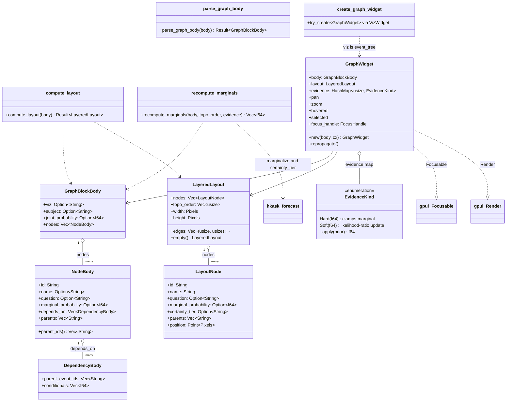
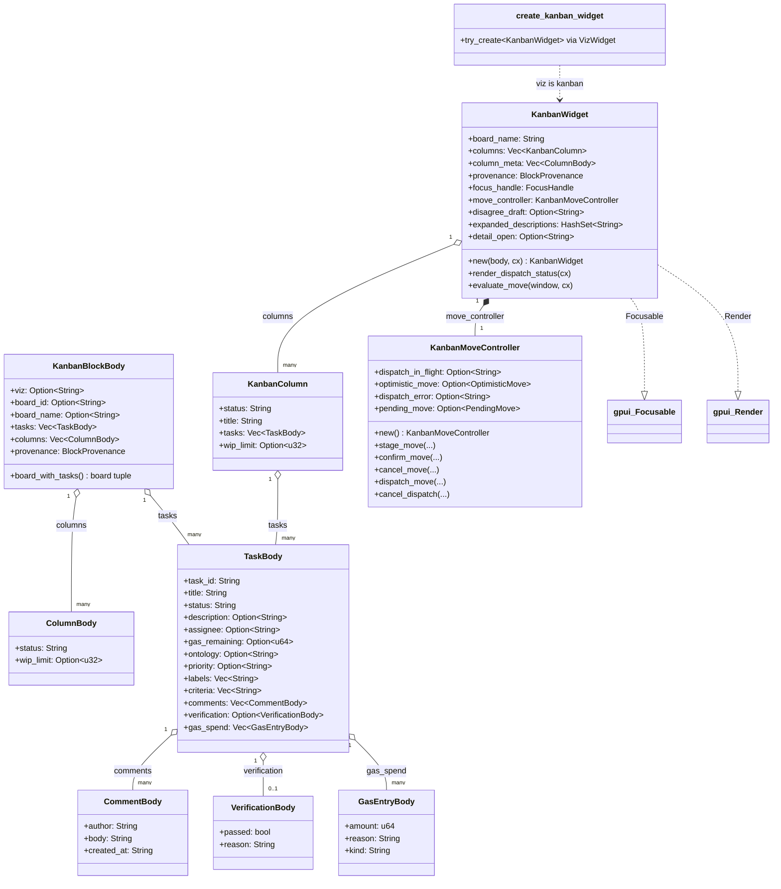
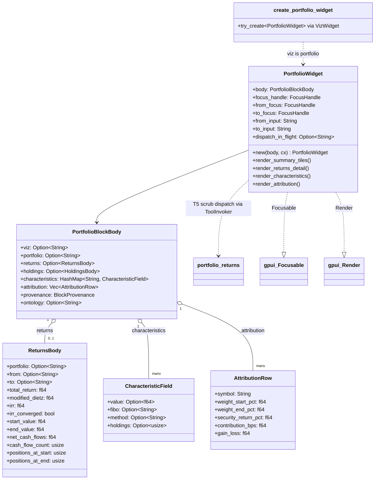
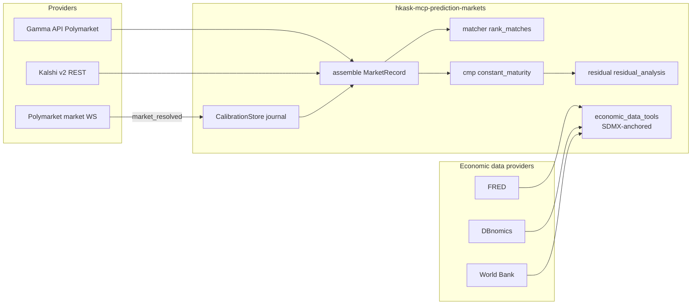
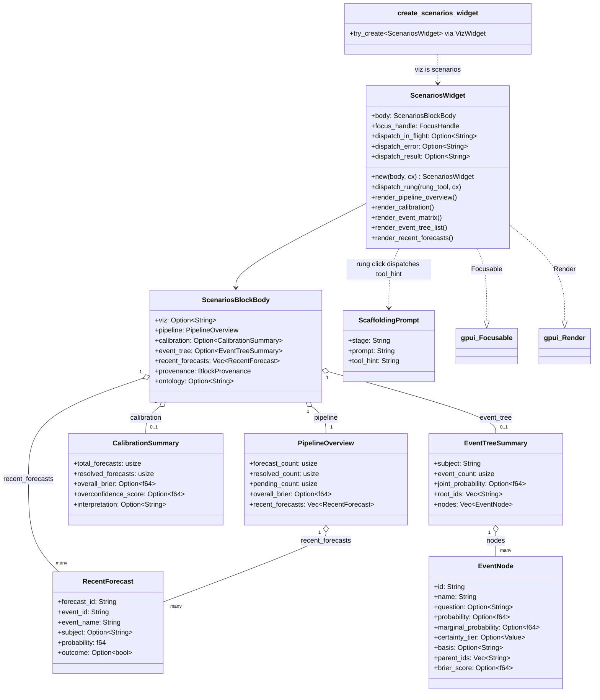
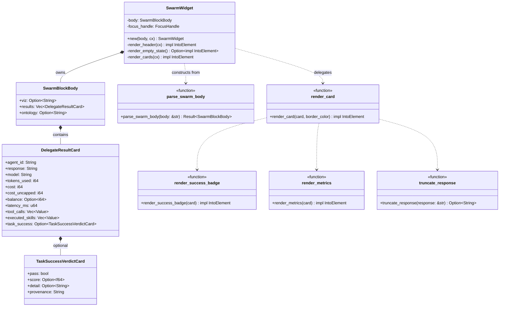

# UI Widget Diagrams

Consolidated class diagrams for the D18 viz widgets and the
prediction-markets server that feeds them. The widgets render
`viz`-discriminated JSON fenced blocks inline in agent markdown via the
`hkask-viz-core` composed `block_renderer` (see
[Architecture diagrams](./architecture.md) for the viz-core composition
root). Unique `DIAGRAM_ALIGNMENT` IDs are preserved from the originals.

## Graph Widget

`hkask-graph-widget` renders ```` ```graph ```` fenced blocks as an
interactive event-tree DAG (the `viz: "event_tree"` shape that mirrors the
`scenario_quantify` tool response). It parses the body, computes a layered
topological layout, and lets the user set evidence on a node and
re-propagate marginals interactively.

**Correction (2026-08-28):** the evidence map is now
`HashMap<usize, EvidenceKind>` — `EvidenceKind::Hard(f64)` clamps a node's
marginal to an observed value, `EvidenceKind::Soft(f64)` applies a Bayesian
likelihood-ratio update (the superforecasting-standard input shape) —
replacing the former plain `HashMap<usize, f64>`.



**Block shape:** a JSON body with `viz: "event_tree"`, an optional `subject`
and `joint_probability`, and a `nodes` array. Edges are child-side: each node
lists its parents in `depends_on[].parent_event_ids` (the `scenario_quantify`
shape) or a flat `parents` array (tolerant fallback). `certainty_tier` is
derived from `marginal_probability` via `hkask_forecast::certainty_tier` (one
source of truth) rather than trusted from the body.

**Layout:** Kahn topological sort assigns layers (roots at layer 0; a node's
layer is one past its deepest parent); cycles and unknown parents are
rejected.

**Re-propagation:** `recompute_marginals` marginalizes over the full joint
truth-assignment space of `depends_on[0]` parents (delegated to
`hkask_forecast::marginalize`); a node in the `evidence` map is treated as
observed — hard evidence clamps, soft evidence applies the likelihood-ratio
posterior `P' = P·LR / (P·LR + (1−P))`.

<!-- DIAGRAM_ALIGNMENT
id: DIAG-VIZ-GRAPH
verified_date: 2026-08-28
verified_against: crates/hkask-graph-widget/src/block.rs (EvidenceKind L17-30 — Hard/Soft + apply); crates/hkask-graph-widget/src/layout.rs; crates/hkask-graph-widget/src/propagate.rs (recompute_marginals L76); crates/hkask-graph-widget/src/view.rs (GraphWidget L49-59 — evidence HashMap<usize, EvidenceKind>, repropagate L161)
status: VERIFIED
-->

## Kanban Widget

`hkask-kanban-widget` renders ` ```kanban ` fenced blocks as a horizontal
column layout (Backlog → Ready → In Progress → Review → Done). It is a
passive renderer: the data comes from the parsed `KanbanBlockBody` (JSON
already in the chat stream, mirroring the combined `kanban_board_list` +
`kanban_task_list` tool responses), not from live MCP fetches. Task moves
are interactive: the move affordance stages a pending move, the user
confirms/cancels, and the controller dispatches `kanban_task_move` via the
governed `shared_tool_invoker()` (metered against the panel persona's call
ceiling; not capability-gated — RR-0056). The move affordance uses the
block's server-authoritative provenance to pick the dispatch server.
Verified current. See [Kanban diagrams](./kanban.md) for the state
machines.



**Column grouping:** `group_tasks_into_columns` buckets tasks by lowercased
`status`, emits the five standard columns in order (attaching WIP limits
from `column_meta`), then appends any non-standard statuses sorted
alphabetically (title-cased).

**Card detail (B3):** `detail_open` holds the task id whose detail panel is
open. The panel renders the full task (description, criteria, comments,
verification, gas spend log) passively from the block body.

<!-- DIAGRAM_ALIGNMENT
id: DIAG-VIZ-KANBAN
verified_date: 2026-08-28
verified_against: crates/hkask-kanban-widget/src/block.rs; crates/hkask-kanban-widget/src/view.rs (KanbanWidget L104-114 — column_meta S8, provenance; render_dispatch_status L260; evaluate_move L974); crates/hkask-kanban-widget/src/move_controller.rs (L61-121)
status: VERIFIED
-->

## Portfolio Widget

`hkask-portfolio-widget` renders ```` ```portfolio ```` fenced blocks as a
portfolio dashboard (summary tiles → returns detail → characteristics table
→ attribution ranking). The agent picks the portfolio and the body already
carries its data.

**Correction (2026-08-28):** the widget is no longer purely passive — the
returns detail carries a **T5 date-range scrub affordance**: two editable
date chips (`from`/`to`) seeded from the block's returns; Apply re-issues
`portfolio_returns` (default server `hkask-mcp-companies`) through the
governed `ToolInvoker`. A missing invoker surfaces a visible
`INVOKER_NOT_WIRED_MSG` status; partial (non-dispatchable) provenance
surfaces `PROVENANCE_INCOMPLETE_MSG` — the widget refuses to re-issue the
wrong tool and asks the user to route through the agent. The selector /
aggregation controls / auto-loader / comparison mode from the deleted
standalone `PortfolioDashboardView` remain intentionally omitted.



**Block shape:** a JSON body with `viz: "portfolio"`. `returns`,
`characteristics`, and `attribution` are all optional so partial bodies still
render the present sections. `AttributionRow.symbol` is required; other
attribution fields default.

**FIBO anchors:** displayed metrics are anchored to the FIBO ontology via
constants (`FIBO_TIME_WEIGHTED_RETURN`, `FIBO_INTERNAL_RATE_OF_RETURN`,
`FIBO_TRANSACTION_LEDGER`, …) that match the `fibo` map entries the
`companies` MCP server includes in its responses.

<!-- DIAGRAM_ALIGNMENT
id: DIAG-VIZ-PORTFOLIO
verified_date: 2026-08-28
verified_against: crates/hkask-portfolio-widget/src/block.rs; crates/hkask-portfolio-widget/src/view.rs (T5 scrub doc L10, DEFAULT_SERVER/DEFAULT_TOOL L42-44, INVOKER_NOT_WIRED_MSG/PROVENANCE_INCOMPLETE_MSG L46-50, from_focus/to_focus L59-66, from_input/to_input L104-120)
status: VERIFIED
-->

## Prediction Markets Server

`hkask-mcp-prediction-markets` is the market-data service for the
forecasting stack: it fetches markets from Polymarket (Gamma API +
market-channel WebSocket) and Kalshi (v2 REST), annotates every record with
spread / volume / calibration / volatility / reliability tier / dual-axis
ontology, and never returns a bare probability. All calibration math is
reused from `hkask-forecast` — never reimplemented here.

**Corrections (2026-08-28):** the tool surface expanded from 13 to **31
tools** — 17 market/CMP tools (adding `market_volatility`,
`market_cmp_index_store`, `market_cmp_portfolio_store`,
`market_cmp_context_suggest`) plus a new **economic-data router** with 14
tools (`fred_*` × 5, `dbnomics_*` × 4, `wb_*` × 5) in
`economic_data_tools.rs`; `combined_router = prediction_markets_router +
economic_data_tools_router`.

```mermaid
classDiagram
    direction TD
    class PredictionMarketsServer {
        +http: reqwest_Client
        +cache_ttl_secs: u64
        +calibration_store: Arc~Mutex~CalibrationStore~~
        +response_cache: TtlCache
        +calibration_path: Option~String~
        +base_events: Vec~(String,String)~
        +called_tools: Mutex~HashSet~String~~
        +combined_router() ToolRouter
    }
    class MarketRecord {
        +source: Source
        +event_id: String
        +market_id: String
        +question: String
        +deadline: String
        +probability: f64
        +probability_method: ProbabilityMethod
        +spread: Option~f64~
        +volume: Option~f64~
        +volume_grain: Option~VolumeGrain~
        +liquidity: Option~f64~
        +volatility: Volatility
        +status: MarketStatus
        +resolved_outcome: Option~bool~
        +resolution_source: Option~String~
        +calibration: Calibration
        +reliability_tier: ReliabilityTier
        +ontology: OntologyBlock
        +from_kalshi(...) MarketRecord
        +from_polymarket(...) MarketRecord
    }
    class Calibration {
        +brier: Option~f64~
        +domain_bias: f64
        +bias_source: String
        +sample_size: u64
        +stale: bool
    }
    class Volatility {
        +realized_variance: Option~f64~
        +structural_flag: StructuralFlag
        +interpretation: String
    }
    class OntologyBlock {
        +process: ProcessAxis
        +state: StateAxis
        +mapping_version: u32
    }
    class CalibrationStore {
        -buckets: HashMap~String, Vec~ResolvedObservation~~
        +record(bucket, observation)
        +brier(bucket) Result~f64~
        +contains(bucket, observation) bool
        +load(path) io::Result~Self~
        +save(path) io::Result
        stale never brier 0
    }
    class TtlCache {
        -ttl: Duration
        -entries: Mutex~HashMap~String, Entry~~
        +get(key) Option~Value~
        +put(key, value)
    }
    class GammaMarket {
        +question: String
        +outcome_prices: String
        +clob_token_ids: String
        +uma_resolution_status: String
        +yes_probability() Option~f64~
        +token_ids() Vec~String~
    }
    class KalshiMarket {
        +ticker: String
        +event_ticker: String
        +yes_bid_dollars: String
        +yes_ask_dollars: String
        +yes_midpoint() Option~f64~
        +spread() Option~f64~
    }
    class economic_data_tools {
        <<module>>
        fred_search_series fred_get_observations
        fred_get_series_info fred_get_release fred_list_categories
        dbnomics_search dbnomics_list_providers
        dbnomics_get_dataset dbnomics_get_series
        wb_list_topics wb_search_indicators
        wb_get_indicator_info wb_list_countries wb_get_observations
    }

    PredictionMarketsServer --> CalibrationStore : journal-backed
    PredictionMarketsServer --> TtlCache : response cache
    PredictionMarketsServer --> economic_data_tools : economic_data_tools_router
    PredictionMarketsServer ..> MarketRecord : assembles
    GammaMarket ..> MarketRecord : from_polymarket
    KalshiMarket ..> MarketRecord : from_kalshi
    MarketRecord "1" o-- "1" Calibration : calibration
    MarketRecord "1" o-- "1" Volatility : volatility
    MarketRecord "1" o-- "1" OntologyBlock : ontology

    note for PredictionMarketsServer "31 tools = 17 market/CMP + 14 economic-data\ncombined_router = prediction_markets_router\n+ economic_data_tools_router"
    note for CalibrationStore "Brier math reused from hkask-forecast.\nMissing/empty bucket is Err — mapped to\nstale: true, never a synthetic brier: 0\n(the .rules unwrap_or(0) trap generalized)."
    note for MarketRecord "Every probability carries spread, volume grain,\ncalibration, volatility, reliability tier,\nand a PKO + Dublin Core ontology block.\nBase events come only from config — a market\ncan never auto-promote to benchmark status."
```



**Pipeline view** (providers → matcher → calibration; economic-data feeds
the SDMX axis):



**Honest-degradation invariants:** a bucket with no data or a read failure
is `stale: true` (never `brier: 0`); `constant_maturity` returns `None` on
empty input; `residual_analysis` refuses below `MIN_OBSERVATIONS = 10`
overlapping pairs (`insufficient_overlap`); the WS stream skips unparsable
frames without dying, and a dead stream surfaces a typed error.

**Ontology anchors:** per-record `ontology` blocks and the
`market_ontology_map` tool output are both generated from `ontology.rs`
constants (`MAPPING_VERSION`, `LIFECYCLE_STAGES`) so they cannot drift.
`dcterms:*` / `pko:*` vocabulary is reused from `hkask-bridge-ontology`;
economic-data vocabulary is SDMX-anchored (see
[Architecture diagrams](./architecture.md) — ontology bridge).

<!-- DIAGRAM_ALIGNMENT
id: DIAG-RF-PM
verified_date: 2026-08-28
verified_against: kask/mcp-servers/hkask-mcp-prediction-markets/src/hkask_mcp_prediction_markets.rs (PredictionMarketsServer L60, combined_router L85-89 = prediction_markets_router + economic_data_tools_router, tool fns — 17 market/CMP tools); kask/mcp-servers/hkask-mcp-prediction-markets/src/economic_data_tools.rs (14 economic-data tools); kask/mcp-servers/hkask-mcp-prediction-markets/src/types.rs (MarketRecord L136); kask/mcp-servers/hkask-mcp-prediction-markets/src/calibration.rs; kask/mcp-servers/hkask-mcp-prediction-markets/src/cmp.rs; kask/mcp-servers/hkask-mcp-prediction-markets/src/residual.rs; kask/mcp-servers/hkask-mcp-prediction-markets/src/matcher.rs; kask/mcp-servers/hkask-mcp-prediction-markets/src/provider_polymarket.rs (GammaMarket L17); kask/mcp-servers/hkask-mcp-prediction-markets/src/provider_kalshi.rs (KalshiMarket L27); kask/mcp-servers/hkask-mcp-prediction-markets/src/cache.rs (TtlCache L16); kask/mcp-servers/hkask-mcp-prediction-markets/src/ontology.rs
status: VERIFIED
-->

## Scenarios Widget

`hkask-scenarios-widget` renders ```` ```scenarios ```` fenced blocks as a
forecasting dashboard: pipeline overview, calibration summary, event matrix,
event-tree list, and recent forecasts. The event-tree DAG itself (`viz:
"event_tree"`) is rendered separately by `hkask-graph-widget`.

**Correction (2026-08-28):** the widget is no longer purely passive — the
pipeline overview's scaffolding rungs are **dispatchable** (T2): a rung click
routes the rung's tool through the governed `ToolInvoker` using the block's
dispatchable provenance (falling back to the hardcoded scenarios server when
provenance is absent). `dispatch_in_flight` / `dispatch_error` /
`dispatch_result` surface the dispatch state; a missing invoker or a
provenance mismatch is a visible error, never a silent no-op.



**Block shape:** a JSON body with `viz: "scenarios"`. All sub-objects default
to empty/`None` so partial bodies render the present sections. A body with
`viz: "event_tree"` is NOT claimed (it goes to `hkask-graph-widget`).

**Scaffolding:** `scaffolding_for_state` maps the current pipeline state to a
`ScaffoldingPrompt` (stage + prompt + tool_hint) — e.g. an empty pipeline
suggests `scenario_frame`, pending forecasts suggest `scenario_quantify`,
and resolved forecasts with a calibration suggest `scenario_assess`.

**FIBO / methodology anchors:** `FIBO_FORECAST_ID`, `FIBO_BRIER_SCORE`,
`FIBO_SCENARIO_PROBABILITY` anchor displayed metrics to the FIBO ontology.

<!-- DIAGRAM_ALIGNMENT
id: DIAG-VIZ-SCENARIOS
verified_date: 2026-08-28
verified_against: crates/hkask-scenarios-widget/src/block.rs; crates/hkask-scenarios-widget/src/view.rs (dispatch fields L35-42, SCENARIO_TOOL_SERVER fallback L21-22, dispatch_rung L554, provenance routing L548-561)
status: VERIFIED
-->

## Swarm Widget

The `hkask-swarm-widget` crate renders ```` ```swarm_delegate_results ````
fenced blocks inline in agent markdown. It is a passive renderer — no
`ToolInvoker` fetches, no dispatch affordance. The data is already in the
chat stream; the widget makes it readable. Each `LocalDelegateResult` from
the `swarm_execute_plan_local` MCP tool renders as a structured per-agent
card: agent id, task-success badge, response (truncated), model, tokens,
cost, latency, tool-call count, executed-skill count. Verified current.



Notes:

- `RESPONSE_TRUNCATE_CHARS` (240) caps the visible response body; the full
  response lives in the tool-call output block.
- `balance: None` renders as a muted "—" rather than a fabricated 0 — the
  `.rules` broken-feedback-loop trap.
- `task_success: None` renders as "not evaluated" — never a fabricated
  pass/fail.
- The `ontology` field on `SwarmBlockBody` carries an optional concept URI
  (e.g. `pko:Procedure`) emitted by the swarm server; pinned by the
  registry-level S4 sensor test in `hkask-viz-core`.

<!-- DIAGRAM_ALIGNMENT
id: DIAG-VIZ-SWARM
verified_date: 2026-08-28
verified_against: crates/hkask-swarm-widget/src/hkask_swarm_widget.rs (SwarmWidget L47-50, render_header L65, render_empty_state L90, render_cards L104, render_card L136, render_success_badge L169, truncate_response L198, render_metrics L213, RESPONSE_TRUNCATE_CHARS L43); crates/hkask-swarm-widget/src/block.rs; crates/hkask-viz-core/src/hkask_viz_core.rs (SwarmWidget VizWidget impl L163-176)
status: VERIFIED
-->

## See also

- [Architecture diagrams](./architecture.md) — the viz-core composition root (D18)
- [Kanban diagrams](./kanban.md) — move controller + task status state machines
- [Swarm diagrams](./swarm.md) — the swarm server whose tools produce these blocks
