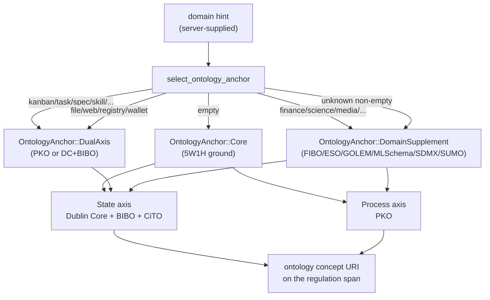

# Tagging Regulation Spans With the Ontology Bridge

This guide shows how to tag a regulation span (or any MCP tool output)
with a domain concept URI from the `hkask-bridge-ontology` crate. The
crate is the single source of truth for ontology vocabulary and the
dual-axis domain-selection logic in hKask. No ontology vocabulary lives
inside an MCP server; every server that does tagging depends on this
crate.

The crate is organised as eight modules: one universal core (5W1H), two
universal axes (Dublin Core + BIBO + CiTO for state, PKO for process),
one upper ontology (SUMO), and four domain supplements (FIBO, ESO,
GOLEM, ML-Schema) plus SDMX for statistical data exchange. The
dual-axis invariant — one axis is always Dublin Core or PKO — guarantees
every artifact has a common mapping in process or state space regardless
of domain.



<!-- DIAGRAM_ALIGNMENT id: DIAG-ONT-001 verified_date: 2026-08-13 verified_against: kask/crates/hkask-bridge-ontology/src/axis.rs:220 status: VERIFIED -->

## Add the dependency

In your server's `Cargo.toml`:

```toml
[dependencies]
hkask-bridge-ontology = { path = "../../crates/hkask-bridge-ontology" }
```

The crate is `forbid(unsafe_code)` and exposes only `pub` modules — no
feature flags, no build-time configuration.

## Pick the right entry point

The crate exposes three layers, used in this order:

1. **Vocabulary constants** — the canonical concept URI strings, one
   module per ontology. Use these when you already know the concept.
2. **`select_ontology_anchor`** — the domain-hint dispatcher. Use this
   when you have a tool name or domain string and want the crate to
   pick the anchor.
3. **`explain_tool_for`** — the widget-side dispatcher. Use this in a
   widget's "Explain" affordance to map an ontology tag back to the
   explain tool that should inspect it.

## Step 1 — Use the universal vocabulary directly

The state axis (Dublin Core + BIBO + CiTO) and process axis (PKO) are
always available. Reach for these first; only escalate to a domain
supplement when the universal axes aren't specific enough.

```rust
use hkask_bridge_ontology::{dc_bibo, pko};

// State axis — "what is this?"
let title   = dc_bibo::TITLE;     // "dcterms:title"
let dataset = dc_bibo::DATASET;   // "dcterms:Dataset"
let article = dc_bibo::ARTICLE;   // "bibo:Article"
let cites   = dc_bibo::CITES;     // "cito:cites"

// Process axis — "how did this come to be?"
let procedure = pko::PROCEDURE;        // "pko:Procedure"
let step_exec = pko::STEP_EXECUTION;   // "pko:StepExecution"
```

Two mapping helpers convert runtime values to state-axis concepts
without forcing every caller to maintain its own match table:

```rust
use hkask_bridge_ontology::dc_bibo;

// MIME type → Dublin Core type vocabulary
let dc_type = dc_bibo::mime_to_dc_type("application/pdf");  // Some("dcterms:Text")

// Resource kind string → BIBO type
let bibo = dc_bibo::kind_to_bibo("arxiv");  // Some("bibo:Preprint")
```

## Step 2 — Use a domain supplement when the universal axes are too coarse

Domain ontologies are layered on top of the dual-axis core for
domain-specific precision. Each supplement module is a flat list of
`pub const` URI strings — no trait, no struct, no runtime state.

```rust
use hkask_bridge_ontology::{fibo, sdmx, eso, golem, mlschema, sumo};

// Financial domain (FIBO)
let roic = fibo::RETURN_ON_INVESTED_CAPITAL;  // "fibo-fbc-fct-ra:ReturnOnInvestedCapital"
let dcf  = fibo::DCF_VALUATION;                // "fibo:dcfValuation"

// Statistical data (SDMX)
let series = sdmx::TIME_SERIES;   // "sdmx:TimeSeries"

// Scientific reasoning (ESO)
let hyp = eso::HAS_HYPOTHESIS;    // "eso:hasHypothesis"

// Narrative (GOLEM)
let character = golem::CHARACTER; // "golem:G1_Character"

// ML experiments (ML-Schema)
let run = mlschema::RUN;          // "mls:Run"

// Upper ontology fallback (SUMO)
let entity = sumo::ENTITY;       // "sumo:Entity"
```

## Step 3 — Let the crate pick the anchor from a domain hint

When you have a tool name or domain string but not a specific concept,
call `select_ontology_anchor`. It maps the hint to an `OntologyAnchor`
using keyword matching that handles both bare domains (`"finance"`) and
tool-style names (`"company_profile"`, `"stock_screener"`) without
substring false positives (`"logistics"` does not match `"log"`).

```rust
use hkask_bridge_ontology::axis::{select_ontology_anchor, OntologyAnchor};

// Tool-style name → FIBO supplement (state axis stays Dublin Core)
let anchor = select_ontology_anchor("company_profile");
// → OntologyAnchor::DomainSupplement { namespace: Fibo, concept: "dcterms:Dataset" }

// Process workflow → PKO dual-axis
let anchor = select_ontology_anchor("kanban_board");
// → OntologyAnchor::DualAxis { axis: Pko, concept: "pko:Procedure" }

// Unknown non-empty domain → SUMO upper-ontology fallback
let anchor = select_ontology_anchor("some-unknown-domain");
// → OntologyAnchor::DomainSupplement { namespace: Sumo, concept: "sumo:Entity" }

// Empty hint → 5W1H core ground
let anchor = select_ontology_anchor("");
// → OntologyAnchor::Core
```

The dispatch order is: SDMX → FIBO → ESO → GOLEM → ML-Schema →
PKO dual-axis → DC+BIBO dual-axis → SUMO fallback → `Core` (only when
the hint is empty). The first matching keyword set wins.

### The dual-axis invariant

When you build or receive an `OntologyAnchor`, the state axis is always
Dublin Core. The process axis is the domain ontology when one applies,
PKO otherwise. This guarantees every artifact has a common mapping in
process or state space regardless of domain — you can always ask "what
is this?" (DC) and "how did this come to be?" (PKO or the domain
supplement's process vocabulary).

```rust
use hkask_bridge_ontology::axis::{
    OntologyAnchor, OntologyAxis, OntologyNamespace,
};
use hkask_bridge_ontology::{dc_bibo, pko};

// Domain supplement: FIBO for a financial document
let anchor = OntologyAnchor::DomainSupplement {
    namespace: OntologyNamespace::Fibo,
    concept: dc_bibo::DATASET.to_string(),
};

// Dual-axis: PKO for a process document
let anchor = OntologyAnchor::DualAxis {
    axis: OntologyAxis::Pko,
    concept: pko::PROCEDURE.to_string(),
};

// Core: the 5W1H fallback when no domain applies
let anchor = OntologyAnchor::Core;
```

### Fallback discipline

If a domain mapping fails or the domain ontology can't place the
concept, fall back to the generalists (DC + PKO) or to SUMO. Never
force a domain ontology where it doesn't fit — the generalists are
always valid. An unknown non-empty domain returns SUMO's `sumo:Entity`,
not an error; an empty hint returns `Core`. Both are correct behavior.

## Step 4 — Read the anchor's tier metadata

The condenser and other regulation-loop consumers read two derived
fields off the anchor to apply domain-aware saliency weighting. Use
these instead of re-deriving them per consumer.

```rust
use hkask_bridge_ontology::axis::{OntologyAnchor, OntologyNamespace};

let anchor = OntologyAnchor::DomainSupplement {
    namespace: OntologyNamespace::Fibo,
    concept: "dcterms:Dataset".to_string(),
};

// Confidence modifier: FIBO +0.10, SUMO +0.05, others ±0.00
let conf = anchor.confidence_modifier();  // 0.10

// Information density expectation: FIBO 1.3, ML-Schema/SDMX 1.1, others 1.0
let density = anchor.density_factor();    // 1.3

// Human-readable tier label for telemetry
let tier = anchor.tier_label();           // "domain_supplement"
```

## Step 5 — Emit the unified ontology tag on the span

Every MCP server emits a top-level `"ontology"` key in each tool output
JSON, carrying a concept URI string. Every widget parses an
`ontology: Option<String>` field on its block body. This is the unified
contract — one key name, one value shape, across all servers and
widgets.

```rust
use hkask_bridge_ontology::fibo;

let output = serde_json::json!({
    "status": "ok",
    // ... tool-specific fields ...
});

// Inject the "ontology" key if the tool has a concept mapping;
// return unchanged otherwise.
let tagged = fibo::enrich_with_ontology(output, "portfolio_list");
// → {"status": "ok", "ontology": "fibo:Portfolio", ...}
```

Keep server-specific dispatch — mapping your server's tool names or
provider field names to the shared vocabulary — in your server. That is
the server's business, not the ontology's. Re-export the shared
vocabulary so existing call sites keep working:

```rust
// In your server's ontology module (e.g. companies server's fibo.rs):
pub use hkask_bridge_ontology::fibo::{
    RETURN_ON_INVESTED_CAPITAL, PRICE_EARNINGS_RATIO, /* ... */
};

// Keep the server-specific mapping here.
pub fn fmp_field_to_fibo(field: &str) -> Option<&'static str> {
    match field {
        "roic"    => Some(RETURN_ON_INVESTED_CAPITAL),
        "peRatio" => Some(PRICE_EARNINGS_RATIO),
        _ => None,
    }
}
```

## Step 6 — Dispatch the explain tool from the ontology tag

The crate root exports `explain_tool_for(ontology: &str) -> &'static str`
— the unified dispatch function that maps an ontology concept URI to the
explain tool a widget should invoke. Widgets call this single function
instead of reimplementing their own ontology-specific dispatch.

```rust
use hkask_bridge_ontology::explain_tool_for;

let tool = explain_tool_for("fibo:Corporation"); // → "research_search"
let tool = explain_tool_for("sdmx:DataSet");      // → "research_search"
let tool = explain_tool_for("pko:Step");          // → "kanban_task_list"
let tool = explain_tool_for("dcterms:Dataset");  // → "research_search"
let tool = explain_tool_for("");                  // → "research_search"
```

The dispatch is driven by the concept URI prefix (the ontology
namespace). Each ontology contributes its own match arm; the empty and
unknown cases fall back to `"research_search"`. Widgets that already
have a domain-specific explain tool (e.g. the scenarios widget's rung
dispatch) don't call this — they dispatch by pipeline position, not by
ontology concept. This function is for widgets that dispatch *because*
of the ontology tag.

## Source citations

| Symbol / concept | File:line |
|------------------|-----------|
| Crate root, module list, `explain_tool_for` | `kask/crates/hkask-bridge-ontology/src/hkask_bridge_ontology.rs:65`, `:101` |
| `OntologyAxis` enum (Pko / DcBibo) | `kask/crates/hkask-bridge-ontology/src/axis.rs:33` |
| `OntologyNamespace` enum (Fibo/Eso/Golem/MlSchema/Sdmx/Sumo) | `kask/crates/hkask-bridge-ontology/src/axis.rs:47` |
| `OntologyNamespace::dc_concept` (state-axis mapping) | `kask/crates/hkask-bridge-ontology/src/axis.rs:69` |
| `OntologyNamespace::pko_concept` (process-axis mapping) | `kask/crates/hkask-bridge-ontology/src/axis.rs:82` |
| `OntologyNamespace` `FromStr` / `Display` | `kask/crates/hkask-bridge-ontology/src/axis.rs:95`, `:111` |
| `OntologyAnchor` enum (Core / DualAxis / DomainSupplement) | `kask/crates/hkask-bridge-ontology/src/axis.rs:133` |
| `OntologyAnchor::confidence_modifier` | `kask/crates/hkask-bridge-ontology/src/axis.rs:156` |
| `OntologyAnchor::density_factor` | `kask/crates/hkask-bridge-ontology/src/axis.rs:170` |
| `OntologyAnchor::axis` / `tier_label` | `kask/crates/hkask-bridge-ontology/src/axis.rs:190`, `:199` |
| `select_ontology_anchor` (domain-hint dispatcher) | `kask/crates/hkask-bridge-ontology/src/axis.rs:220` |
| SDMX keyword arm | `kask/crates/hkask-bridge-ontology/src/axis.rs:233` |
| FIBO keyword arm | `kask/crates/hkask-bridge-ontology/src/axis.rs:253` |
| ESO keyword arm | `kask/crates/hkask-bridge-ontology/src/axis.rs:277` |
| GOLEM keyword arm | `kask/crates/hkask-bridge-ontology/src/axis.rs:293` |
| ML-Schema keyword arm | `kask/crates/hkask-bridge-ontology/src/axis.rs:310` |
| PKO dual-axis keyword arm | `kask/crates/hkask-bridge-ontology/src/axis.rs:332` |
| DC+BIBO dual-axis keyword arm | `kask/crates/hkask-bridge-ontology/src/axis.rs:352` |
| SUMO fallback / empty → Core | `kask/crates/hkask-bridge-ontology/src/axis.rs:361` |
| `dc_bibo` constants (TITLE/DATASET/ARTICLE/CITES/...) | `kask/crates/hkask-bridge-ontology/src/dc_bibo.rs:13` |
| `dc_bibo::mime_to_dc_type` | `kask/crates/hkask-bridge-ontology/src/dc_bibo.rs:73` |
| `dc_bibo::kind_to_bibo` | `kask/crates/hkask-bridge-ontology/src/dc_bibo.rs:85` |
| `pko` constants (PROCEDURE/STEP_EXECUTION/...) | `kask/crates/hkask-bridge-ontology/src/pko.rs:19`, `:50` |
| `pko::kanban_status_to_pko_execution` | `kask/crates/hkask-bridge-ontology/src/pko.rs:102` |
| `pko::corpus_stage_to_pko_step` | `kask/crates/hkask-bridge-ontology/src/pko.rs:114` |
| `pko::research_stage_to_pko` | `kask/crates/hkask-bridge-ontology/src/pko.rs:128` |
| `pko::task_breakdown_field_to_pko` | `kask/crates/hkask-bridge-ontology/src/pko.rs:150` |
| `fibo` constants (CORPORATION/RETURN_ON_INVESTED_CAPITAL/DCF_VALUATION/...) | `kask/crates/hkask-bridge-ontology/src/fibo.rs:26`, `:131`, `:163` |
| `eso` constants (HAS_HYPOTHESIS/...) | `kask/crates/hkask-bridge-ontology/src/eso.rs:21` |
| `golem` constants (CHARACTER/CREATIVE_WORK/...) | `kask/crates/hkask-bridge-ontology/src/golem.rs:21`, `:49` |
| `mlschema` constants (MODEL/RUN/...) | `kask/crates/hkask-bridge-ontology/src/mlschema.rs:19` |
| `sdmx` constants (DATASET/TIME_SERIES/...) | `kask/crates/hkask-bridge-ontology/src/sdmx.rs:21` |
| `sumo` constants (ENTITY/OBJECT/PROCESS/AGENT/...) | `kask/crates/hkask-bridge-ontology/src/sumo.rs:30` |
| `five_w_one_h` constants (WHO/WHAT/WHEN/WHERE/WHY/HOW) | `kask/crates/hkask-bridge-ontology/src/five_w_one_h.rs:26` |
| `five_w_one_h::axis_for_concept` (5W1H → axis mapping) | `kask/crates/hkask-bridge-ontology/src/five_w_one_h.rs:95` |

## See also

- [Ontology Bridge API Reference](../../reference/ontology-bridge.md) — the full API surface.
