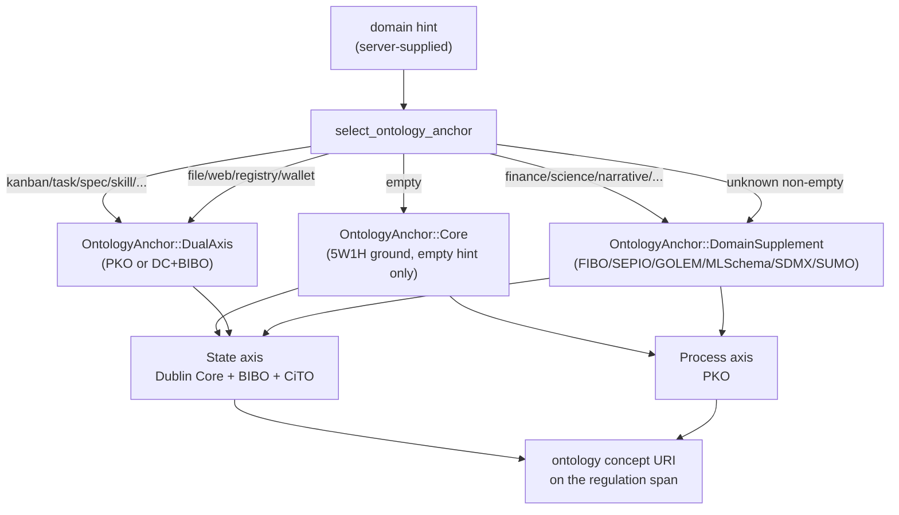

# Tagging Regulation Spans With the Ontology Bridge

This guide shows how to tag a regulation span (or any MCP tool output)
with a domain concept URI from the `hkask-bridge-ontology` crate. The
crate is the single source of truth for ontology vocabulary and the
dual-axis domain-selection logic in hKask. No ontology vocabulary lives
inside an MCP server; every server that does tagging depends on this
crate (user directive 2026-08-05, recorded in the crate root doc,
`kask/crates/hkask-bridge-ontology/src/hkask_bridge_ontology.rs:38-41`).

The crate is organised as ten `pub` modules
(`hkask_bridge_ontology.rs:58-67`): two universal axes (Dublin Core +
BIBO + CiTO for state, PKO for process), one upper ontology (SUMO), and
six domain supplements (FIBO, SEPIO, GOLEM, ML-Schema, SDMX, OMC) plus the
`axis` domain-selection logic. The dual-axis invariant — one axis is
always Dublin Core or PKO — guarantees every artifact has a common
mapping in process or state space regardless of domain.



<!-- DIAGRAM_ALIGNMENT
id: DIAG-ONT-001
verified_date: 2026-08-28
verified_against: kask/crates/hkask-bridge-ontology/src/axis.rs:210-351 (select_ontology_anchor dispatch); kask/crates/hkask-bridge-ontology/src/hkask_bridge_ontology.rs:58-67 (module list)
status: VERIFIED
-->

## Add the dependency

In your server's `Cargo.toml`:

```toml
[dependencies]
hkask-bridge-ontology = { path = "../../crates/hkask-bridge-ontology" }
```

The crate is `forbid(unsafe_code)`
(`hkask_bridge_ontology.rs:1`) and exposes only `pub` modules plus two
root re-exports, `DcConcept` and `PkoConcept` (`:71-72`) — no feature
flags, no build-time configuration.

## Pick the right entry point

The crate exposes two layers, used in this order:

1. **Vocabulary constants** — the canonical concept URI strings, one
   module per ontology. Use these when you already know the concept.
2. **`select_ontology_anchor`** — the domain-hint dispatcher. Use this
   when you have a tool name or domain string and want the crate to
   pick the anchor.

(An earlier revision of this guide described a crate-root
`explain_tool_for(ontology)` dispatcher and a `five_w_one_h` module.
Neither exists: `explain_tool_for` lives in `omc.rs` and dispatches OMC
media concepts only — see Step 6 — and there is no `five_w_one_h`
module in the current tree.)

## Step 1 — Use the universal vocabulary directly

The state axis (Dublin Core + BIBO + CiTO) and process axis (PKO) are
always available. Reach for these first; only escalate to a domain
supplement when the universal axes aren't specific enough.

```rust
use hkask_bridge_ontology::{dc_bibo, pko};

// State axis — "what is this?"
let title   = dc_bibo::TITLE;     // "dcterms:title"        (dc_bibo.rs:15)
let dataset = dc_bibo::DATASET;   // "dcterms:Dataset"      (dc_bibo.rs:37)
let article = dc_bibo::ARTICLE;   // "bibo:Article"         (dc_bibo.rs:44)
let cites   = dc_bibo::CITES;     // "cito:cites"           (dc_bibo.rs:59)

// Process axis — "how did this come to be?"
let procedure = pko::PROCEDURE;        // "pko:Procedure"        (pko.rs:21)
let step_exec = pko::STEP_EXECUTION;   // "pko:StepExecution"    (pko.rs:54)
```

One mapping helper converts runtime values to state-axis concepts
without forcing every caller to maintain its own match table:

```rust
use hkask_bridge_ontology::dc_bibo;

// MIME type → Dublin Core type vocabulary      (dc_bibo.rs:79)
let dc_type = dc_bibo::mime_to_dc_type("application/pdf");  // Some("dcterms:Text")
```

PKO also ships stage-mapping helpers for the servers that convert their
domain stages to process concepts: `kanban_status_to_pko_execution`
(`pko.rs:106`), `corpus_stage_to_pko_step` (`pko.rs:127`), and
`research_stage_to_pko` (`pko.rs:156`). GOLEM ships `corpus_op_to_golem`
(`golem.rs:156`) for creative-generation operations. The corpus server's
`ontology_anchor` delegates to `corpus_stage_to_pko_step` and
`corpus_op_to_golem` — the canonical mapping, so it cannot drift.

## Step 2 — Use a domain supplement when the universal axes are too coarse

Domain ontologies are layered on top of the dual-axis core for
domain-specific precision. Each supplement module is a flat list of
`pub const` URI strings — no trait, no struct, no runtime state.

```rust
use hkask_bridge_ontology::{fibo, sdmx, sepio, golem, ml_schema, sumo, omc};

// Financial domain (FIBO)
let roic = fibo::CORPORATION;             // "fibo-be-le-cb:Corporation"  (fibo.rs:50)
let mcap = fibo::MARKET_CAPITALIZATION;   // "fibo-ind-mkt-bas:MarketCapitalization" (fibo.rs:62)

// Statistical data (SDMX)
let series = sdmx::TIME_SERIES;   // "sdmx:TimeSeries"  (sdmx.rs:30)

// Scientific evidence and provenance (SEPIO — official Monarch Initiative terms)
let ev = sepio::HAS_EVIDENCE;      // "SEPIO:0000189" (sepio.rs, fixture-pinned)

// Narrative (GOLEM — official v1.1 vocabulary, prefix gc:, reusing crm:/dlp:/lrmoo:)
let character = golem::CHARACTER; // "gc:G1_Character" (golem.rs:54)
let work = golem::WORK;          // "lrmoo:F1_Work"   (golem.rs:46)

// ML experiments (ML-Schema — note the module name is ml_schema, not mlschema)
let run = ml_schema::RUN;        // "mls:Run"  (ml_schema.rs:23)

// Upper ontology fallback (SUMO)
let entity = sumo::ENTITY;       // "sumo:Entity" (sumo.rs:32)

// Media production workflows (OMC — MovieLabs Ontology for Media Creation)
let scene = omc::SCENE;          // "omc:Scene" (omc.rs:32)
```

## Step 3 — Let the crate pick the anchor from a domain hint

When you have a tool name or domain string but not a specific concept,
call `select_ontology_anchor` (`axis.rs:210`). It maps the hint to an
`OntologyAnchor` using keyword matching that handles both bare domains
(`"finance"`) and tool-style names (`"company_profile"`,
`"stock_screener"`) without substring false positives (`"logistics"`
does not match `"log"`) — the `matches_kw` helper at `axis.rs:216-221`.

```rust
use hkask_bridge_ontology::axis::{select_ontology_anchor, OntologyAnchor};

// Tool-style name → FIBO supplement (state axis stays Dublin Core)
let anchor = select_ontology_anchor("company_profile");
// → OntologyAnchor::DomainSupplement { namespace: Fibo, concept: "dcterms:Dataset" }
//   (FIBO arm, axis.rs:243-265)

// Process workflow → PKO dual-axis
let anchor = select_ontology_anchor("kanban_board");
// → OntologyAnchor::DualAxis { axis: Pko, concept: "pko:Procedure" }
//   (PKO arm, axis.rs:310-328)

// Statistical data → SDMX supplement
let anchor = select_ontology_anchor("fred_indicator");
// → DomainSupplement { namespace: Sdmx, concept: "sdmx:DataSet" }
//   (SDMX arm, axis.rs:223-241)

// Unknown non-empty domain → SUMO upper-ontology fallback
let anchor = select_ontology_anchor("some-unknown-domain");
// → DomainSupplement { namespace: Sumo, concept: "sumo:Entity" }
//   (axis.rs:345-351)

// Empty hint → 5W1H core ground
let anchor = select_ontology_anchor("");
// → OntologyAnchor::Core   (axis.rs:345-347)
```

The dispatch order is: SDMX (`axis.rs:223`) → FIBO (`:243`) → SEPIO
(`:267`) → GOLEM (`:283`) → ML-Schema (`:300`) → PKO dual-axis (`:310`)
→ DC+BIBO dual-axis (`:330`) → SUMO fallback / `Core` for the empty
hint (`:345-351`). The first matching keyword set wins.

### The dual-axis invariant

When you build or receive an `OntologyAnchor`, the state axis is always
Dublin Core. The process axis is the domain ontology when one applies,
PKO otherwise. This guarantees every artifact has a common mapping in
process or state space regardless of domain — you can always ask "what
is this?" (DC) and "how did this come to be?" (PKO or the domain
supplement's process vocabulary). The invariant is enforced by
`OntologyNamespace::dc_concept` (`axis.rs:67`, every namespace maps to a
DC concept) and `pko_concept` (`axis.rs:79`, every namespace maps to a
PKO concept).

```rust
use hkask_bridge_ontology::axis::{
    OntologyAnchor, OntologyAxis, OntologyNamespace,
};
use hkask_bridge_ontology::{dc_bibo, pko};

// Domain supplement: FIBO for a financial document
let anchor = OntologyAnchor::DomainSupplement {
    namespace: OntologyNamespace::Fibo,
    concept: dc_bibo::DATASET.to_string(),
};

// Dual-axis: PKO for a process document
let anchor = OntologyAnchor::DualAxis {
    axis: OntologyAxis::Pko,
    concept: pko::PROCEDURE.to_string(),
};

// Core: the 5W1H fallback when no domain applies
let anchor = OntologyAnchor::Core;
```

### Fallback discipline

If a domain mapping fails or the domain ontology can't place the
concept, fall back to the generalists (DC + PKO) or to SUMO. Never
force a domain ontology where it doesn't fit — the generalists are
always valid. An unknown non-empty domain returns SUMO's `sumo:Entity`,
not an error; an empty hint returns `Core`. Both are correct behavior
(`axis.rs:339-351`).

## Step 4 — Read the anchor's tier metadata

The condenser and other regulation-loop consumers read derived fields
off the anchor to apply domain-aware saliency weighting. Use these
instead of re-deriving them per consumer.

```rust
use hkask_bridge_ontology::axis::{OntologyAnchor, OntologyNamespace};

let anchor = OntologyAnchor::DomainSupplement {
    namespace: OntologyNamespace::Fibo,
    concept: "dcterms:Dataset".to_string(),
};

// Confidence modifier: FIBO +0.10, SUMO +0.05, others ±0.00
let conf = anchor.confidence_modifier();  // 0.10   (axis.rs:149)

// Information density expectation: FIBO 1.3, ML-Schema/SDMX 1.1, others 1.0
let density = anchor.density_factor();    // 1.3    (axis.rs:162)

// Human-readable tier label for telemetry
let tier = anchor.tier_label();           // "domain_supplement" (axis.rs:190)
```

## Step 5 — Re-export the shared vocabulary in your server

Keep server-specific dispatch — mapping your server's tool names or
provider field names to the shared vocabulary — in your server. That is
the server's business, not the ontology's. Re-export the shared
vocabulary so existing call sites keep working; this is the pattern the
condenser uses (`kask/crates/hkask-condenser/src/types.rs:19-21`
re-exports `OntologyAnchor`, `OntologyAxis`, `OntologyNamespace`, and
`select_ontology_anchor` from the bridge crate so its call sites keep
one import path):

```rust
// In your server's ontology module — re-export only the verified FIBO
// terms the server anchors on:
pub use hkask_bridge_ontology::fibo::{CORPORATION, MARKET_CAPITALIZATION};

// Internal metric identifiers are plain hKask canonical names — NOT
// ontology URIs (FIBO publishes no terms for financial ratios; verified
// 2026-08-29).
pub const METRIC_RETURN_ON_INVESTED_CAPITAL: &str = "return_on_invested_capital";
pub const METRIC_PRICE_EARNINGS_RATIO: &str = "price_earnings_ratio";

// Keep the server-specific mapping here.
pub fn fmp_field_to_metric(field: &str) -> Option<&'static str> {
    match field {
        "roic"    => Some(METRIC_RETURN_ON_INVESTED_CAPITAL),
        "peRatio" => Some(METRIC_PRICE_EARNINGS_RATIO),
        _ => None,
    }
}
```

Note: there is no `enrich_with_ontology` helper in the current tree —
an earlier revision of this guide showed one; it does not exist. Inject
whatever tag key your server's contract uses directly from the
vocabulary constants.

## Step 6 — Dispatch the gallery explain tool from an OMC tag

The only explain-dispatch function in the crate is
`omc::explain_tool_for` (`omc.rs:76`). It is OMC-scoped: it maps OMC
media-production concepts to the gallery tool that should inspect them
— `omc:Scene` / `omc:Asset` → `"gallery_analyze"`, everything else →
`"describe_image"`:

```rust
use hkask_bridge_ontology::omc;

let tool = omc::explain_tool_for("omc:Scene");   // → "gallery_analyze"
let tool = omc::explain_tool_for("omc:Asset");   // → "gallery_analyze"
let tool = omc::explain_tool_for("anything-else"); // → "describe_image"
```

There is no crate-root ontology→explain-tool dispatcher for the other
namespaces; widgets that dispatch on non-OMC ontology tags implement
their own mapping today.

## Source citations

| Symbol / concept | File:line |
|------------------|-----------|
| Crate root, module list, dual-axis invariant | `kask/crates/hkask-bridge-ontology/src/hkask_bridge_ontology.rs:58-67`, `:38-41` |
| Root re-exports (`DcConcept`, `PkoConcept`) | `kask/crates/hkask-bridge-ontology/src/hkask_bridge_ontology.rs:71-72` |
| `OntologyAxis` enum (Pko / DcBibo) | `kask/crates/hkask-bridge-ontology/src/axis.rs:33` |
| `OntologyNamespace` enum (Fibo/Eso/Golem/MlSchema/Sdmx/Sumo) | `kask/crates/hkask-bridge-ontology/src/axis.rs:47` |
| `OntologyNamespace::dc_concept` (state-axis mapping) | `kask/crates/hkask-bridge-ontology/src/axis.rs:67` |
| `OntologyNamespace::pko_concept` (process-axis mapping) | `kask/crates/hkask-bridge-ontology/src/axis.rs:79` |
| `OntologyNamespace` `FromStr` / `Display` | `kask/crates/hkask-bridge-ontology/src/axis.rs:91`, `:106` |
| `OntologyAnchor` enum (Core / DualAxis / DomainSupplement) | `kask/crates/hkask-bridge-ontology/src/axis.rs:126` |
| `OntologyAnchor::confidence_modifier` | `kask/crates/hkask-bridge-ontology/src/axis.rs:149` |
| `OntologyAnchor::density_factor` | `kask/crates/hkask-bridge-ontology/src/axis.rs:162` |
| `OntologyAnchor::axis` / `tier_label` | `kask/crates/hkask-bridge-ontology/src/axis.rs:181`, `:190` |
| `select_ontology_anchor` (domain-hint dispatcher) | `kask/crates/hkask-bridge-ontology/src/axis.rs:210` |
| SDMX keyword arm | `kask/crates/hkask-bridge-ontology/src/axis.rs:223` |
| FIBO keyword arm | `kask/crates/hkask-bridge-ontology/src/axis.rs:243` |
| SEPIO keyword arm | `kask/crates/hkask-bridge-ontology/src/axis.rs:267` |
| GOLEM keyword arm | `kask/crates/hkask-bridge-ontology/src/axis.rs:283` |
| ML-Schema keyword arm | `kask/crates/hkask-bridge-ontology/src/axis.rs:300` |
| PKO dual-axis keyword arm | `kask/crates/hkask-bridge-ontology/src/axis.rs:310` |
| DC+BIBO dual-axis keyword arm | `kask/crates/hkask-bridge-ontology/src/axis.rs:330` |
| SUMO fallback / empty → Core | `kask/crates/hkask-bridge-ontology/src/axis.rs:345-351` |
| `dc_bibo` constants (TITLE/DATASET/ARTICLE/CITES/...) | `kask/crates/hkask-bridge-ontology/src/dc_bibo.rs:15`, `:37`, `:44`, `:59` |
| `dc_bibo::mime_to_dc_type` | `kask/crates/hkask-bridge-ontology/src/dc_bibo.rs:79` |
| `pko` constants (PROCEDURE/STEP_EXECUTION/...) | `kask/crates/hkask-bridge-ontology/src/pko.rs:21`, `:54` |
| `pko` stage-mapping helpers | `kask/crates/hkask-bridge-ontology/src/pko.rs:106`, `:127`, `:156` |
| `golem::corpus_op_to_golem` | `kask/crates/hkask-bridge-ontology/src/golem.rs:156` |
| `fibo` constants (CORPORATION/TICKER_SYMBOL/PORTFOLIO/MARKET_CAPITALIZATION/... — verified FIBO terms, fixture-pinned) | `kask/crates/hkask-bridge-ontology/src/fibo.rs:47-80`, fixture `fixtures/fibo-verified-terms.txt` |
| `sepio` constants (HAS_EVIDENCE/CONTRADICTS/... — official SEPIO terms, fixture-pinned) | `kask/crates/hkask-bridge-ontology/src/sepio.rs`, fixture `fixtures/sepio-2023-06-13-terms.txt` |
| `golem` constants (WORK/CHARACTER/HAS_CHARACTER/... — official v1.1 terms, fixture-pinned) | `kask/crates/hkask-bridge-ontology/src/golem.rs:41-135`, fixture `fixtures/golem-v1.1-terms.txt` |
| `ml_schema` constants (MODEL/RUN/...) | `kask/crates/hkask-bridge-ontology/src/ml_schema.rs:21`, `:23` |
| `sdmx` constants (DATASET/TIME_SERIES/...) | `kask/crates/hkask-bridge-ontology/src/sdmx.rs:23`, `:30` |
| `sumo` constants (ENTITY/OBJECT/PROCESS/AGENT/...) | `kask/crates/hkask-bridge-ontology/src/sumo.rs:32` |
| `omc` constants (SCENE/ASSET/...) | `kask/crates/hkask-bridge-ontology/src/omc.rs:32`, `:47` |
| `omc::explain_tool_for` (OMC-scoped explain dispatch) | `kask/crates/hkask-bridge-ontology/src/omc.rs:76` |
| Condenser re-export pattern | `kask/crates/hkask-condenser/src/types.rs:19-21` |

## See also

- [hkask-condenser Reference](../hkask-condenser/reference.md) — the
  anchor-consuming saliency pipeline.
