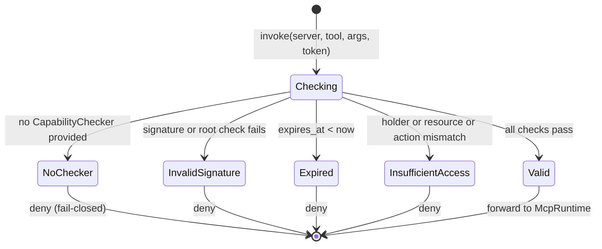

# hkask-capability — Explanation

The OCAP layer exists to enforce the Magna Carta principle P4: Clear
Boundaries. Every tool invocation requires a `DelegationToken` proving
authorization. This design replaces ambient authority (where any code can
call any tool) with capability-based authority (where access requires
possession of an unforgeable token). The tradeoff is complexity: tokens must
be constructed, verified, and attenuated. The benefit is that a compromised
component cannot escalate beyond the capabilities it holds.

## Source citations

| Symbol | Location |
|--------|----------|
| `VerificationOutcome` enum | `kask/crates/hkask-capability/src/verification/types.rs:22` |
| `CapabilityChecker` struct | `kask/crates/hkask-capability/src/verification/checker.rs:20` |
| `verify_delegation_token_now` | `kask/crates/hkask-capability/src/verification/verify.rs:22` |
| `DelegationToken` struct | `kask/crates/hkask-capability/src/token_types.rs:58` |
| `ToolPort` trait | `kask/crates/hkask-capability/src/tool_port.rs:47` |
| `DelegationResource` enum | `kask/crates/hkask-capability/src/resources.rs:51` |
| `DelegationAction` enum | `kask/crates/hkask-capability/src/resources.rs:80` |
| `attenuation_level` field | `kask/crates/hkask-capability/src/token_types.rs:58` |
| `max_attenuation` field | `kask/crates/hkask-capability/src/token_types.rs:58` |

## Verification state machine

When a tool invocation arrives at the `ToolPort`, the free function
`verify_delegation_token_now` verifies the attached `DelegationToken` using
an optional `CapabilityChecker`. The verification produces a
`VerificationOutcome` (`verification/types.rs:22`) with five possible states.
The state machine below shows the transitions.

<!-- DIAGRAM_ALIGNMENT
id: DIAG-DIA-CAP-002
verified_date: 2026-07-29
verified_against: kask/crates/hkask-capability/src/verification/types.rs:22; kask/crates/hkask-capability/src/verification/checker.rs:20; kask/crates/hkask-capability/src/verification/verify.rs:22,63; kask/crates/hkask-capability/src/tool_port.rs:47
status: VERIFIED
-->

The five outcomes map to two decisions: deny or forward. Four outcomes deny
the call. Only `Valid` forwards the call to the underlying `McpRuntime`. The
`NoChecker` outcome is a fail-closed default: if no `CapabilityChecker` is
configured, access is denied rather than allowed.

Note: `CapabilityChecker::verify` itself returns `bool` (signature + root
trust only). The structured `VerificationOutcome` is produced by
`verify_delegation_token` / `verify_delegation_token_now`, which layer
expiry and capability checks on top of the checker's `verify` and `check`
methods.

## Why fail-closed

The `NoChecker` variant exists because the `CapabilityChecker` is an optional
dependency. A pod-internal checker may construct tokens locally and verify
only the self-signature (`enforce_roots: false`). A boundary checker
verifies against a trusted root set (`enforce_roots: true`). If neither is
provided, the system denies access rather than allowing it.

This implements the Magna Carta principle P2: Affirmative Consent. The
default is deny. Access requires explicit, scoped, version-aware, and
revocable consent. A missing checker is not implicit consent; it is the
absence of consent, which denies access.

## Attenuation

The `DelegationToken` carries an `attenuation_level` and a `max_attenuation`
field (both at `token_types.rs:58`). When a token is delegated from one
principal to another, the attenuation level increases. A token at
`attenuation_level == max_attenuation` cannot be further delegated.

This enforces the OCAP attenuation principle: a delegated capability is
strictly less powerful than the original. A sub-task that receives a token
cannot escalate beyond the scope granted to it, and it cannot re-delegate
indefinitely. The `max_attenuation` cap prevents deep delegation chains
that would make audit difficult.

## Resource and action granularity

The `DelegationResource` enum (`resources.rs:51`) has four variants: `Tool`,
`Template`, `Registry`, and `Key`. The `DelegationAction` enum
(`resources.rs:80`) has three variants: `Read`, `Write`, and `Execute`.

This granularity is deliberate. A token scoped to `Tool` + `Execute` on a
specific server ID authorizes calling that tool but not modifying the
registry. A token scoped to `Key` + `Write` authorizes API key lifecycle
management but not tool invocation. The separation prevents a token granted
for one purpose from being used for another.

## See also

- [hkask-capability Reference](./reference.md): class diagram of the token,
  checker, and ToolPort types.
- [hkask-types Explanation](../hkask-types/explanation.md): how the guard
  layer wraps the inference port in the composition root.
- [`kask/docs/architecture/core/PRINCIPLES.md`](../../architecture/core/PRINCIPLES.md):
  P2 (Affirmative Consent), P4 (Clear Boundaries), P4.1 (Pod Boundary).
- [`kask/docs/architecture/core/magna-carta.md`](../../architecture/core/magna-carta.md):
  the four sovereignty principles.

---

[^miller-ocap]: Miller, M. S. (2006). *Robust Composition: Towards a Unified Approach to Access Control and Concurrency Control.* Johns Hopkins University. <https://www.erights.org/talks/thesis/markm-thesis.pdf>. The Object Capability model: access is granted by possession of an unforgeable capability token, and attenuation preserves safety.

[^saltzer-1975]: Saltzer, J. H., & Schroeder, M. D. (1975). *The Protection of Information in Computer Systems.* Proceedings of the IEEE, 63(9), 1278-1308. <https://www.cs.virginia.edu/~evans/cs551/p10-saltzer.pdf>. The fail-closed default and least-privilege principle that the `NoChecker` outcome implements.
