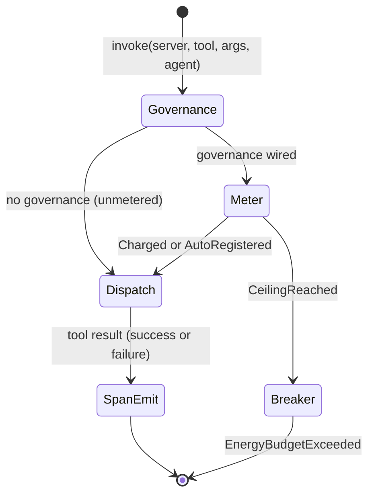
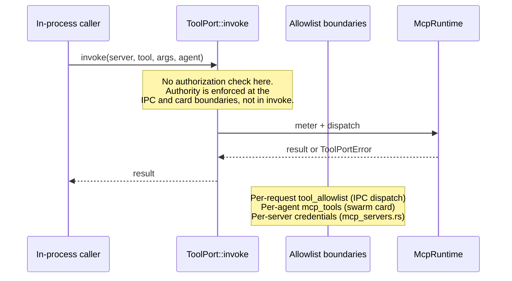

# hkask-capability — Explanation

The capability layer exists to keep tool authority *separated* — to make it
structurally impossible for an agent to reach a tool nobody granted it. It does
**not** try to re-check that grant on every call. `McpRuntime::invoke` meters
the call, dispatches it, and emits the outcome span; the decision about what an
agent may reach is made earlier, by a list the agent does not write.

That is a correction, not a design preference. The crate once minted a
`DelegationToken` per call and checked it at invoke time, and the check was
worthless.

## Source citations

| Concept                              | Location                                                       |
| ------------------------------------ | -------------------------------------------------------------- |
| Per-call gate removal rationale      | `kask/crates/hkask-capability/src/hkask_capability.rs:5-21`    |
| `invoke` does not authorize          | `kask/crates/hkask-capability/src/tool_port.rs:64-83`          |
| `invoke` metering + dispatch         | `kask/crates/hkask-mcp/src/runtime.rs:969-1057`                |
| `CallMeterOutcome` branches          | `kask/crates/hkask-regulation/src/energy.rs:35-45`             |
| Per-request allowlist gate           | `kask/crates/kask_bridge/src/inference_ipc_server.rs:724-747` |
| Per-agent `mcp_tools` allowlist       | `kask/mcp-servers/hkask-mcp-swarm/src/agent_executor.rs:236-346` |
| Per-server credential allowlist      | `kask/crates/kask_bridge/src/mcp_servers.rs:26-43`             |
| Taint gate removal rationale         | `kask/crates/hkask-capability/src/hkask_capability.rs:19-21`   |

## What was removed and why

The per-call capability gate was deleted (RR-0056). The mechanics of its
failure are worth stating precisely, because the shape recurs:

- `DelegationToken::is_valid_for` was field-wise equality: `resource == resource
  && resource_id == resource_id && action == action`.
- All three production mint sites — the panel tool invoker, the inference IPC
  `tool_invoke` dispatch, and the manifest executor's `invoke_tool` step —
  derived the token's `resource_id` from the same `tool` value they then passed
  to `invoke`.
- So the gate compared a caller-supplied value against itself. It returned true
  unconditionally, on every tool call, forever, while `DIVERGENCE.md` D3
  advertised it as "the enforced gate."

**A capability check is a gate only when the authority list is not chosen by the
caller being checked.** That is the whole lesson, and it is why the earlier
cryptographic ceremony had already failed the same way: the Ed25519 signature
removed earlier was verified against the public key embedded in the token
itself, not against a trusted root — a hostile caller could mint anything.
Signing a self-asserted claim does not make it an authority.

Deleted with the gate: `DelegationToken`, `panel_default_token`,
`capabilities_match`, `capability_from_server_id`, `CapabilitySpec`,
`DelegationResource`, `DelegationAction`,
`ToolPortError::CapabilityDenied`, and `McpRuntime::verify_capability_domain`.
`invoke` now takes `agent: WebID`, which is an accounting identity — a meter
reading, not a credential.

## Where authority moved (it did not disappear)

Capability separation is enforced at boundaries that hold a list the caller
cannot set:

- **The per-request `tool_allowlist`** on the inference IPC `tool_invoke`
  dispatch (`kask/crates/kask_bridge/src/inference_ipc_server.rs`). The child
  MCP server declares what it may dispatch; the zed side enforces it before
  dispatch, so the gate does not depend on the child's own matching being
  correct. Fail-closed: a missing or empty allowlist is a protocol violation,
  never an implicit grant-all. Pinned by `dispatch_tool_invoke_rejects_unallowed_tool`.
- **The per-agent `mcp_tools` allowlist** on each swarm agent card
  (`kask/mcp-servers/hkask-mcp-swarm/src/agent_executor.rs`). A tool call
  outside the declared set is refused with "not in declared mcp_tools
  allowlist" and never dispatched.
- **The per-server MCP env/credential allowlists**
  (`kask/crates/kask_bridge/src/mcp_servers.rs`). A server's process receives
  only the credentials scoped to it.

Each of these is a list written by a different actor than the one it
constrains. That is what the deleted gate lacked.

## The invoke pipeline

<!-- DIAGRAM_ALIGNMENT
id: DIAG-CAP-004
verified_date: 2026-08-13
verified_against: kask/crates/hkask-mcp/src/runtime.rs:969-1057 (impl ToolPort for McpRuntime, charge_call_metered branch + no-governance branch); kask/crates/hkask-regulation/src/energy.rs:35-45 (CallMeterOutcome); kask/crates/hkask-mcp/tests/invoke_gate.rs
status: VERIFIED
-->

One mechanism remains on the dispatch path, and it does not authorize:

**The runaway-loop breaker.** One call is charged against the agent's per-tick
ceiling. Only an exhausted ceiling refuses (`EnergyBudgetExceeded`), and the
cap resets each regulation tick. Its purpose is to end a non-terminating tool
loop and to meter usage so cost can be optimized over time — not to limit
precisely or to authorize. It is deliberately **fail-open** on an agent with no
registered ceiling: such an agent is auto-registered at
`DEFAULT_RUNAWAY_CALL_CEILING` and the wiring gap is logged. The prior
fail-closed behavior demonstrated why: `main.rs` seeded a ceiling only for the
`swarm-panel` persona while the IPC dispatch used `kask-panel` and the cascade
used `manifest-executor`, so every delegated tool call was refused for a wiring
omission that had nothing to do with authority.

## The taint gate failed the same way, and was deleted too

A second removal (RR-0053) took the FIDES taint machinery: `ToolTaint`,
`can_flow_to`, the `ToolInfo.taint` field, and the `DefaultPolicy` check in the
manifest executor's `invoke_tool` that consumed them. It is worth recording
next to the capability gate, because the shape is the same one again — a check
that runs and cannot decide:

- The policy's one prohibition was `Source` → `Sink`.
- `McpRuntime::get_tool_info` hardcoded `ToolTaint::Pure` at the only site that
  constructed a `ToolInfo`, so no tool was ever `Sink`.
- The executor's untrusted-input flag read legacy `__taint__{key}` context
  markers that the write path had stopped emitting, so it was always `false`.

Both inputs were constants, so the block could never fire — and, as with the
capability gate, a passing wiring test concealed it. **A wiring test proves a
call happens, not that the call can ever decide anything.** That is the shared
lesson across RR-0053 (this), RR-0056 (the capability gate), and RR-0057 (the
fail-closed meter).

The operator chose deletion over repair, so defense **Layer 5 (information
flow control) is absent by decision** — the same disposition Layer 3
(instruction hierarchy) has. That is the honest state and the safer one: an
inert gate invites reliance on a protection that does not exist, and every
downstream doc re-credits it. RR-0053 is now an absence check, and it states
what a real IFC gate would have to prove. Rationale in full:
[`DIVERGENCE.md`](../../../../DIVERGENCE.md) D4 (guard layer removal) and
`kask/security/regressions/RR-0053.yaml` (taint gate removal).

## If a real trust boundary appears

Nothing here defends against a hostile caller already executing inside the
process; such a caller can call `invoke` directly. That is acceptable only
because there is no trust boundary at this seam — the allowlist gates sit at
the IPC and card boundaries, where the untrusted party actually is.

<!-- DIAGRAM_ALIGNMENT
id: DIAG-CAP-005
verified_date: 2026-08-13
verified_against: kask/crates/hkask-capability/src/tool_port.rs:64-83 (invoke does not authorize); kask/crates/kask_bridge/src/inference_ipc_server.rs:724-747 (tool_allowlist gate); kask/mcp-servers/hkask-mcp-swarm/src/agent_executor.rs:236-346 (mcp_tools gate); kask/crates/kask_bridge/src/mcp_servers.rs:26-43 (credential allowlist)
status: VERIFIED
-->

If a genuine boundary is ever introduced (tokens crossing a process or network
edge to an untrusted verifier), verification must be reintroduced with a
**trusted root key set**, and the change must ship with a test proving that a
mismatched request produced on a path production can actually reach is
refused. Do not re-add a per-call authorization argument to `ToolPort::invoke`
without that proof — see `kask/security/regressions/RR-0056.yaml`.

## See also

- [hkask-capability Reference](./reference.md): the current type surfaces and
  the invoke pipeline.
- [hkask-capability Tutorial](./tutorial.md): dispatching through the seam.
- [`DIVERGENCE.md`](../../../../DIVERGENCE.md) D4 and
  `kask/security/regressions/RR-0053.yaml`: full rationale for the guard-layer
  and taint-gate deletions.
- `kask/security/regressions/RR-0053.yaml`, `RR-0056.yaml`, `RR-0057.yaml`.

---

[^fides-cap]: Microsoft Research. (2025). _FIDES: Information flow control for LLM agents_ (arXiv:2505.23643). The Source/Sink/Pure/Endorser lattice and the Source→Sink endorsement rule. Retained as the academic source for a design this crate no longer implements — the lattice was deleted (RR-0053). Citing it is not a claim that information flow control is deployed.

[^miller-ocap]: Miller, M. S. (2006). _Robust Composition: Towards a Unified Approach to Access Control and Concurrency Control._ Johns Hopkins University. <https://www.erights.org/talks/thesis/markm-thesis.pdf>. The Object Capability model, retained here as the source of the principle that survived: authority must be *separated* by a list the caller cannot choose. The in-process token *matching* that once cited this reference was removed as vacuous.
