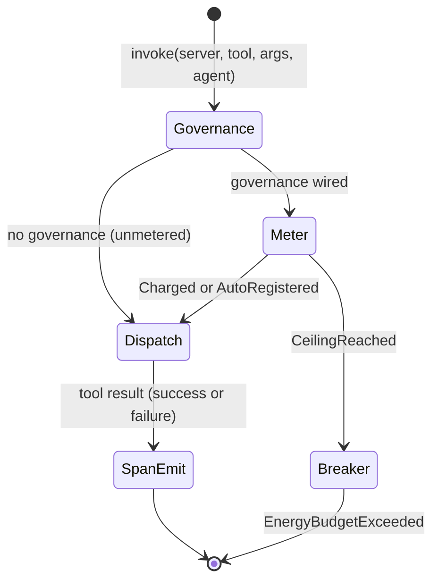

# hkask-capability — Explanation

The capability layer exists to keep tool authority *separated* — to make it
structurally impossible for an agent to reach a tool nobody granted it. It does
**not** try to re-check that grant on every call. `McpRuntime::invoke` meters the
call, dispatches it, and emits the outcome span; the decision about what an agent
may reach is made earlier, by a list the agent does not write.

That is a correction, not a design preference. The crate once minted a
`DelegationToken` per call and checked it at invoke time, and the check was
worthless.

## What was removed and why

On 2026-08-12 the per-call capability gate was deleted (RR-0056). The mechanics
of its failure are worth stating precisely, because the shape recurs:

- `DelegationToken::is_valid_for` was field-wise equality: `resource == resource
  && resource_id == resource_id && action == action`.
- All three production mint sites — the panel tool invoker, the inference IPC
  `tool_invoke` dispatch, and the manifest executor's `invoke_tool` step —
  derived the token's `resource_id` from the same `tool` value they then passed
  to `invoke`.
- So the gate compared a caller-supplied value against itself. It returned true
  unconditionally, on every tool call, forever, while `DIVERGENCE.md` D3
  advertised it as "the enforced gate."

**A capability check is a gate only when the authority list is not chosen by the
caller being checked.** That is the whole lesson, and it is why the earlier
cryptographic ceremony had already failed the same way: the Ed25519 signature
removed on 2026-07-31 was verified against the public key embedded in the token
itself, not against a trusted root — a hostile caller could mint anything.
Signing a self-asserted claim does not make it an authority.

Deleted with the gate: `DelegationToken`, `panel_default_token`,
`capabilities_match`, `capability_from_server_id`, `CapabilitySpec`,
`DelegationResource`, `DelegationAction`,
`ToolPortError::CapabilityDenied`, and `McpRuntime::verify_capability_domain`.
`invoke` now takes `agent: WebID`, which is an accounting identity — a meter
reading, not a credential.

## Where authority moved (it did not disappear)

Capability separation is enforced at boundaries that hold a list the caller
cannot set:

- **The per-request `tool_allowlist`** on the inference IPC `tool_invoke`
  dispatch (`kask_bridge/src/inference_ipc_server.rs`). The child MCP server
  declares what it may dispatch; the zed side enforces it before dispatch, so
  the gate does not depend on the child's own matching being correct. Fail-closed:
  a missing or empty allowlist is a protocol violation, never an implicit
  grant-all. Pinned by `dispatch_tool_invoke_rejects_unallowed_tool`.
- **The per-agent `mcp_tools` allowlist** on each swarm agent card
  (`hkask-mcp-swarm/src/agent_executor.rs`). A tool call outside the declared set
  is refused with "not in declared mcp_tools allowlist" and never dispatched.
- **The per-server MCP env/credential allowlists**
  (`kask_bridge/src/mcp_servers.rs`, RR-0038). A server's process receives only
  the credentials scoped to it.

Each of these is a list written by a different actor than the one it constrains.
That is what the deleted gate lacked.

## What the invoke path still does

Two mechanisms remain on the dispatch path, and neither authorizes:

**The runaway-loop breaker.** One call is charged against the agent's per-tick
ceiling. Only an exhausted ceiling refuses (`EnergyBudgetExceeded`), and the cap
resets each regulation tick. Its purpose is to end a non-terminating tool loop
and to meter usage so cost can be optimized over time — not to limit precisely
or to authorize. It is deliberately **fail-open** on an agent with no registered
ceiling: such an agent is auto-registered at `DEFAULT_RUNAWAY_CALL_CEILING` and
the wiring gap is logged (RR-0057). The prior fail-closed behavior demonstrated
why: `main.rs` seeded a ceiling only for the `swarm-panel` persona while the IPC
dispatch used `kask-panel` and the cascade used `manifest-executor`, so every
delegated tool call was refused for a wiring omission that had nothing to do with
authority.

**The FIDES taint labels.** `ToolInfo.taint` feeds the runtime policy check in
the manifest executor's `invoke_tool`, which blocks a `Sink` tool whose inputs
reference `Source`-tainted context (RR-0053). This *is* a live gate — on
information flow, not on authority — and it works precisely because the label
comes from the tool's registration rather than from the caller's own claim about
itself.

## The invoke pipeline

<!-- DIAGRAM_ALIGNMENT
id: DIAG-DIA-CAP-001
verified_date: 2026-08-12
verified_against: kask/crates/hkask-mcp/src/runtime.rs (impl hkask_capability::ToolPort for McpRuntime); kask/crates/hkask-regulation/src/energy.rs (CallCapManager::charge_metered, CallMeterOutcome, DEFAULT_RUNAWAY_CALL_CEILING); kask/crates/hkask-mcp/tests/invoke_gate.rs
status: VERIFIED
-->

## If a real trust boundary appears

Nothing here defends against a hostile caller already executing inside the
process; such a caller can call `invoke` directly. That is acceptable only
because there is no trust boundary at this seam — the allowlist gates sit at the
IPC and card boundaries, where the untrusted party actually is.

If a genuine boundary is ever introduced (tokens crossing a process or network
edge to an untrusted verifier), verification must be reintroduced with a
**trusted root key set**, and the change must ship with a test proving that a
mismatched request produced on a path production can actually reach is refused.
Do not re-add a per-call authorization argument to `ToolPort::invoke` without
that proof — see `kask/security/regressions/RR-0056.yaml`.
