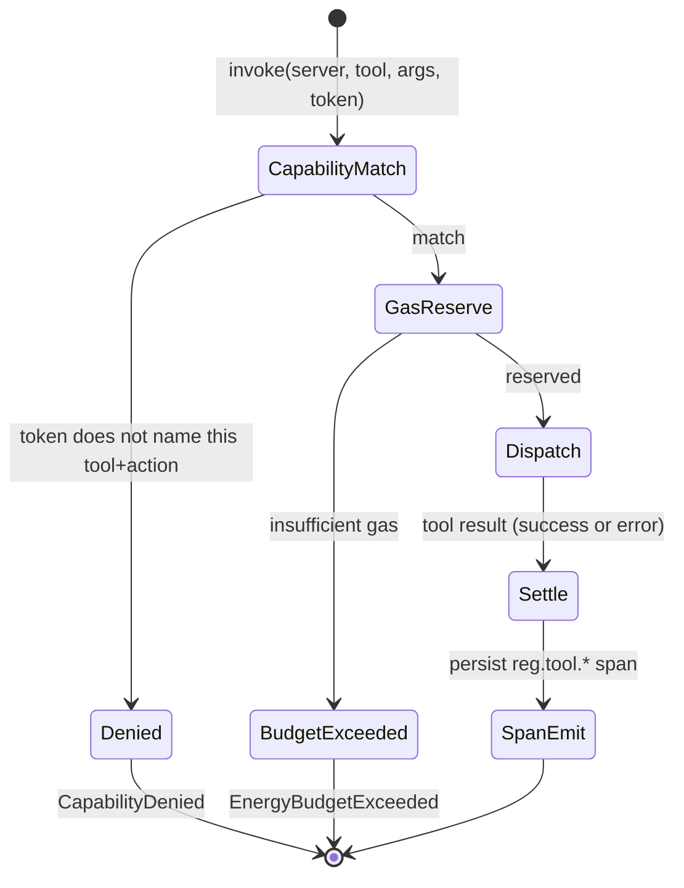

# hkask-capability — Explanation

The capability layer exists to make tool authority *explicit* at the
dispatch membrane. Every governed tool invocation carries a
`DelegationToken` declaring which resource and action the caller claims.
`McpRuntime::invoke` checks that declaration against the actual call
(capability match) and enforces gas budgets. This replaces ambient authority
(any code can call any tool with no record of what it was allowed to call)
with declared authority (every call names its claimed scope, and mismatches
are denied and logged).

## What the gate is — and is not

Tokens are minted and consumed **in-process** (`panel_default_token` at the
composition root). There is no untrusted transport boundary — the caller and
the gate are in the same address space. Two consequences follow:

1. **No cryptography.** Earlier versions signed tokens with Ed25519 and
   verified the signature at invoke time. The verification was
   self-referential (checked against the public key embedded in the token
   itself, not a trusted authority), so it denied nothing a hostile caller
   couldn't bypass — security theater per the "advertised invariants need
   enforcement points" rule. The signature, public key, `verify()`,
   `derive_signing_key`, and the minting-key threading were removed on
   2026-07-31.
2. **The gate is a consistency check, not a security boundary.** It catches
   manifest/config bugs — a cascade step or panel view naming the wrong
   tool, or a capability string that drifted from the tool's declared
   requirement. It does not (and cannot) defend against a hostile caller
   already executing inside the process; such a caller can mint any token.

If a genuine trust boundary is ever introduced (e.g. tokens crossing a
network or process boundary to an untrusted verifier), cryptographic
verification must be reintroduced *with a trusted root key set* — not the
self-referential check that was removed.

## The invoke pipeline

<!-- DIAGRAM_ALIGNMENT
id: DIAG-DIA-CAP-001
verified_date: 2026-08-04
verified_against: kask/crates/hkask-capability/src/token_types.rs; kask/crates/hkask-capability/src/resources.rs; kask/crates/hkask-mcp/src/runtime.rs (invoke, verify_capability_domain); kask/crates/hkask-regulation/src/energy.rs (CallCapManager, CallCap)
status: VERIFIED
-->