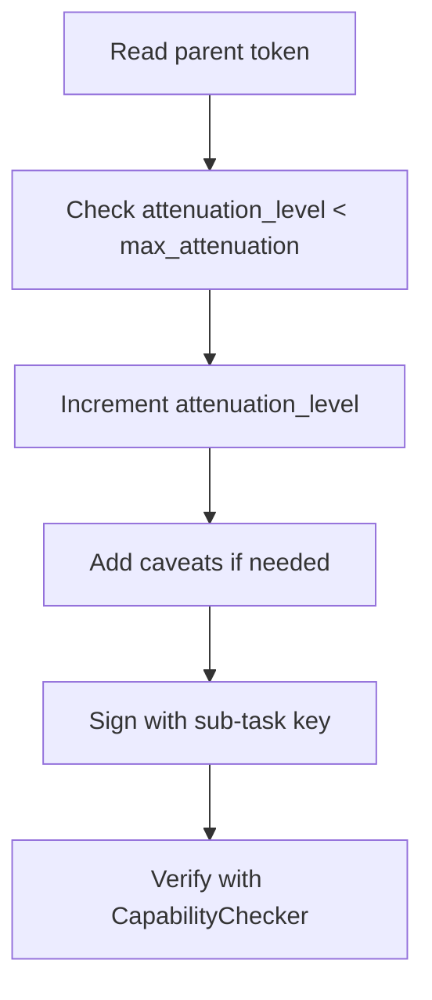

# hkask-capability — How-to: Attenuate a Token for a Sub-task

This guide shows how to attenuate a `DelegationToken` when delegating to a
sub-task. Attenuation ensures the sub-task cannot escalate beyond the scope
granted to it.

## Source citations

| Symbol | Location |
|--------|----------|
| `DelegationToken` | `kask/crates/hkask-capability/src/token_types.rs:58` |
| `DelegationTokenBuilder` | `kask/crates/hkask-capability/src/token_types.rs:90` |
| `attenuation_level` field | `kask/crates/hkask-capability/src/token_types.rs:58` |
| `max_attenuation` field | `kask/crates/hkask-capability/src/token_types.rs:58` |
| `Caveat` struct | `kask/crates/hkask-capability/src/token_types.rs:40` |

## Procedure

<!-- DIAGRAM_ALIGNMENT
id: DIAG-DIA-CAP-004
verified_date: 2026-07-27
verified_against: kask/crates/hkask-capability/src/token_types.rs:58,90,40
status: VERIFIED
-->

### Step 1: Check the attenuation limit

Read the parent token's `attenuation_level` and `max_attenuation` fields
(`token_types.rs:58`). If `attenuation_level >= max_attenuation`, the
token cannot be further delegated. Stop and report the error.

### Step 2: Build the attenuated token

Use `DelegationTokenBuilder` (`token_types.rs:90`) to construct a new
token with `attenuation_level` incremented by 1. Copy the `max_attenuation`
from the parent. Set `delegated_from` to the parent's `delegated_to` and
`delegated_to` to the sub-task's WebID.

### Step 3: Add caveats

Add `Caveat` entries (`token_types.rs:40`) to further restrict the token.
Common caveats include time limits, tool restrictions, and data-scope
restrictions.

### Step 4: Sign and verify

Sign the token with the sub-task's Ed25519 key. Verify it with
`CapabilityChecker` before passing it to the sub-task.

## See also

- [hkask-capability Reference](./reference.md): class diagram of tokens.
- [hkask-capability Tutorial](./tutorial.md): your first capability token.
- [hkask-capability Explanation](./explanation.md): why attenuation exists.

---

[^miller-ocap]: Miller, M. S. (2006). *Robust Composition.* <https://www.erights.org/talks/thesis/markm-thesis.pdf>. The attenuation principle: a delegated capability is strictly less powerful than the original.
