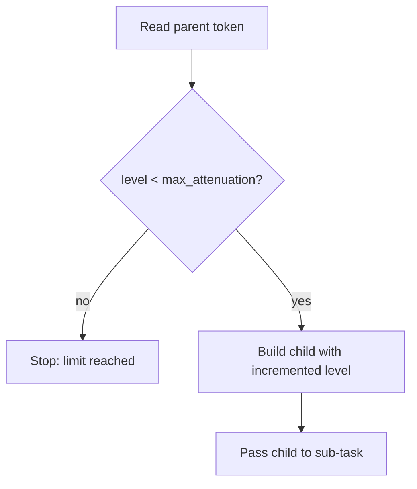

# hkask-capability — How-to: Attenuate a Token for a Sub-task

This guide shows how to mark delegation depth on a `DelegationToken` when
delegating to a sub-task. Attenuation is a structural bound — it keeps
delegation chains shallow enough to audit.

## Procedure



### Step 1: Check the attenuation limit

Compare `token.attenuation_level` against `token.max_attenuation` (default
`SYSTEM_MAX_ATTENUATION`, 7). If the level has reached the cap, do not
re-delegate — report the depth limit instead.

### Step 2: Build the child token

Construct the child with the builder, carrying the parent's scope forward
and incrementing the level:

```rust
let child = DelegationTokenBuilder::new(
    parent.resource,
    parent.resource_id.clone(),
    parent.action,
    parent.delegated_to.clone(), // the holder becomes the issuer
    subtask_webid,
)
.attenuation_level(parent.attenuation_level + 1)
.context_nonce(parent.context_nonce.clone())
.build();
```

The child inherits the parent's resource, action, and caveats; only the
delegation chain (`from`/`to`) and the attenuation level change.

## See also

- [hkask-capability Reference](./reference.md): the token model.
- [hkask-capability Tutorial](./tutorial.md): your first capability token.
- [hkask-capability Explanation](./explanation.md): why attenuation exists.
