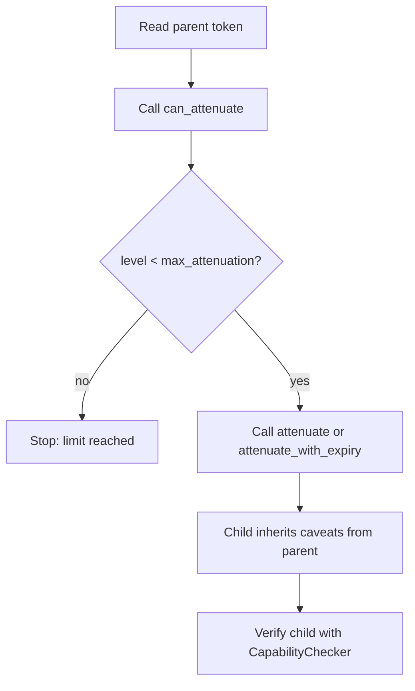

# hkask-capability — How-to: Attenuate a Token for a Sub-task

This guide shows how to attenuate a `DelegationToken` when delegating to a
sub-task. Attenuation ensures the sub-task cannot escalate beyond the scope
granted to it.

## Source citations

| Symbol | Location |
|--------|----------|
| `DelegationToken` | `kask/crates/hkask-capability/src/token_types.rs:58` |
| `DelegationTokenBuilder` | `kask/crates/hkask-capability/src/token_types.rs:90` |
| `can_attenuate` method | `kask/crates/hkask-capability/src/token_types.rs:341` |
| `attenuate` method | `kask/crates/hkask-capability/src/token_types.rs:352` |
| `attenuate_with_expiry` method | `kask/crates/hkask-capability/src/token_types.rs:369` |
| `CapabilityChecker::attenuate` | `kask/crates/hkask-capability/src/verification/checker.rs:243` |
| `Caveat` struct | `kask/crates/hkask-capability/src/token_types.rs:40` |

## Procedure

<!-- DIAGRAM_ALIGNMENT
id: DIAG-DIA-CAP-004
verified_date: 2026-07-29
verified_against: kask/crates/hkask-capability/src/token_types.rs:58,341,352,369; kask/crates/hkask-capability/src/verification/checker.rs:243
status: VERIFIED
-->

### Step 1: Check the attenuation limit

Call `token.can_attenuate()` (`token_types.rs:341`). This returns `true` only
if `attenuation_level < max_attenuation`. If it returns `false`, the token
has reached its delegation depth limit and cannot be further delegated. Stop
and report the error.

### Step 2: Attenuate the token

Call `token.attenuate(new_to, signing_key, current_time)`
(`token_types.rs:352`) to produce a child token with `attenuation_level`
incremented by 1, a 1-hour expiry, and a chained context nonce. Use
`token.attenuate_with_expiry(new_to, signing_key, current_time, ttl)`
(`token_types.rs:369`) if you need a custom TTL. The child inherits all
caveats from the parent.

Alternatively, if you have a `CapabilityChecker` with a signing key, call
`checker.attenuate(token, new_to, current_time)` (`checker.rs:243`), which
returns `Option<DelegationToken>` — `None` if the checker has no signing key
or the attenuation limit is reached.

### Step 3: Verify the child token

Verify the attenuated child token with `CapabilityChecker::verify` or the
free function `verify_delegation_token_now` before passing it to the
sub-task. The child is strictly less powerful: its `attenuation_level` is
higher, bringing it closer to the `max_attenuation` ceiling.

## See also

- [hkask-capability Reference](./reference.md): class diagram of tokens.
- [hkask-capability Tutorial](./tutorial.md): your first capability token.
- [hkask-capability Explanation](./explanation.md): why attenuation exists.

---

[^miller-ocap]: Miller, M. S. (2006). *Robust Composition.* <https://www.erights.org/talks/thesis/markm-thesis.pdf>. The attenuation principle: a delegated capability is strictly less powerful than the original.
