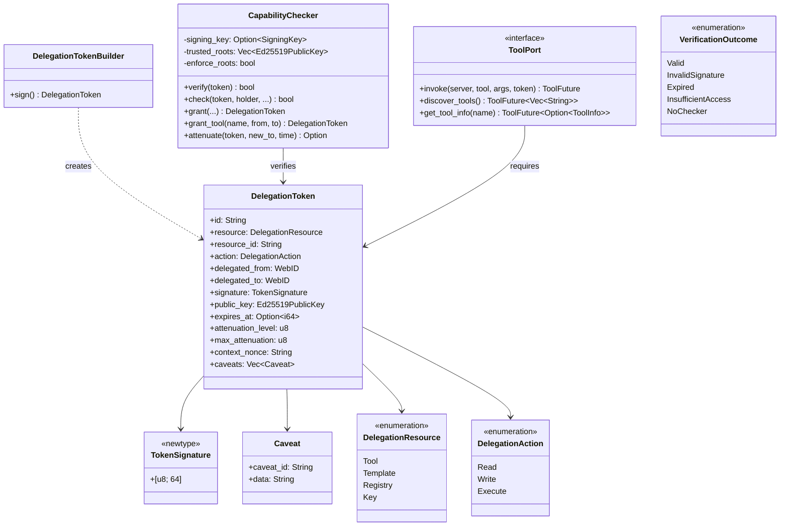

# hkask-capability — Reference

`hkask-capability` implements the Object Capability (OCAP) layer for hKask. It
defines `DelegationToken`, the `ToolPort` trait, and the `CapabilityChecker`
that verifies tokens before tool invocation. Every tool call in the governed
dispatch path requires a valid `DelegationToken` proving authorization.

## Source citations

| Symbol | Location |
|--------|----------|
| `DelegationToken` struct | `kask/crates/hkask-capability/src/token_types.rs:58` |
| `DelegationTokenBuilder` | `kask/crates/hkask-capability/src/token_types.rs:90` |
| `TokenSignature` newtype | `kask/crates/hkask-capability/src/token_types.rs:50` |
| `Caveat` struct | `kask/crates/hkask-capability/src/token_types.rs:40` |
| `CapabilityError` enum | `kask/crates/hkask-capability/src/token_types.rs:15` |
| `TokenRegistry` trait | `kask/crates/hkask-capability/src/token_types.rs:574` |
| `NoOpTokenRegistry` | `kask/crates/hkask-capability/src/token_types.rs:613` |
| `ToolPort` trait | `kask/crates/hkask-capability/src/tool_port.rs:47` |
| `ToolPortError` enum | `kask/crates/hkask-capability/src/tool_port.rs:9` |
| `ToolInfo` struct | `kask/crates/hkask-capability/src/tool_port.rs:73` |
| `CapabilityChecker` struct | `kask/crates/hkask-capability/src/verification/checker.rs:20` |
| `verify_delegation_token_now` | `kask/crates/hkask-capability/src/verification/verify.rs:22` |
| `verify_delegation_token` | `kask/crates/hkask-capability/src/verification/verify.rs:63` |
| `require_write_access` | `kask/crates/hkask-capability/src/verification/verify.rs:114` |
| `require_read_access` | `kask/crates/hkask-capability/src/verification/verify.rs:140` |
| `VerificationOutcome` enum | `kask/crates/hkask-capability/src/verification/types.rs:22` |
| `CapabilitySpec` struct | `kask/crates/hkask-capability/src/resources.rs:8` |
| `DelegationResource` enum | `kask/crates/hkask-capability/src/resources.rs:51` |
| `DelegationAction` enum | `kask/crates/hkask-capability/src/resources.rs:80` |
| `capabilities_match` fn | `kask/crates/hkask-capability/src/resources.rs:131` |
| `capability_from_server_id` fn | `kask/crates/hkask-capability/src/resources.rs:117` |

## Token and verification model

The `DelegationToken` (`token_types.rs:58`) is the core capability object. It
carries a resource, a resource_id, an action, a delegation chain (from/to
WebIDs), an Ed25519 signature, an Ed25519 public key, an optional expiry, an
attenuation level, a max attenuation cap, a context nonce, and a list of
caveats. The `DelegationTokenBuilder` (`token_types.rs:90`) constructs tokens
with the required fields and signs them with an Ed25519 key via `sign()`.

The `CapabilityChecker` (`verification/checker.rs:20`) verifies tokens. It
holds an optional signing key, a set of trusted root public keys, and an
`enforce_roots` flag. When `enforce_roots` is true, a token is accepted only
if its embedded public key is in the trusted set. When false, the checker
verifies only the self-signature, which is the mode used by pod-internal
checkers where tokens are constructed locally.

<!-- DIAGRAM_ALIGNMENT
id: DIAG-DIA-CAP-001
verified_date: 2026-07-29
verified_against: kask/crates/hkask-capability/src/token_types.rs:58,90,50,40; kask/crates/hkask-capability/src/tool_port.rs:47,73; kask/crates/hkask-capability/src/verification/checker.rs:20; kask/crates/hkask-capability/src/verification/types.rs:22; kask/crates/hkask-capability/src/resources.rs:51,80
status: VERIFIED
-->

## ToolPort trait

The `ToolPort` trait (`tool_port.rs:47`) is the actuator boundary for governed
tool dispatch. The `invoke` method requires a `DelegationToken` as a
parameter. The `discover_tools` and `get_tool_info` methods return public
tool metadata and require no token, because tool schemas are public per the
MCP protocol design.

The trait returns `ToolFuture` (`Pin<Box<dyn Future + Send + '_>>`), a pinned
boxed future, because tool invocation is asynchronous. The trait is
object-safe: `Arc<dyn ToolPort>` works. The `ToolPortError` enum
(`tool_port.rs:9`) includes `CapabilityDenied` for insufficient-token
failures, `EnergyBudgetExceeded` for gas exhaustion, `NotFound` for missing
tools, and `InvocationFailed` for runtime errors.

Implementor: `BridgeToolPort` in `kask/crates/kask_bridge/src/tool_port.rs:25`,
which wraps zed's `McpRuntime` and enforces OCAP, gas, and span emission.

## Verification functions

Four public functions in `verification/verify.rs` perform token verification:

- `verify_delegation_token_now` (`verify.rs:22`) verifies a token against the
  current time, checking signature, expiry, and capability. Returns a
  `VerificationOutcome`.
- `verify_delegation_token` (`verify.rs:63`) verifies a token against a
  caller-provided timestamp, used in tests and replay scenarios. Returns a
  `VerificationOutcome`.
- `require_write_access` (`verify.rs:114`) returns an error if the token
  does not grant write-level access on the given store.
- `require_read_access` (`verify.rs:140`) returns an error if the token does
  not grant read-level access on the given store.

Note: `CapabilityChecker::verify` returns `bool` (signature + root check
only). The structured `VerificationOutcome` is returned by the free functions
`verify_delegation_token` and `verify_delegation_token_now`, which layer
expiry and capability checks on top of the checker's `verify` and `check`
methods.

The `VerificationOutcome` enum (`verification/types.rs:22`) has five
variants: `Valid`, `InvalidSignature`, `Expired`, `InsufficientAccess {
resource_id, action }`, and `NoChecker`. The `InsufficientAccess` variant
carries the `resource_id` and `action` that were denied. The `NoChecker`
variant indicates that no `CapabilityChecker` was provided, which denies
access by default.

## Resource and action model

The `DelegationResource` enum (`resources.rs:51`) has four variants: `Tool`,
`Template`, `Registry`, and `Key`. The `DelegationAction` enum
(`resources.rs:80`) has three variants: `Read`, `Write`, and `Execute`. The
action hierarchy is `Execute >= Write >= Read`: a token with `Execute` action
satisfies requests for `Write` or `Read`; a `Write` token satisfies `Read`
requests but not `Execute`.

The `capabilities_match` function (`resources.rs:131`) compares a token's
declared capability against a required capability, applying the action
hierarchy. The `capability_from_server_id` function (`resources.rs:117`) maps
an MCP server ID (e.g. `hkask-mcp-<domain>` or short `<domain>`) to a
capability string `tool:<domain>:execute`, used when constructing tokens for
server-scoped access.

## See also

- [hkask-capability Explanation](./explanation.md): state diagram of token
  verification outcomes and the OCAP rationale.
- [hkask-types Reference](../hkask-types/reference.md): the `ToolPort` trait
  appears in both crates; this crate defines it, `hkask-types` re-exports it.
- [`kask/docs/architecture/core/PRINCIPLES.md`](../../architecture/core/PRINCIPLES.md):
  P4 (Clear Boundaries) and P4.1 (Pod Boundary as OCAP Enforcement Perimeter).
- [`kask/docs/architecture/core/magna-carta.md`](../../architecture/core/magna-carta.md):
  sovereignty principles P1 through P4.

---

[^miller-ocap]: Miller, M. S. (2006). *Robust Composition: Towards a Unified Approach to Access Control and Concurrency Control.* Johns Hopkins University. <https://www.erights.org/talks/thesis/markm-thesis.pdf>. The Object Capability model: access is granted by possession of an unforgeable capability token, not by ambient authority.

[^ed25519]: Bernstein, D. J., Duif, N., Lange, T., Schwabe, P., & Yang, B. Y. (2012). *High-speed high-security signatures.* Journal of Cryptographic Engineering, 2(2), 77-89. <https://ed25519.cr.yp.to/>. The Ed25519 signature scheme used for `TokenSignature`.
