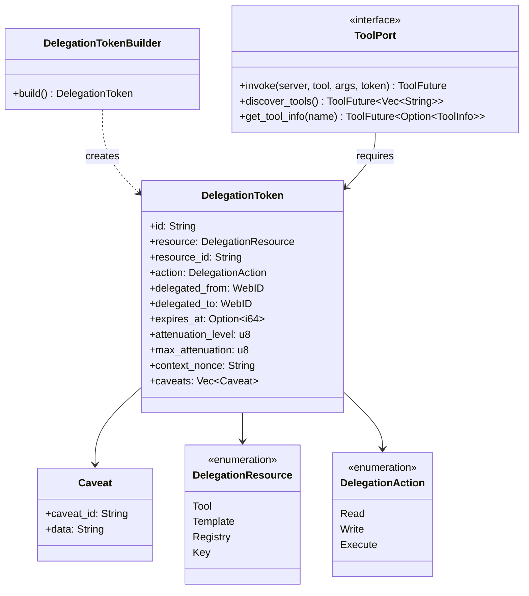

# hkask-capability — Reference

`hkask-capability` defines the in-process capability layer for hKask:
`DelegationToken`, the `ToolPort` trait, and the `capabilities_match`
function. A `DelegationToken` declares "holder X may perform action Y on
resource Z". Tokens are minted and consumed **in-process** (the composition
root hands them to `McpRuntime::invoke`); there is no untrusted transport
boundary, so tokens carry **no signature and no public key**. The enforced
gate is the capability match in `McpRuntime::invoke` (`is_valid_for` /
`verify_capability_domain`), not cryptography — it catches manifest/config
bugs (a caller naming the wrong tool); it is not a security boundary against
a hostile in-process caller.

## Source citations

| Symbol | Location |
|--------|----------|
| `DelegationToken` struct | `kask/crates/hkask-capability/src/token_types.rs` |
| `DelegationTokenBuilder` | `kask/crates/hkask-capability/src/token_types.rs` |
| `Caveat` struct | `kask/crates/hkask-capability/src/token_types.rs` |
| `CapabilityError` enum | `kask/crates/hkask-capability/src/token_types.rs` |
| `TokenRegistry` trait | `kask/crates/hkask-capability/src/token_types.rs` |
| `panel_default_token` (minting) | `kask/crates/hkask-capability/src/auth.rs` |
| `ToolPort` trait | `kask/crates/hkask-capability/src/tool_port.rs` |
| `ToolPortError` enum | `kask/crates/hkask-capability/src/tool_port.rs` |
| `ToolInfo` struct | `kask/crates/hkask-capability/src/tool_port.rs` |
| Capability-match gate (enforcement) | `kask/crates/hkask-mcp/src/runtime.rs` (`invoke`, `verify_capability_domain`) |
| `CapabilitySpec` struct | `kask/crates/hkask-capability/src/resources.rs` |
| `DelegationResource` enum | `kask/crates/hkask-capability/src/resources.rs` |
| `DelegationAction` enum | `kask/crates/hkask-capability/src/resources.rs` |
| `capabilities_match` fn | `kask/crates/hkask-capability/src/resources.rs` |
| `capability_from_server_id` fn | `kask/crates/hkask-capability/src/resources.rs` |

Removed in the 2026-07-31 token-ceremony collapse: `signature`/`public_key`
fields, `verify()`/`verify_cryptographic()`, `TokenSignature`,
`derive_signing_key`, base64 serialization, the `SigningPayload`, the
`AuthContext` struct, `require_read_access`/`require_write_access`,
`NoOpTokenRegistry`, and the Kani tamper-detection harnesses. The
`TokenRegistry` SQL store keeps its legacy `signature_hex`/`public_key_hex`
columns (written as empty strings — no schema migration).

## Token model

The `DelegationToken` is the core capability object. It carries an id
(deterministic content hash), a resource, a resource_id, an action, a
delegation chain (from/to WebIDs), an optional expiry, an attenuation level,
a max attenuation cap, a context nonce, and a list of caveats. The
`DelegationTokenBuilder` constructs tokens via `build()` (no signing step).

## The enforced gate

`McpRuntime::invoke` (in `hkask-mcp/src/runtime.rs`) applies, in order:

1. **Capability match** — `token.is_valid_for(Tool, tool, Execute)` or
   `verify_capability_domain` (string-form capability comparison via
   `capabilities_match`). Denies with `CapabilityDenied`.
2. **Gas** — reserve estimated cost, dispatch, settle actual cost
   (hold-settle). Denies with `EnergyBudgetExceeded`.
3. **Span emission** — `reg.tool.*` spans persisted via the wired
   `RegulationSink` (`RegulationArchive` on the curator's pod.db in
   zed-kask).

The gate does NOT verify token signatures or consult the `TokenRegistry`
table. `TokenRegistry` is a consent-audit recording surface consumed by the
curator MCP server's `list_tokens` tool — revocation recorded there is not
checked at invoke time.

## ToolPort trait

The `ToolPort` trait is the actuator boundary for governed tool dispatch.
The `invoke` method requires a `DelegationToken` as a parameter. The
`discover_tools` and `get_tool_info` methods return public tool metadata and
require no token, because tool schemas are public per the MCP protocol
design.

The trait returns `ToolFuture` (`Pin<Box<dyn Future + Send + '_>>`), a pinned
boxed future, because tool invocation is asynchronous. The trait is
object-safe: `Arc<dyn ToolPort>` works. The `ToolPortError` enum includes
`CapabilityDenied` for capability mismatches, `EnergyBudgetExceeded` for gas
exhaustion, `NotFound` for missing tools, and `InvocationFailed` for runtime
errors.

Implementor: `McpRuntime` itself (`hkask-mcp/src/runtime.rs`) — the
composition root passes `Arc<McpRuntime>` wherever a `ToolPort` is needed.
The former `BridgeToolPort` adapter was deleted as a pure pass-through.

## Resource and action model

The `DelegationResource` enum has four variants: `Tool`, `Template`,
`Registry`, and `Key`. The `DelegationAction` enum has three variants:
`Read`, `Write`, and `Execute`. The action hierarchy is
`Execute >= Write >= Read`: a token with `Execute` action satisfies requests
for `Write` or `Read`; a `Write` token satisfies `Read` requests but not
`Execute`.

The `capabilities_match` function compares a token's declared capability
against a required capability, applying the action hierarchy. The
`capability_from_server_id` function maps an MCP server ID (e.g.
`hkask-mcp-<domain>` or short `<domain>`) to a capability string
`tool:<domain>:execute`, used when constructing tokens for server-scoped
access.

## See also

- [hkask-capability Explanation](./explanation.md): why the gate is a
  capability match and not a cryptographic check.
- [`kask/docs/architecture/core/PRINCIPLES.md`](../../architecture/core/PRINCIPLES.md):
  P4 (Clear Boundaries).

---

[^miller-ocap]: Miller, M. S. (2006). *Robust Composition: Towards a Unified Approach to Access Control and Concurrency Control.* Johns Hopkins University. <https://www.erights.org/talks/thesis/markm-thesis.pdf>. The Object Capability model as inspiration for capability-based dispatch. Note: zed-kask implements capability *matching* in-process, not the unforgeable-token model — there is no trust boundary to defend with cryptography.
