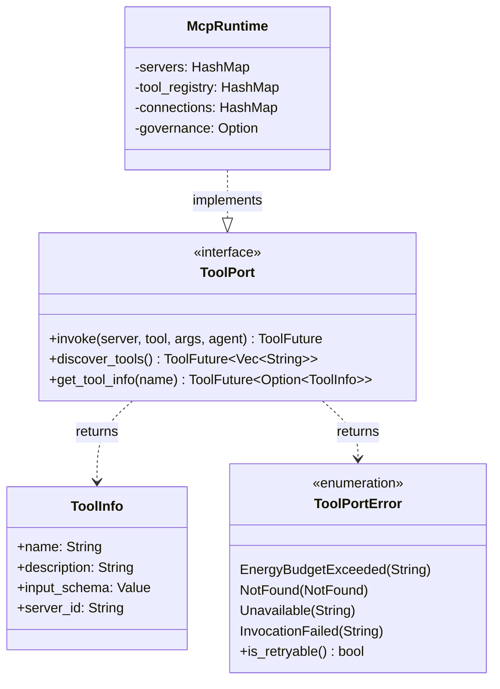

# hkask-capability — Reference

`hkask-capability` defines the tool dispatch port: the `ToolPort` trait, its
`ToolInfo` metadata, `ToolFuture` alias and `ToolPortError` taxonomy, plus the
`SYSTEM_MAX_RECURSION` structural bound. That is the entire surface. It contains
**no capability tokens, no authorization check, and no information-flow labels**.
Tool authority is enforced outside this crate, at the allowlist boundaries listed
under [Where authority is enforced](#where-authority-is-enforced).

## Source citations

| Symbol                       | Location                                            |
| ---------------------------- | --------------------------------------------------- |
| `ToolPort` trait             | `kask/crates/hkask-capability/src/tool_port.rs`     |
| `ToolPortError` enum         | `kask/crates/hkask-capability/src/tool_port.rs`     |
| `ToolFuture` type alias      | `kask/crates/hkask-capability/src/tool_port.rs`     |
| `ToolInfo` struct            | `kask/crates/hkask-capability/src/tool_port.rs`     |
| `SYSTEM_MAX_RECURSION` const | `kask/crates/hkask-capability/src/token_types.rs`   |
| `ToolPort` implementor       | `kask/crates/hkask-mcp/src/runtime.rs` (`McpRuntime`) |

The crate's `src/` directory holds exactly three files: `hkask_capability.rs`
(lib root), `token_types.rs`, and `tool_port.rs`.

## What was removed, and why

**2026-08-12 — the per-call capability gate (RR-0056).** `McpRuntime::invoke`
previously checked a `DelegationToken`'s declared `(resource, resource_id,
action)` triple against the invoked tool. The check was vacuous: all three
production mint sites derived the token's `resource_id` from the same tool name
they then passed to `invoke`, so `is_valid_for` — plain equality on each field —
compared a caller-supplied value against itself and returned true
unconditionally. It denied nothing while running on every tool call. Deleted:
`DelegationToken` (with `new` and `is_valid_for`), `panel_default_token`,
`capabilities_match`, `capability_from_server_id`, `CapabilitySpec`,
`CapabilityParseError`, `DelegationResource`, `DelegationAction`,
`ToolPortError::CapabilityDenied`, `McpRuntime::verify_capability_domain`,
`McpRuntime::required_capability_for`, the `ToolInfo::required_capability`
field, the `src/auth.rs` and `src/resources.rs` modules, and the
`test_token_for_tool` / `arb_delegation_token` / `arb_resource` / `arb_action`
test helpers. `ToolPort::invoke` now takes `agent: hkask_types::WebID` in the
token's place.

**2026-08-12 — the fail-closed call cap (RR-0057).** The meter no longer refuses
an agent that has no registered ceiling; see [Call metering](#call-metering).

**2026-08-12 — the FIDES taint labels (RR-0053).** `ToolTaint` (`Source` / `Sink`
/ `Pure` / `Endorser`), `can_flow_to`, `can_flow_to_matrix`, the whole
`src/tool_taint.rs` file, and the `ToolInfo.taint` field were deleted, along with
the `DefaultPolicy` gate in `hkask-templates` that consumed them. The gate was
inert: `McpRuntime::get_tool_info` hardcoded `ToolTaint::Pure` at the only site
that built a `ToolInfo`, and the executor's untrusted-input flag read cascade
markers the write path had stopped emitting, so `Source`→`Sink` could never fire.
The now-orphaned `serde` dependency was removed from `Cargo.toml`. See
[Information flow](#information-flow-absent-by-decision).

Earlier collapses removed the surrounding token ceremony: the 2026-07-31 pass
deleted `signature`/`public_key`, `verify()`/`verify_cryptographic()`,
`TokenSignature`, `derive_signing_key`, base64 serialization, `SigningPayload`,
`AuthContext`, `require_read_access`/`require_write_access`, `NoOpTokenRegistry`,
and the Kani tamper-detection harnesses. The 2026-08-02 pass deleted
`OcapConfig` and manifest `ocap:` blocks, `expires_at`,
`attenuation_level`/`max_attenuation`, `context_nonce`, `caveats`,
`DelegationTokenBuilder`, `Caveat`, `CapabilityError`, the `TokenRegistry` trait
and its SQL table, and `SYSTEM_MAX_ATTENUATION`.

## Type surface

<!-- DIAGRAM_ALIGNMENT
id: DIAG-DIA-CAP-002
verified_date: 2026-08-12
verified_against: kask/crates/hkask-capability/src/tool_port.rs; kask/crates/hkask-capability/src/token_types.rs; kask/crates/hkask-mcp/src/runtime.rs (McpRuntime, impl hkask_capability::ToolPort)
status: VERIFIED
-->

## ToolPort trait

`ToolPort` is the dispatch boundary for MCP tool invocation. Every method
returns `ToolFuture` (`Pin<Box<dyn Future + Send + '_>>`), so the trait is
object-safe and `Arc<dyn ToolPort>` works — this is why no adapter layer wraps
`McpRuntime` any more. The former `BridgeToolPort` pass-through was deleted.

| Method            | Signature                                                                        |
| ----------------- | -------------------------------------------------------------------------------- |
| `invoke`          | `(&self, server: &str, tool: &str, args: Value, agent: WebID) -> Result<Value, ToolPortError>` |
| `discover_tools`  | `(&self) -> Vec<String>`                                                         |
| `get_tool_info`   | `(&self, tool_name: &str) -> Option<ToolInfo>`                                   |

`agent` is the accounting identity for the call meter. `discover_tools` and
`get_tool_info` take no identity at all, because tool schemas are public per the
MCP protocol design (`tools/list` is an unauthenticated handshake).

`ToolPortError` has four variants and one predicate, `is_retryable`, which is
true only for `Unavailable` — the call never reached the tool, so a retry cannot
duplicate a side effect. `EnergyBudgetExceeded` needs a new regulation tick, and
`NotFound` / `InvocationFailed` would fail identically.

## What `invoke` does

`McpRuntime::invoke` (in `kask/crates/hkask-mcp/src/runtime.rs`) performs, in
order:

1. **Call metering** — when governance is wired (`with_governance`), charge one
   call against the agent's per-tick ceiling via
   `CyberneticsLoop::charge_call_metered`. Without governance, dispatch
   unmetered.
2. **Dispatch** — `call_tool_inner` checks for a live connection, reconnects once
   if the transport closed, and issues the JSON-RPC call.
3. **Span emission** — persist a `reg.gas.settled` `RegulationRecord` (target
   `reg.mcp`) carrying server, tool, call count, and success/failure status,
   through the wired `RegulationSink` (`RegulationArchive` on the curator's
   curator.db in zed-kask).

There is no authorization step. The only way `invoke` returns an error before
dispatch is `EnergyBudgetExceeded`.

## Call metering

The meter is a runaway-loop breaker and a usage recorder, not a permission
check. `hkask_regulation::CallCapManager::charge_metered` returns
`CallMeterOutcome`:

| Outcome                        | Behavior                                                                                    |
| ------------------------------ | ------------------------------------------------------------------------------------------- |
| `Charged`                      | Headroom remained; the call proceeds.                                                        |
| `AutoRegistered`               | The agent had no registered ceiling: register at `DEFAULT_RUNAWAY_CALL_CEILING` (10 000), charge, proceed, and log the wiring gap. |
| `CeilingReached { ceiling }`   | The per-tick ceiling is exhausted: refuse with `ToolPortError::EnergyBudgetExceeded`. Resets on the next regulation tick. |

Fail-open on an unregistered agent is deliberate (RR-0057): a missing
registration is a composition-root wiring omission, and refusing it fails live
paths without protecting anything.

## Where authority is enforced

A capability check is only a gate when the authority list is not chosen by the
caller being checked. Three boundaries satisfy that:

| Boundary                                                        | Location                                                       | Note                                        |
| --------------------------------------------------------------- | -------------------------------------------------------------- | ------------------------------------------- |
| Per-request delegated-tool `tool_allowlist` (fail-closed on missing/empty) | `kask/crates/kask_bridge/src/inference_ipc_server.rs` `tool_invoke` dispatch | Enforced before dispatch; pinned by `dispatch_tool_invoke_rejects_unallowed_tool` |
| Per-agent declared `mcp_tools` allowlist                        | `kask/mcp-servers/hkask-mcp-swarm/src/agent_executor.rs`        | Restricts which tools a swarm agent may call |
| Per-server MCP env / credential allowlists                      | `kask/crates/kask_bridge/src/mcp_servers.rs`                    | Scopes credentials per server (RR-0038)      |

There is no fourth gate. A FIDES `Source`→`Sink` information-flow check used to be
listed here; it was deleted on 2026-08-12 — see
[Information flow](#information-flow-absent-by-decision).

## Information flow: absent by decision

Nothing in this crate or on the invoke path inspects information flow. Defense
**Layer 5 (information flow control) is absent by decision**, recorded in the same
register as Layer 3 (instruction hierarchy, RR-0010): de-advertised rather than
deployed.

The FIDES lattice[^fides-cap] that once lived in `src/tool_taint.rs` labelled each
tool `Source` / `Sink` / `Pure` / `Endorser` and blocked `Source → Sink`. It was
deleted rather than repaired because the gate consuming it could not decide
anything: `McpRuntime::get_tool_info` hardcoded `Pure` at the only `ToolInfo`
construction site, so the `Sink` arm never matched. An inert gate is worse than no
gate — it invites reliance on a protection that does not exist.

Governing entry: `kask/security/regressions/RR-0053.yaml`, rewritten as an absence
check that forbids re-adding the machinery in inert form and states the bar a real
IFC gate must clear (labels derived from real per-tool metadata; an untrusted-input
signal read from the same field the write path sets, with a drift test; and a test
proving a `Source` input to a `Sink` tool is actually blocked on a reachable path).
RR-0012, RR-0013, RR-0026, RR-0027, RR-0033 and RR-0034 are `obsolete`. Full
rationale: [`guard-taint-pipeline.md`](../../architecture/guard-taint-pipeline.md).

## Structural bound

`SYSTEM_MAX_RECURSION` (7) is the shared bound for cascade depth and subgoal
nesting, consulted by the manifest executor and the registry bootstrap. It is a
runaway-recursion breaker, not an authorization limit — the same distinction the
call meter draws.

**Empirical context:** Wang (2026, arXiv:2603.02615v1) demonstrates that RLM
recursion depth=2 already degrades model performance across all tested
models and tasks — format collapse, parametric hallucination, and latency
explosion (3.6s → 344.5s). The cap of 7 is structural headroom for future
native-RLM-aligned models; skill authors should self-limit flowdef nesting
to depth 1–2 in practice. The matryoshka guard is a hard ceiling, not a
recommended operating point.

## See also

- [hkask-capability Explanation](./explanation.md): why per-call gating was
  removed and separation kept.
- [`kask/docs/architecture/core/PRINCIPLES.md`](../../architecture/core/PRINCIPLES.md):
  P4 (Clear Boundaries).
- `kask/security/regressions/RR-0053.yaml`, `RR-0056.yaml`, `RR-0057.yaml`.

---

[^fides-cap]: Microsoft Research. (2025). _FIDES: Information flow control for LLM agents_ (arXiv:2505.23643). The Source/Sink/Pure/Endorser lattice and the Source→Sink endorsement rule. Retained as the academic source for a design this crate no longer implements — the lattice was deleted on 2026-08-12 (RR-0053). Citing it is not a claim that information flow control is deployed.

[^miller-ocap]: Miller, M. S. (2006). _Robust Composition: Towards a Unified Approach to Access Control and Concurrency Control._ Johns Hopkins University. <https://www.erights.org/talks/thesis/markm-thesis.pdf>. The Object Capability model, retained here as the source of the principle that survived: authority must be *separated* by a list the caller cannot choose. The in-process token *matching* that once cited this reference was removed as vacuous — see [What was removed, and why](#what-was-removed-and-why).
