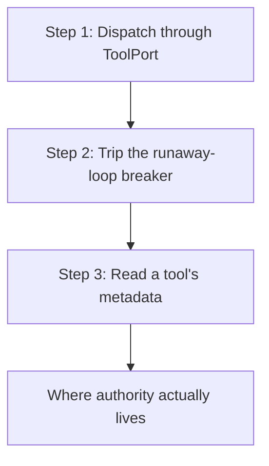

# hkask-capability — Tutorial: Dispatch a Tool Through the ToolPort Seam

This tutorial walks through the three things the `hkask-capability` crate
actually lets you do: dispatch a tool through the `ToolPort` seam, trip the
runaway-loop breaker, and read a tool's metadata. You will learn what `invoke`
*does* — it meters and dispatches — and what it deliberately does *not* do:
authorize. Authority is enforced outside this crate, at allowlist boundaries
the caller cannot choose.

The crate is small on purpose. It contains one trait (`ToolPort`), one error
enum (`ToolPortError`), one metadata struct (`ToolInfo`), one type alias
(`ToolFuture`), and one constant (`SYSTEM_MAX_RECURSION`). There are no
capability tokens in this crate and no per-call authorization argument on
`invoke`.

## Learning path



<!-- DIAGRAM_ALIGNMENT
id: DIAG-CAP-001
verified_date: 2026-08-13
verified_against: kask/crates/hkask-capability/src/tool_port.rs:89-115 (ToolPort trait); kask/crates/hkask-capability/src/tool_port.rs:8-53 (ToolPortError); kask/crates/hkask-mcp/src/runtime.rs:969-1067 (impl ToolPort for McpRuntime)
status: VERIFIED
-->

## Step 1: Dispatch through `ToolPort`

`McpRuntime` implements `ToolPort` directly — there is no adapter layer between
them. Build a runtime, register a server so the runtime has tool metadata, and
invoke:

```rust
use hkask_capability::ToolPort;
use hkask_mcp::{McpRuntime, McpServer, McpTool};

let runtime = McpRuntime::new();
runtime
    .register_server(McpServer {
        id: "test-server".to_string(),
        name: "test-server".to_string(),
        tools: vec![McpTool {
            name: "test_tool".to_string(),
            description: "test tool".to_string(),
            input_schema: serde_json::json!({"type": "object", "properties": {}}),
            server_id: "test-server".to_string(),
        }],
    })
    .await;

let agent = hkask_types::WebID::from_persona(b"my-agent");
let result = runtime
    .invoke("test-server", "test_tool", serde_json::json!({}), agent)
    .await;
```

The fourth argument, `agent`, is an **accounting identity**: it names who to
charge and attribute the call to. It is not a credential, and `invoke` does not
check it against a permission list. A `McpRuntime::new()` with no governance
wired dispatches unmetered rather than refusing — metering is accounting, not
authorization.

## Step 2: Trip the runaway-loop breaker

Wire governance and register a deliberately tiny per-tick ceiling. The second
call exhausts it:

```rust
use hkask_regulation::{CyberneticsLoop, NoopEventSink, RegulationLedger};
use std::sync::Arc;
use tokio::sync::RwLock;

let ledger = Arc::new(RwLock::new(RegulationLedger::with_threshold(10)));
let cybernetics = Arc::new(RwLock::new(CyberneticsLoop::new(ledger)));
cybernetics.read().await.register_call_cap(agent, 1).await;

let runtime = McpRuntime::new().with_governance(cybernetics, Arc::new(NoopEventSink));
// …register_server as above…

// First call fits the ceiling of 1. The second is refused:
// Err(ToolPortError::EnergyBudgetExceeded(_))
```

This is the **only** pre-dispatch refusal on the invoke path, and it is a loop
breaker, not a permission check: a non-terminating tool loop that burns its
whole per-tick ceiling is stopped, and the cap resets on the next regulation
tick. An agent the composition root never registered is **not** refused — it is
auto-registered at `hkask_regulation::DEFAULT_RUNAWAY_CALL_CEILING` (10 000) and
the wiring gap is logged, because a missing seed is a wiring omission rather
than an authorization decision.

Both behaviors are pinned in `kask/crates/hkask-mcp/src/runtime.rs` by
`unregistered_agent_is_auto_registered_not_denied` and
`exhausted_ceiling_trips_the_runaway_breaker`, and re-pinned in
`kask/crates/hkask-mcp/tests/invoke_gate.rs`.

## Step 3: Read a tool's metadata

`get_tool_info` returns a `ToolInfo` — four descriptive fields and nothing that
decides anything:

```rust
use hkask_capability::ToolPort;

let info = runtime.get_tool_info("test_tool").await.expect("registered above");
assert_eq!(info.name, "test_tool");
assert_eq!(info.server_id, "test-server");
// Also: info.description, info.input_schema.
```

`server_id` is what callers need in practice: it is how the MCP runtime's
tool dispatch resolves which server to dispatch to. `get_tool_info` takes no
identity, because tool schemas are public per the MCP protocol design —
`tools/list` is an unauthenticated handshake.

To stub a tool without a real server, register it on
`hkask_test_harness::NoopToolPort` via `with_tool` — `discover_tools` and
`get_tool_info` then report only what you registered.

## Where authority actually lives

Nothing in this tutorial authorized anything. Capability *separation* — which
tools an agent may reach at all — is enforced at three boundaries whose contents
the caller being checked does not choose:

1. The per-request `tool_allowlist` on the inference IPC `tool_invoke` dispatch
   (`kask/crates/kask_bridge/src/inference_ipc_server.rs`), fail-closed on a
   missing or empty allowlist. Pinned by `dispatch_tool_invoke_rejects_unallowed_tool`.
2. Each swarm agent card's declared `mcp_tools` allowlist
   (`kask/mcp-servers/hkask-mcp-swarm/src/agent_executor.rs`).
3. The per-server MCP env/credential allowlists
   (`kask/crates/kask_bridge/src/mcp_servers.rs`).

## See also

- [hkask-capability Reference](./reference.md): the current type surfaces and
  the invoke pipeline.
- [hkask-capability Explanation](./explanation.md): why the per-call gate was
  removed and what separation still buys.
- [hkask-types Reference](../hkask-types/reference.md): `WebID` and the shared
  error types `ToolPortError` wraps.
