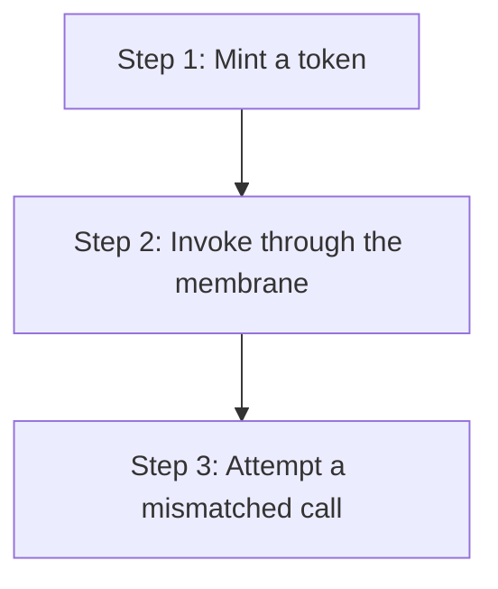

# hkask-capability — Tutorial: Your First Capability Token

This tutorial walks through creating a `DelegationToken` and invoking a
tool through the governed membrane. You will learn how capability matching
gates tool calls and how the action hierarchy (`Execute >= Write >= Read`)
works.

## Learning path



<!-- DIAGRAM_ALIGNMENT
id: DIAG-DIA-CAP-003
verified_date: 2026-08-04
verified_against: kask/crates/hkask-capability/src/token_types.rs (DelegationToken::new, is_valid_for); kask/crates/hkask-capability/src/resources.rs (DelegationResource, DelegationAction); kask/crates/hkask-mcp/src/runtime.rs (invoke)
status: VERIFIED
-->

## Steps 1-2: Mint a token and invoke

Use `DelegationToken::new` with a `DelegationResource::Tool`, a
`DelegationAction::Execute`, and a resource ID matching the target tool:

```rust
let token = DelegationToken::new(
    DelegationResource::Tool,
    "web_search".into(),
    DelegationAction::Execute,
    WebID::from_persona(b"issuer"),
    WebID::from_persona(b"holder"),
);
```

Pass it to `McpRuntime::invoke` (the `ToolPort` impl). The membrane checks
`token.is_valid_for(Tool, "web_search", Execute)` — an exact triple match —
then reserves gas, dispatches, settles, and emits the `reg.tool.*` span.
There is no signing step: tokens are in-process declarations, and the gate
is the capability match, not cryptography.

## Step 3: Attempt a mismatched call

Build a token naming a *different* tool (`"fs_read"`) and pass it to an
invoke of `"web_search"`. The capability match fails and the call is denied
with `ToolPortError::CapabilityDenied`. This is the gate's purpose: it
catches wiring bugs — a cascade step or panel view that names the wrong
tool — at the membrane rather than deep inside a server.

## See also

- [hkask-capability Reference](./reference.md): the token model and the
  invoke pipeline.
- [hkask-capability Explanation](./explanation.md): why the gate is a
  capability match and not a cryptographic check.
- [hkask-types Reference](../hkask-types/reference.md): the `ToolPort`
  trait that requires tokens.