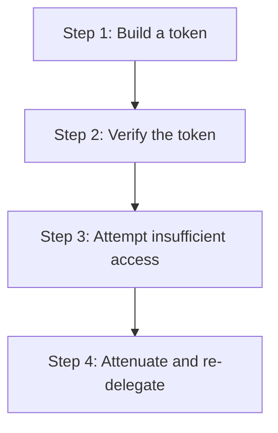

# hkask-capability — Tutorial: Your First Capability Token

This tutorial walks through creating and verifying a `DelegationToken`. You
will learn how the OCAP model grants access, how attenuation limits
delegation depth, and how the `CapabilityChecker` verifies tokens at the
actuator boundary.

## Learning path

<!-- DIAGRAM_ALIGNMENT
id: DIAG-DIA-CAP-003
verified_date: 2026-07-27
verified_against: kask/crates/hkask-capability/src/token_types.rs:58,90; kask/crates/hkask-capability/src/verification/checker.rs:20; kask/crates/hkask-capability/src/verification/types.rs:22
status: VERIFIED
-->

## Steps 1-2: Build and verify a token

Use `DelegationTokenBuilder` (`token_types.rs:90`) to construct a token
with a `DelegationResource::Tool`, a `DelegationAction::Execute`, and a
resource ID matching the target MCP server. Sign it with an Ed25519 key.

Pass the token to `CapabilityChecker::verify` (`checker.rs:20`). The
checker returns `VerificationOutcome::Valid` if the signature is correct,
the token has not expired, and the resource and action match the request.

## Steps 3-4: Attempt insufficient access and attenuate

Construct a token with `DelegationAction::Read` and attempt to invoke a
tool that requires `Execute`. The checker returns
`VerificationOutcome::InsufficientAccess`. This is the fail-closed
behavior: the token does not grant the requested access.

Now attenuate the token: increase the `attenuation_level` field
(`token_types.rs:58`) and re-delegate to a sub-task. The sub-task's token
is strictly less powerful. When `attenuation_level` reaches
`max_attenuation`, the token cannot be further delegated.

## See also

- [hkask-capability Reference](./reference.md): class diagram of tokens
  and checkers.
- [hkask-capability How-to](./how-to.md): attenuating a token for a
  sub-task.
- [hkask-types Reference](../hkask-types/reference.md): the `ToolPort`
  trait that requires tokens.

---

[^miller-ocap]: Miller, M. S. (2006). *Robust Composition.* <https://www.erights.org/talks/thesis/markm-thesis.pdf>. The Object Capability model that this tutorial demonstrates.
