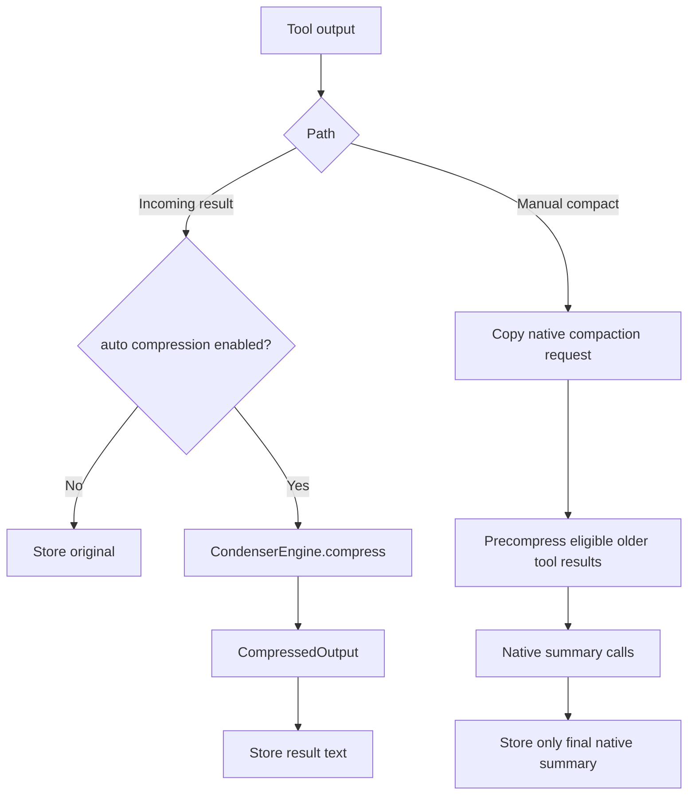

# hkask-condenser — Explanation

`hkask-condenser` is a synchronous domain crate: it classifies tool output,
selects one of three line-oriented algorithms, applies a profile budget and
ontology-aware saliency, and returns a `CompressedOutput`. It has no MCP, HTTP,
or async dependency (`kask/crates/hkask-condenser/src/hkask_condenser.rs:3-7,40-44`).

## One engine, two integration paths

The same `CondenserEngine` serves two distinct user-visible paths:

1. **Incoming tool-result compression.** `compress_tool_result` runs before a
   result is stored only when `auto_compress_tool_results` is enabled
   (`kask/crates/kask_bridge/src/condenser_bridge.rs:42-73`).
2. **Manual-compaction precompression.** `precompress_history` runs regardless
   of that setting. It changes only eligible older tool-result text in the
   summarizer request copy; the native model still writes the summary
   (`kask/crates/kask_bridge/src/condenser_bridge.rs:75-125`).

<!-- DIAGRAM_ALIGNMENT
id: DIAG-COND-004
verified_date: 2026-09-16
verified_against: kask/crates/kask_bridge/src/condenser_bridge.rs:42-125; crates/agent/src/thread.rs:3594-3643; crates/zed/src/main.rs:2190-2202
status: VERIFIED
-->

Manual precompression preserves user and assistant prose, the newest user-led
exchange, protected tools, failed tool results, valid JSON, and non-text parts.
It replaces text only when the labelled excerpt is nonempty and smaller than
the original (`kask/crates/kask_bridge/src/condenser_bridge.rs:80-123`). The
stored thread remains unchanged because preprocessing happens after the native
request has been copied to the background task
(`crates/agent/src/thread.rs:3609-3629`).

## Compression dispatch

`CondenserEngine::compress` derives a `ContextCategory`, selects a registered
algorithm, derives an ontology anchor, runs the algorithm, and calculates line
and byte reductions (`kask/crates/hkask-condenser/src/engine.rs:48-97`). The
selection is static rather than learned.

- `RtkStyleAlgorithm` handles shell, test, and build output
  (`kask/crates/hkask-condenser/src/algorithms.rs:46-60`).
- `WordRankAlgorithm` handles conversation history and logs
  (`kask/crates/hkask-condenser/src/algorithms.rs:156-166`).
- `FlashrankAlgorithm` handles files, structured data, and unknown categories
  (`kask/crates/hkask-condenser/src/algorithms.rs:365-375`).

Profiles set retention and maximum-line budgets: heavy 10%/30, normal 20%/80,
soft 60%/200, and light 95%/unbounded
(`kask/crates/hkask-condenser/src/types.rs:27-78`). These are line budgets, not
a guarantee that a provider token limit will be met.

## Native compaction remains native

Only manual compaction invokes Kask precompression. Automatic compaction skips
the hook. After preprocessing, the existing compaction path may split a suitable
history into two chronological halves, summarize them concurrently, and merge
them; indivisible histories use one summary call
(`crates/agent/src/thread.rs:3609-3642`). Cancellation, streaming, usage
accounting, and summary persistence remain owned by the native thread lifecycle.

## Protected source-oriented tools

The call site bypasses line elision for source code, searches, listings,
diagnostics, references, code actions, and edits. The exact list is
`NO_COMPRESS_TOOLS` (`crates/agent/src/thread.rs:160-185`). Terminal output is
intentionally eligible because build and test logs are a primary condenser use.

## Further reading

- [Condenser tuning procedure](./how-to.md)
- [Condenser reference](./reference.md)
