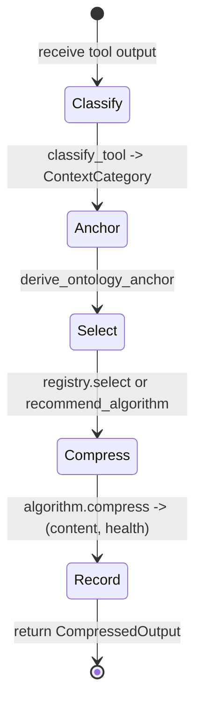

# hkask-condenser — Explanation

Tool-result compression solves a context-window problem. As an agent
conversation grows, verbose tool output (shell commands, logs, file dumps)
exceeds the model's context limit. The condenser compresses each tool result
by classifying it, deriving an ontology anchor, selecting an algorithm, and
scoring lines by domain saliency — discarding low-salience lines and keeping
high-salience ones within a `Profile`-derived budget.

## Source citations

| Symbol | Location |
|--------|----------|
| `CondenserEngine` | `kask/crates/hkask-condenser/src/engine.rs:39` |
| `CondenserEngine::compress` | `kask/crates/hkask-condenser/src/engine.rs:75` |
| `recommend_algorithm` | `kask/crates/hkask-condenser/src/engine.rs:199` |
| `CondenserAlgorithm` trait | `kask/crates/hkask-condenser/src/algorithms.rs:33` |
| `AlgorithmRegistry` | `kask/crates/hkask-condenser/src/algorithms.rs:576` |
| `domain_saliency` | `kask/crates/hkask-condenser/src/algorithms.rs:231` |
| `score_against_persona` | `kask/crates/hkask-condenser/src/saliency.rs:52` |
| `classify_tool` | `kask/crates/hkask-condenser/src/algorithms.rs:654` |
| `derive_ontology_anchor` | `kask/crates/hkask-condenser/src/algorithms.rs:680` |
| `BridgeThreadCondenser` | `kask/crates/kask_bridge/src/condenser_bridge.rs:22` |
| `set_thread_condenser` hook | `crates/agent/src/agent.rs:2995` |
| Deferred-task wiring | `crates/zed/src/main.rs:1537` |

## The compression cycle

`CondenserEngine::compress` (`engine.rs:75`) runs a single-pass cycle: classify
the tool, derive an anchor, select an algorithm (static or learned), invoke
`algorithm.compress(...)`, record the observation for learning, and return a
`CompressedOutput`. There is no re-classification loop — each `compress` call
is one pass.

<!-- DIAGRAM_ALIGNMENT
id: DIAG-DIA-COND-002
verified_date: 2026-07-29
verified_against: kask/crates/hkask-condenser/src/engine.rs:39,75,199; kask/crates/hkask-condenser/src/algorithms.rs:33,231,576,654,680; kask/crates/hkask-condenser/src/saliency.rs:52; kask/crates/kask_bridge/src/condenser_bridge.rs:22; crates/agent/src/agent.rs:2995; crates/zed/src/main.rs:1537
status: VERIFIED
-->

## Why ontology anchoring

The `derive_ontology_anchor` function (`algorithms.rs:680`) maps a tool name
to an `OntologyAnchor` (`types.rs:23`). This anchor connects compression to
the dual-axis ontology (PKO + DC+BIBO) plus domain supplements (FIBO, GOLEM,
CogAT, ML-Schema, OMC). The anchor provides the keywords that the
`domain_saliency` function (`algorithms.rs:231`) uses to score lines.

Without ontology anchoring, the condenser would score lines by generic word
frequency, which loses domain-specific signal. A line about "gas_budget" is
salient in a Regulation context but not in a corpus context. The anchor tells
the scorer which domain the conversation belongs to.

## Why three algorithms

The three algorithms offer different tradeoffs. `RtkStyleAlgorithm`
(`algorithms.rs:49`) is a deterministic structural scorer (error/warning
line preservation). `WordRankAlgorithm` (`algorithms.rs:119`) ranks by TF-IDF
word frequency, position, and ontology anchoring. `FlashrankAlgorithm`
(`algorithms.rs:429`) uses greedy marginal-utility selection within a budget.
The `AlgorithmRegistry` (`algorithms.rs:576`) selects the algorithm based on
the `ContextCategory` and, when sufficient history exists, the
`recommend_algorithm` learning override (`engine.rs:199`).

The separation allows the condenser to degrade gracefully. If a ranking model
is unavailable, the registry falls back to the deterministic
`RtkStyleAlgorithm` or the universal `FlashrankAlgorithm` fallback.

## The learning feedback loop

`CondenserEngine` maintains a bounded ring buffer of `CompressionRecord`
observations. After each `compress` call, the record (algorithm, category,
profile, compression ratio) is pushed. When enough observations exist for a
category (`MIN_OBSERVATIONS_FOR_RECOMMENDATION`), `recommend_algorithm()`
returns the algorithm with the highest mean compression ratio, and subsequent
`compress` calls use it instead of the static `default_for()` mapping. This is
a cybernetic feedback loop: the engine observes its own performance and
adjusts its selection policy. The loop has low delay (one observation per
compress call) and high fidelity (the signal is the actual compression ratio,
not a proxy).

## Wiring: deferred post-login task

The `set_thread_condenser` hook (`crates/agent/src/agent.rs:2995`) is a
`OnceLock`-based process-global. It is wired from the deferred post-login task
in `crates/zed/src/main.rs:1537`, which constructs a
`BridgeThreadCondenser` (`condenser_bridge.rs:22`) wrapping a
`CondenserEngine`. The wiring is conditional on
`condenser_settings.auto_compress_tool_results`; when disabled, the hook is
left `None` and tool results pass through uncompressed.

## See also

- [hkask-condenser Reference](./reference.md): class diagram of the
  algorithms, registry, and ontology graph.
- [hkask-condenser How-to](./how-to.md): tuning salience weights.
- [hkask-types Explanation](../hkask-types/explanation.md): the memory bridge
  that consumes compressed output.

---

[^salience]: Itti, L., Koch, C., & Niebur, E. (1998). *A model of saliency-based visual attention for rapid scene analysis.* IEEE TPAMI, 20(11), 1254-1259. <https://ieeexplore.ieee.org/document/730558>. The saliency model adapted for text compression.

[^ousterhout]: Ousterhout, J. (2018). *A Philosophy of Software Design.* Yakny Press. <https://web.stanford.edu/~ouster/cgi-bin/book.php>. The deep-module principle: the condenser exposes a simple interface (compress) over a complex implementation (three algorithms + ontology graph + learning loop).
