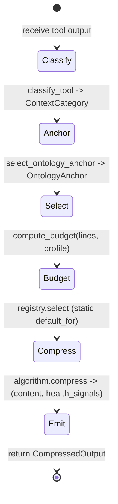

# hkask-condenser — Explanation

Tool-result compression solves a context-window problem. As an agent
conversation grows, verbose tool output (shell commands, logs, file dumps)
exceeds the model's context limit. The condenser compresses each tool
result by classifying it, deriving an ontology anchor, selecting an
algorithm, and scoring lines by domain saliency — discarding low-salience
lines and keeping high-salience ones within a `Profile`-derived budget. The
condenser is a deep module: a simple interface (`compress`) over a complex
implementation (three algorithms + ontology graph + saliency scoring).

## Source citations

| Symbol | Location |
|--------|----------|
| `CondenserEngine` | `kask/crates/hkask-condenser/src/engine.rs:29` |
| `CondenserEngine::compress` | `kask/crates/hkask-condenser/src/engine.rs:48` |
| `CondenserAlgorithm` trait | `kask/crates/hkask-condenser/src/algorithms.rs:33` |
| `AlgorithmRegistry::select` | `kask/crates/hkask-condenser/src/algorithms.rs:483` |
| `classify_tool` | `kask/crates/hkask-condenser/src/algorithms.rs:518` |
| `select_ontology_anchor` (anchor derivation, called at `engine.rs:60`) | `kask/crates/hkask-bridge-ontology/src/axis.rs:210` |
| `domain_saliency` | `kask/crates/hkask-condenser/src/algorithms.rs:224` |
| `compute_budget` | `kask/crates/hkask-condenser/src/algorithms.rs:26` |
| `OntologyGraph::graph_adjacency_bonus` | `kask/crates/hkask-condenser/src/ontology_graph.rs:260` |
| `word_frequencies` | `kask/crates/hkask-condenser/src/saliency.rs:13` |
| `BridgeThreadCondenser` | `kask/crates/kask_bridge/src/condenser_bridge.rs:22` |
| `KaskCondenserSettings` | `kask/crates/kask_bridge/src/settings.rs:253` |
| `set_thread_condenser` | `crates/agent/src/agent.rs:3136` |
| `NO_COMPRESS_TOOLS` | `crates/agent/src/thread.rs:185` |
| Deferred-task wiring | `crates/zed/src/main.rs:2056` |

## The compression cycle

`CondenserEngine::compress` (`engine.rs:48`) runs a single-pass cycle.
There is no re-classification loop and no learning override — each
`compress` call is one pass. The previous learning subsystem (history
ring buffer, `recommend_algorithm`, `compression_stats`, `suggest_profile`,
`check_global_health`) was removed because it was dormant in the
default-off configuration and existed only to justify MCP tools that
surfaced it; the runtime bridge path (`BridgeThreadCondenser`) never used
it (doc comment, `engine.rs:22-28`).

<!-- DIAGRAM_ALIGNMENT
id: DIAG-COND-004
verified_date: 2026-08-28
verified_against: kask/crates/hkask-condenser/src/engine.rs:48,54,60,63,70,86; kask/crates/hkask-condenser/src/algorithms.rs:26,483,518; kask/crates/hkask-bridge-ontology/src/axis.rs:210
status: VERIFIED
-->

The cycle steps, in order:

1. **Classify** — `classify_tool` (`algorithms.rs:518`) maps the tool name
   to a `ContextCategory` via exact token match, then substring fallback.
2. **Anchor** — `select_ontology_anchor` (`axis.rs:210`), called directly
   by the engine (`engine.rs:60`), maps the tool name to an
   `OntologyAnchor`.
3. **Select** — `AlgorithmRegistry::select` (`algorithms.rs:483`) walks
   the registry in registration order and returns the first algorithm
   whose `default_for()` contains the category.
4. **Budget** — `compute_budget` (`algorithms.rs:26`) derives the line
   budget from `retention_pct * lines`, capped by `max_lines` and
   `lines`. If the budget meets or exceeds the input, the algorithm
   returns the input unchanged (passthrough).
5. **Compress** — the selected algorithm's `compress` method
   (`algorithms.rs:39-45`) returns `(content, health_signals)`.
6. **Emit** — the engine assembles a `CompressedOutput` (`engine.rs:86`)
   and emits two diagnostic `hkask.condenser` spans (`engine.rs:68` and
   `:84`).

## Why ontology anchoring

The engine calls `select_ontology_anchor` (`axis.rs:210`) on the tool
name (`engine.rs:60`) to get an `OntologyAnchor` (`axis.rs:126`). This
anchor connects compression to the dual-axis ontology (PKO + DC+BIBO)
plus domain supplements (FIBO, SEPIO, GOLEM, ML-Schema, SDMX, SUMO). The
anchor provides the keywords that `domain_saliency`
(`algorithms.rs:224`) uses to score lines.

Without ontology anchoring, the condenser would score lines by generic
word frequency, which loses domain-specific signal. A line about
`market_capitalization` is salient in a FIBO-anchored financial context
but not in a GOLEM narrative context. The anchor tells the scorer which
domain the conversation belongs to, and the ontology graph supplies the
adjacency bonus — lines referencing concepts related to the anchor
concept (e.g., `fibo:MarketCapitalization` when anchored to
`fibo:Corporation`) receive a bonus via
`OntologyGraph::graph_adjacency_bonus` (`ontology_graph.rs:260`).

The anchor is derived from the tool name alone because every MCP server
links against the same bridge crates — no wire-protocol fields are
needed. This keeps the condenser's interface narrow: `compress(tool_name,
output, category)` is the entire surface.

## Why three algorithms

The three algorithms offer different tradeoffs:

- `RtkStyleAlgorithm` (`algorithms.rs:48`) is a deterministic structural
  scorer — head/tail preservation with an ontology-aware split ratio. It
  is the right choice for shell, test, and build output, where the first
  and last lines carry the command and the result.
- `WordRankAlgorithm` (`algorithms.rs:115`) ranks by TF-IDF word
  frequency, structural bonus, and ontology anchoring. It is the right
  choice for conversation history and logs, where salient lines are
  scattered through the input.
- `FlashrankAlgorithm` (`algorithms.rs:319`) uses greedy marginal-utility
  selection within a budget, balancing relevance, novelty, and brevity.
  It is the right choice for file contents and structured data, and is
  the universal fallback because it is registered last and `select`
  returns the last algorithm when no `default_for()` matches
  (`algorithms.rs:489-492`).

There is no learning loop that could drift the selection — the static
`default_for()` mapping is the only selection path.

## Why health signals, not errors

`CondenserHealthSignal` (`types.rs:177`) is emitted when an algorithm
exhibits unexpected behavior — `negative_compression` (rtk_style produced
larger output), `low_signal` (word_rank found no usable signal),
`budget_shortfall` (flashrank could not fill the budget). These are
diagnostic ν-event *candidates*: they indicate deviation from expected
bounds, not failure. Content is still returned. Promoting them to actual
ν-events would require a `reg.*` namespace and a wired consumer —
neither exists today (`types.rs:170-175`); **not yet enforced**. The
condenser never blocks the agent turn on a compression anomaly — it logs
the signal and moves on, so a misbehaving algorithm cannot stall the
conversation.

## Wiring: deferred post-login task

The `set_thread_condenser` hook (`crates/agent/src/agent.rs:3136`) is a
`Mutex`-based process-global (re-settable). It is wired from the
deferred post-login task in `crates/zed/src/main.rs:2056-2060`, which
constructs a `BridgeThreadCondenser`
(`kask/crates/kask_bridge/src/condenser_bridge.rs:22`) wrapping a
`CondenserEngine`. The wiring is conditional on
`KaskCondenserSettings.auto_compress_tool_results`
(`kask/crates/kask_bridge/src/settings.rs:263`), which defaults to `false`
(`settings.rs:279`); when disabled, the hook is left `None` and tool
results pass through uncompressed.

Code-reading tools (`read_file`, `grep`, `list_directory`, etc.) bypass
the condenser via `NO_COMPRESS_TOOLS` (`crates/agent/src/thread.rs:185`).
The condenser's line-level elision (joining non-consecutive selected
lines with `...`) is destructive for source code, so these tools' output
passes through verbatim even when a condenser is wired.

Note: `KaskCondenserSettings.persona_keywords` (`settings.rs:268`)
exists and is emitted to MCP servers as `HKASK_CONDENSER_PERSONA_KEYWORDS`
(`kask/crates/kask_bridge/src/mcp_env.rs:76-85`), but the condenser
domain crate does not read it — no persona-scoring function exists in
`saliency.rs` (58 lines, `word_frequencies` only). The persona path is
**not yet enforced** downstream of the env var.

## See also

- [hkask-condenser Reference](./reference.md): class diagram of the
  algorithms, registry, and ontology graph.
- [hkask-condenser How-to](./how-to.md): tuning profiles and keyword
  weights.
- [hkask-condenser Tutorial](./tutorial.md): compressing your first tool
  output.

---

[^salience]: Itti, L., Koch, C., & Niebur, E. (1998). *A model of saliency-based visual attention for rapid scene analysis.* IEEE Transactions on Pattern Analysis and Machine Intelligence, 20(11), 1254–1259. <https://ieeexplore.ieee.org/document/730558>. The saliency model adapted for text compression.

[^ousterhout]: Ousterhout, J. (2018). *A Philosophy of Software Design.* Yakny Press. <https://web.stanford.edu/~ouster/cgi-bin/book.php>. The deep-module principle: the condenser exposes a simple interface (`compress`) over a complex implementation (three algorithms + ontology graph + saliency scoring).
