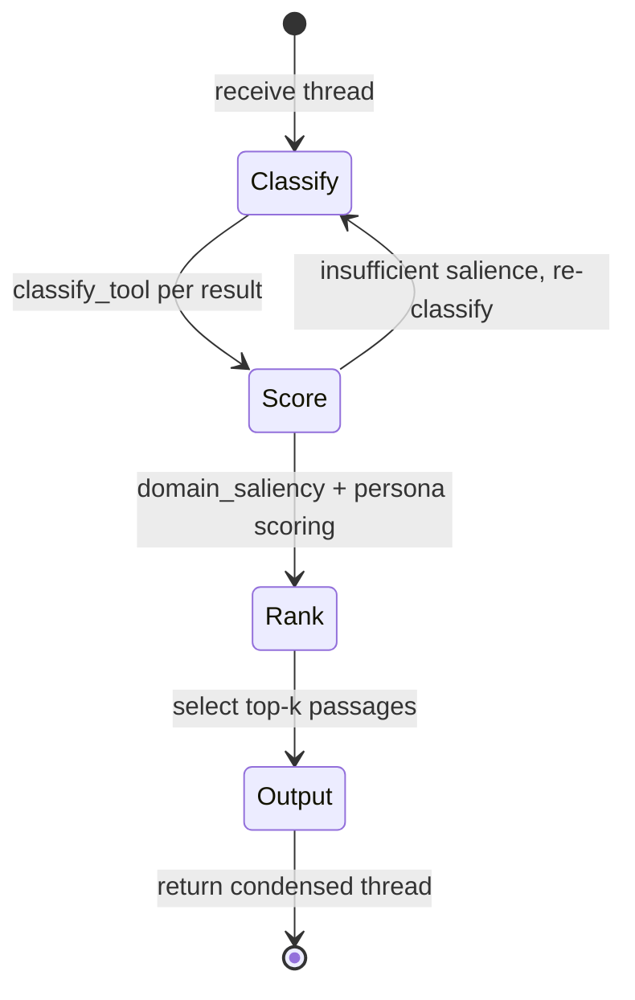

# hkask-condenser — Explanation

Thread condensation solves a context-window problem. As an agent conversation
grows, the full thread exceeds the model's context limit. The condenser
extracts the salient passages and discards the rest, preserving the
information the agent needs to continue the task. The design uses a two-phase
approach: first classify and score, then compress and output.

## Source citations

| Symbol | Location |
|--------|----------|
| `CondenserEngine` | `kask/crates/hkask-condenser/src/engine.rs:39` |
| `CondenserAlgorithm` trait | `kask/crates/hkask-condenser/src/algorithms.rs:33` |
| `AlgorithmRegistry` | `kask/crates/hkask-condenser/src/algorithms.rs:576` |
| `domain_saliency` | `kask/crates/hkask-condenser/src/algorithms.rs:231` |
| `score_against_persona` | `kask/crates/hkask-condenser/src/saliency.rs:52` |
| `classify_tool` | `kask/crates/hkask-condenser/src/algorithms.rs:654` |
| `derive_ontology_anchor` | `kask/crates/hkask-condenser/src/algorithms.rs:680` |
| `BridgeThreadCondenser` | `kask/crates/kask_bridge/src/condenser_bridge.rs` |
| `set_thread_condenser` hook | `crates/agent/src/agent.rs:2857` |

## The two-phase condensation cycle

The `CondenserEngine` (`engine.rs:39`) runs a two-phase cycle. In the first
phase, it classifies each tool result and derives an ontology anchor. In the
second phase, it scores passages against the anchor and persona keywords,
then selects the top-ranked passages for the condensed output.

<!-- DIAGRAM_ALIGNMENT
id: DIAG-DIA-COND-002
verified_date: 2026-07-27
verified_against: kask/crates/hkask-condenser/src/engine.rs:39; kask/crates/hkask-condenser/src/algorithms.rs:33,231,654,680; kask/crates/hkask-condenser/src/saliency.rs:52
status: VERIFIED
-->

## Why ontology anchoring

The `derive_ontology_anchor` function (`algorithms.rs:680`) maps a tool name
to an `OntologyAnchor`. This anchor connects the condensation to the
dual-axis ontology (PKO + DC+BIBO) defined in `PRINCIPLES.md` P5.4. The
anchor provides the keywords that the `domain_saliency` function
(`algorithms.rs:231`) uses to score passages.

Without ontology anchoring, the condenser would score passages by generic
word frequency, which loses domain-specific signal. A passage about
"gas_budget" is salient in a Regulation context but not in a corpus context.
The anchor tells the scorer which domain the conversation belongs to.

## Why three algorithms

The three algorithms (`RtkStyleAlgorithm`, `WordRankAlgorithm`,
`FlashrankAlgorithm`) offer different tradeoffs. `RtkStyleAlgorithm` is a
deterministic keyword-based scorer. `WordRankAlgorithm` ranks by word
frequency and position. `FlashrankAlgorithm` uses a lightweight ranking
model. The `AlgorithmRegistry` (`algorithms.rs:576`) selects the algorithm
based on the ontology anchor and the available compute budget.

The separation allows the condenser to degrade gracefully. If a ranking
model is unavailable, the registry falls back to the deterministic
`RtkStyleAlgorithm`.

## See also

- [hkask-condenser Reference](./reference.md): class diagram of the
  algorithms, registry, and ontology graph.
- [`kask/docs/architecture/salience-specification.md`](../../architecture/salience-specification.md):
  the passage salience algorithm specification.
- [hkask-types Explanation](../hkask-types/explanation.md): the memory bridge
  that consumes condensed threads.

---

[^salience]: Itti, L., Koch, C., & Niebur, E. (1998). *A model of saliency-based visual attention for rapid scene analysis.* IEEE TPAMI, 20(11), 1254-1259. <https://ieeexplore.ieee.org/document/730558>. The saliency model adapted for text condensation.

[^ousterhout]: Ousterhout, J. (2018). *A Philosophy of Software Design.* Yakny Press. <https://web.stanford.edu/~ouster/cgi-bin/book.php>. The deep-module principle: the condenser exposes a simple interface (condense) over a complex implementation (three algorithms + ontology graph).
