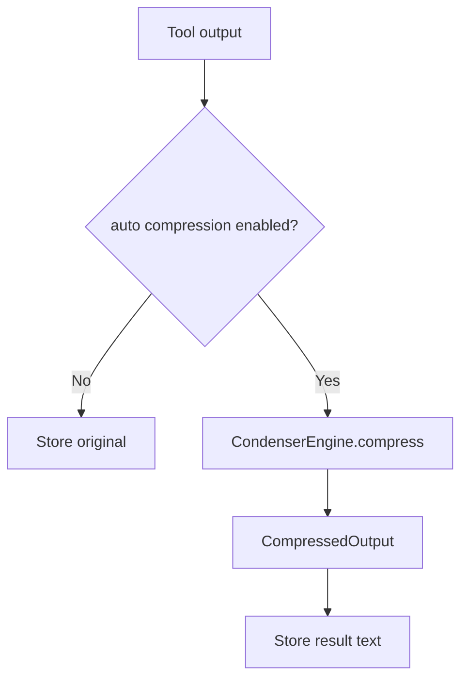

# hkask-condenser — Explanation

`hkask-condenser` is a synchronous domain crate: it classifies tool output,
selects one of three line-oriented algorithms, applies a profile budget and
ontology-aware saliency, and returns a `CompressedOutput`. It has no MCP, HTTP,
or async dependency (`kask/crates/hkask-condenser/src/hkask_condenser.rs:3-7,40-44`).

## One engine, one integration path

The `CondenserEngine` serves one user-visible path:

1. **Incoming tool-result compression.** `compress_tool_result` runs before a
   result is stored only when `auto_compress_tool_results` is enabled
   (`kask/crates/kask_bridge/src/condenser_bridge.rs:42-73`).

Compaction no longer routes through the condenser — see
[Native compaction remains native](#native-compaction-remains-native) below
and `kask/docs/architecture/compaction-pipeline-spec.md`.

```mermaid
flowchart TD
    A[Tool output] --> B{auto compression enabled?}
    B -->|No| C[Store original]
    B -->|Yes| D[CondenserEngine.compress]
    D --> E[CompressedOutput]
    E --> F[Store result text]
```

<!-- DIAGRAM_ALIGNMENT
id: DIAG-COND-004
verified_date: 2026-09-28
verified_against: kask/crates/kask_bridge/src/condenser_bridge.rs:42-125; crates/agent/src/thread.rs:3687-3715; crates/zed/src/main.rs:2299-2309
status: VERIFIED
-->

Incoming compression preserves user and assistant prose (it never touches
them), and `NO_COMPRESS_TOOLS` exempts source-reading tools at the call site
(`crates/agent/src/thread.rs`). The stored thread is what the condenser
writes; there is no second request-copy path through this package.

## Compression dispatch

`CondenserEngine::compress` derives a `ContextCategory`, selects a registered
algorithm, derives an ontology anchor, runs the algorithm, and calculates line
and byte reductions (`kask/crates/hkask-condenser/src/engine.rs:48-98`). The
selection is static rather than learned.

- `RtkStyleAlgorithm` handles shell, test, and build output
  (`kask/crates/hkask-condenser/src/algorithms.rs:46-60`).
- `WordRankAlgorithm` handles conversation history and logs
  (`kask/crates/hkask-condenser/src/algorithms.rs:156-166`).
- `FlashrankAlgorithm` handles files, structured data, and unknown categories
  (`kask/crates/hkask-condenser/src/algorithms.rs:365-375`).

Profiles set retention and maximum-line budgets: heavy 10%/30, normal 20%/80,
soft 60%/200, and light 95%/unbounded
(`kask/crates/hkask-condenser/src/types.rs:27-78`). These are line budgets, not
a guarantee that a provider token limit will be met.

## Native compaction remains native

Compaction no longer routes through the condenser. The deterministic stage is
owned by `kask_compaction::pre_shrink` and runs in-process on the
summarizer's request copy for BOTH manual and automatic compaction:
run-length collapse of repeated lines, then head+tail windowing of any
tool-result text over a budget-derived per-result cap — no protected-tool,
JSON, error, or positional exemptions (windowing cannot corrupt structure
the way the condenser's mid-content ellipsis can, and the stored history
keeps the full text). The condenser package serves ingestion-time
tool-result compression only (`run_tool` + `NO_COMPRESS_TOOLS`). After the
pre-shrink, the compaction path plans against the compaction model's input
capacity, calibrated per thread from the last completed request's reported
input tokens (`kask_compaction.rs::plan_compaction`): a fitting splittable
history splits into two chronological halves; an over-budget history packs
into balanced budget-fitting segments summarized concurrently in batches
of at most 8 and merged chronologically; an indivisible history larger
than the budget is head+tail elided on the summarizer's request copy only
— the stored thread history is never modified. Cancellation, streaming,
usage accounting, and summary persistence remain owned by the native
thread lifecycle. Full specification with diagrams and reference models:
`kask/docs/architecture/compaction-pipeline-spec.md`.

## Protected source-oriented tools

The call site bypasses line elision for source code, searches, listings,
diagnostics, references, code actions, and edits. The exact list is
`NO_COMPRESS_TOOLS` (`crates/agent/src/thread.rs:160-185`). Terminal output is
intentionally eligible because build and test logs are a primary condenser use.

## Further reading

- [Condenser reference — API surface and tuning procedures](./reference.md)
