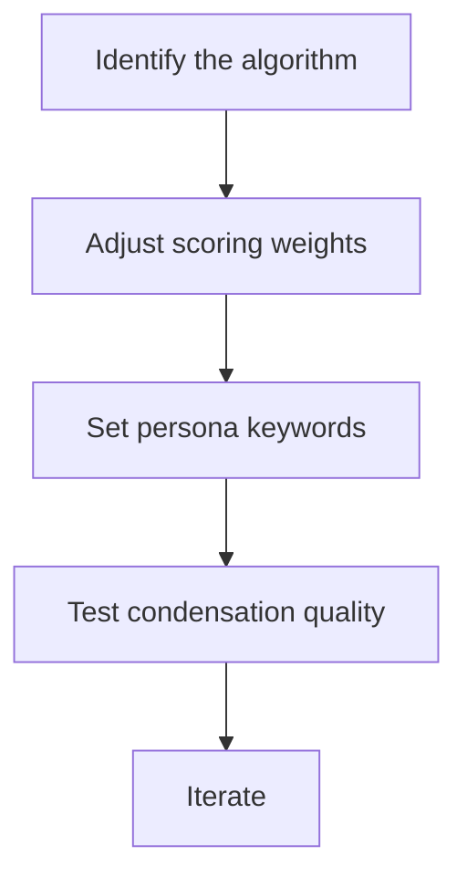

# hkask-condenser — How-to: Tune Salience Weights

This guide shows how to adjust the salience scoring weights to change which
passages the condenser preserves.

## Source citations

| Symbol | Location |
|--------|----------|
| `domain_saliency` fn | `kask/crates/hkask-condenser/src/algorithms.rs:231` |
| `score_against_persona` | `kask/crates/hkask-condenser/src/saliency.rs:52` |
| `RtkStyleAlgorithm` | `kask/crates/hkask-condenser/src/algorithms.rs:49` |
| `AlgorithmRegistry` | `kask/crates/hkask-condenser/src/algorithms.rs:576` |

## Procedure

<!-- DIAGRAM_ALIGNMENT
id: DIAG-DIA-COND-004
verified_date: 2026-07-27
verified_against: kask/crates/hkask-condenser/src/algorithms.rs:231,49,576; kask/crates/hkask-condenser/src/saliency.rs:52
status: VERIFIED
-->

### Step 1: Identify the algorithm

Check which algorithm the `AlgorithmRegistry` (`algorithms.rs:576`) selects
for your use case. The `RtkStyleAlgorithm` (`algorithms.rs:49`) is the
deterministic default.

### Step 2: Adjust scoring weights

The `domain_saliency` function (`algorithms.rs:231`) scores lines against
an ontology anchor. Adjust the keyword weights in the anchor's keyword list
to prioritize different terms.

### Step 3: Set persona keywords

The `score_against_persona` function (`saliency.rs:52`) scores text against
persona keywords. Provide keywords that match the agent's persona to boost
passages in the agent's voice.

### Step 4: Test and iterate

Run the condenser on a sample thread and inspect the condensed output.
Adjust weights and repeat until the output preserves the right passages.

## See also

- [hkask-condenser Reference](./reference.md): class diagram of algorithms.
- [hkask-condenser Tutorial](./tutorial.md): condensing your first thread.
- [`kask/docs/architecture/salience-specification.md`](../../architecture/salience-specification.md).

---

[^salience]: Itti, L., Koch, C., & Niebur, E. (1998). *A model of saliency-based visual attention.* IEEE TPAMI, 20(11), 1254-1259. <https://ieeexplore.ieee.org/document/730558>.
