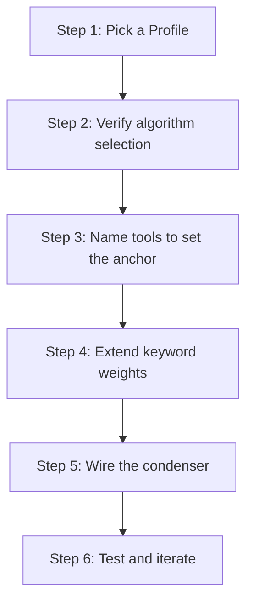

# hkask-condenser — How-to: Tune Compression and Saliency

This guide shows how to change which lines the condenser preserves by
selecting a `Profile`, naming tools to influence the `OntologyAnchor`,
extending the ontology keyword sets, and wiring the condenser into the
agent turn loop. The condenser scores each line of tool output against an
`OntologyAnchor` and a `Profile`-derived budget; higher-scoring lines are
kept, lower-scoring lines are dropped.

## Source citations

| Symbol | Location |
|--------|----------|
| `CondenserEngine::compress` | `kask/crates/hkask-condenser/src/engine.rs:47` |
| `CondenserEngine::set_profile` | `kask/crates/hkask-condenser/src/engine.rs:99` |
| `Profile` enum | `kask/crates/hkask-condenser/src/types.rs:49` |
| `Profile::retention_pct` | `kask/crates/hkask-condenser/src/types.rs:59` |
| `Profile::max_lines` | `kask/crates/hkask-condenser/src/types.rs:91` |
| `Profile::action_threshold` | `kask/crates/hkask-condenser/src/types.rs:82` |
| `RtkStyleAlgorithm` | `kask/crates/hkask-condenser/src/algorithms.rs:49` |
| `WordRankAlgorithm` | `kask/crates/hkask-condenser/src/algorithms.rs:119` |
| `FlashrankAlgorithm` | `kask/crates/hkask-condenser/src/algorithms.rs:326` |
| `AlgorithmRegistry` | `kask/crates/hkask-condenser/src/algorithms.rs:473` |
| `classify_tool` | `kask/crates/hkask-condenser/src/algorithms.rs:528` |
| `derive_ontology_anchor` | `kask/crates/hkask-condenser/src/algorithms.rs:559` |
| `domain_saliency` | `kask/crates/hkask-condenser/src/algorithms.rs:231` |
| `anchor_keywords` | `kask/crates/hkask-condenser/src/ontology_graph.rs:316` |
| `score_against_persona` | `kask/crates/hkask-condenser/src/saliency.rs:52` |
| `BridgeThreadCondenser` | `kask/crates/kask_bridge/src/condenser_bridge.rs:22` |
| `KaskCondenserSettings` | `kask/crates/kask_bridge/src/settings.rs:333` |
| `set_thread_condenser` | `crates/agent/src/agent.rs:3144` |
| `NO_COMPRESS_TOOLS` | `crates/agent/src/thread.rs:175` |

## Procedure



<!-- DIAGRAM_ALIGNMENT
id: DIAG-COND-002
verified_date: 2026-08-13
verified_against: kask/crates/hkask-condenser/src/engine.rs:47,99; kask/crates/hkask-condenser/src/types.rs:49,59,82,91; kask/crates/hkask-condenser/src/algorithms.rs:231,528,559; kask/crates/hkask-condenser/src/ontology_graph.rs:316; kask/crates/kask_bridge/src/condenser_bridge.rs:22; kask/crates/kask_bridge/src/settings.rs:333; crates/agent/src/agent.rs:3144; crates/agent/src/thread.rs:175
status: VERIFIED
-->

### Step 1: Pick a Profile

The `Profile` enum (`kask/crates/hkask-condenser/src/types.rs:49`) has four
variants. Each fixes three knobs: `retention_pct`
(`kask/crates/hkask-condenser/src/types.rs:59`), `max_lines`
(`kask/crates/hkask-condenser/src/types.rs:91`), and `action_threshold`
(`kask/crates/hkask-condenser/src/types.rs:82`).

| Profile | Retention | Max lines | Action threshold | Use case |
|---------|-----------|-----------|------------------|----------|
| `Heavy` | 10% | 30 | 0.10 | Aggressive — minimal representation |
| `Normal` | 20% | 80 | 0.25 | Default — balanced |
| `Soft` | 60% | 200 | 0.50 | Light touch — preserves more context |
| `Light` | 95% | none | 0.90 | Near-passthrough — user sovereignty |

Set it on the engine via `set_profile`
(`kask/crates/hkask-condenser/src/engine.rs:99`). In the wired runtime,
the profile comes from `KaskCondenserSettings.profile`
(`kask/crates/kask_bridge/src/settings.rs:339`), which defaults to
`"normal"` (`kask/crates/kask_bridge/src/settings.rs:358`).

```rust
engine.set_profile(Profile::Heavy);
```

### Step 2: Verify algorithm selection

The `AlgorithmRegistry` (`kask/crates/hkask-condenser/src/algorithms.rs:473`)
selects an algorithm per compression via the static `default_for()` mapping
walked in `select` (`kask/crates/hkask-condenser/src/algorithms.rs:493`).
There is no learning override — the previous learning subsystem was removed
(see `kask/crates/hkask-condenser/src/engine.rs:22`).

| Algorithm | Default categories | File |
|-----------|--------------------|------|
| `RtkStyleAlgorithm` | ShellCommand, TestOutput, BuildOutput | `algorithms.rs:49` |
| `WordRankAlgorithm` | ConversationHistory, LogOutput | `algorithms.rs:119` |
| `FlashrankAlgorithm` | FileContents, StructuredData, Unknown | `algorithms.rs:326` |

`FlashrankAlgorithm` is the universal fallback because it is registered
last and `select` returns the last algorithm when no `default_for()` matches
(`kask/crates/hkask-condenser/src/algorithms.rs:499`).

### Step 3: Name tools to set the anchor

The `derive_ontology_anchor` function
(`kask/crates/hkask-condenser/src/algorithms.rs:559`) is a thin pass-through
to `select_ontology_anchor`
(`kask/crates/hkask-bridge-ontology/src/axis.rs:220`). It maps a tool name
to an `OntologyAnchor` (`kask/crates/hkask-bridge-ontology/src/axis.rs:133`)
— `Core`, `DualAxis` (PKO/DC+BIBO), or `DomainSupplement` (FIBO, ESO, GOLEM,
ML-Schema, OMC, SDMX, SUMO). You do not set the anchor directly; you
influence it by naming tools with a domain-signaling prefix
(`company_fundamentals`, `memory_recall`, `generate_image`, `training_run`).

### Step 4: Extend keyword weights

The `domain_saliency` function (`kask/crates/hkask-condenser/src/algorithms.rs:231`)
scores a line as `direct + graph_bonus`:

- `direct` is a per-namespace keyword-containment score (FIBO, SUMO, PKO,
  GOLEM, ML-Schema). To prioritize different terms, extend the containment
  checks in the match arms of `domain_saliency`.
- `graph_bonus` is computed by `OntologyGraph::graph_adjacency_bonus`
  (`kask/crates/hkask-condenser/src/ontology_graph.rs:290`) using
  `anchor_keywords` (`kask/crates/hkask-condenser/src/ontology_graph.rs:316`).
  Each related concept found in the line adds 0.15, capped at 0.5. To change
  which concepts count as related, extend the `edges` map in
  `OntologyGraph::build` (`kask/crates/hkask-condenser/src/ontology_graph.rs:50`).

For persona-based scoring, `score_against_persona`
(`kask/crates/hkask-condenser/src/saliency.rs:52`) scores text against a
keyword set. In the wired runtime, persona keywords come from
`KaskCondenserSettings.persona_keywords`
(`kask/crates/kask_bridge/src/settings.rs:348`) and are exported to the
condenser MCP server as `HKASK_CONDENSER_PERSONA_KEYWORDS`
(`kask/crates/kask_bridge/src/settings.rs:789`).

### Step 5: Wire the condenser

The runtime path is `BridgeThreadCondenser`
(`kask/crates/kask_bridge/src/condenser_bridge.rs:22`), which wraps a
`CondenserEngine` in a `Mutex` and gates compression on
`auto_compress_tool_results`. It is wired via the process-global
`set_thread_condenser` hook (`crates/agent/src/agent.rs:3144`) from the
deferred post-login task in `crates/zed/src/main.rs:1929`, conditional on
`KaskCondenserSettings.auto_compress_tool_results`
(`kask/crates/kask_bridge/src/settings.rs:343`), which defaults to `false`
(`kask/crates/kask_bridge/src/settings.rs:359`).

Code-reading tools bypass the condenser via `NO_COMPRESS_TOOLS`
(`crates/agent/src/thread.rs:175`): `read_file`, `grep`, `find_path`,
`list_directory`, `diagnostics`, `find_references`, `get_code_actions`,
`edit_file`. Their output passes through verbatim even when a condenser is
wired, because the condenser's line-level elision is destructive for source
code.

### Step 6: Test and iterate

Run the condenser on a sample tool output and inspect the `CompressedOutput`'s
`reduction_pct` and `health_signals`. Adjust the profile or keyword weights
and repeat until the output preserves the right lines. The crate's
proptest suite (`kask/crates/hkask-condenser/src/algorithms.rs:1099`)
checks `compression_is_idempotent`, `compression_never_expands`, and
`compute_budget_invariants` — useful oracles when tuning.

## See also

- [hkask-condenser Reference](./reference.md): class diagram of algorithms and types.
- [hkask-condenser Tutorial](./tutorial.md): compressing your first tool output.
- [hkask-condenser Explanation](./explanation.md): the compression cycle and ontology anchoring rationale.

---

[^salience]: Itti, L., Koch, C., & Niebur, E. (1998). *A model of saliency-based visual attention for rapid scene analysis.* IEEE Transactions on Pattern Analysis and Machine Intelligence, 20(11), 1254–1259. <https://ieeexplore.ieee.org/document/730558>. The saliency model adapted for text compression.
