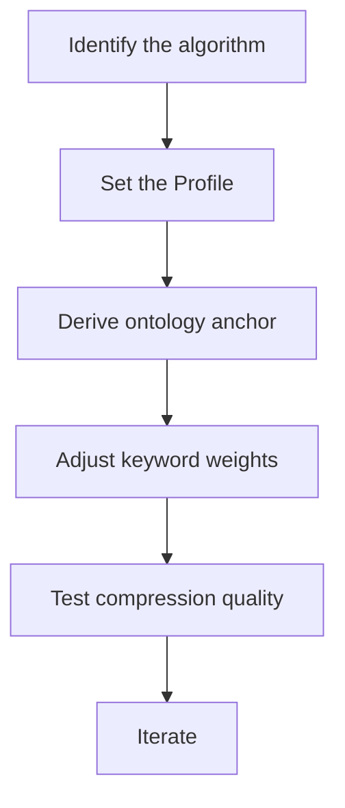

# hkask-condenser — How-to: Tune Salience Weights

This guide shows how to adjust the salience scoring weights to change which
lines the condenser preserves during compression. The condenser scores each
line of tool output against an `OntologyAnchor` and a `Profile`-derived
budget; higher-scoring lines are kept, lower-scoring lines are dropped.

## Source citations

| Symbol | Location |
|--------|----------|
| `domain_saliency` fn | `kask/crates/hkask-condenser/src/algorithms.rs:231` |
| `score_against_persona` | `kask/crates/hkask-condenser/src/saliency.rs:52` |
| `RtkStyleAlgorithm` | `kask/crates/hkask-condenser/src/algorithms.rs:49` |
| `WordRankAlgorithm` | `kask/crates/hkask-condenser/src/algorithms.rs:119` |
| `FlashrankAlgorithm` | `kask/crates/hkask-condenser/src/algorithms.rs:429` |
| `AlgorithmRegistry` | `kask/crates/hkask-condenser/src/algorithms.rs:576` |
| `derive_ontology_anchor` | `kask/crates/hkask-condenser/src/algorithms.rs:580` |
| `anchor_keywords` | `kask/crates/hkask-condenser/src/ontology_graph.rs:316` |
| `Profile` enum | `kask/crates/hkask-condenser/src/types.rs:217` |

## Procedure

<!-- DIAGRAM_ALIGNMENT
id: DIAG-DIA-COND-004
verified_date: 2026-07-29
verified_against: kask/crates/hkask-condenser/src/algorithms.rs:231,49,119,429,576,680; kask/crates/hkask-condenser/src/saliency.rs:52; kask/crates/hkask-condenser/src/ontology_graph.rs:316; kask/crates/hkask-condenser/src/types.rs:217
status: VERIFIED
-->

### Step 1: Identify the algorithm

Check which algorithm the `AlgorithmRegistry` (`algorithms.rs:576`) selects
for your `ContextCategory`. The static mapping is in `default_for()` per
algorithm: `RtkStyleAlgorithm` (`algorithms.rs:49`) for shell commands,
`WordRankAlgorithm` (`algorithms.rs:119`) for logs and conversation history,
`FlashrankAlgorithm` (`algorithms.rs:429`) for file contents and as the
universal fallback. The static `default_for()` mapping is the only
selection path — the learning override was removed.

### Step 2: Set the Profile

The `Profile` enum (`types.rs:217`) — `Heavy`, `Normal`, `Soft`, `Light` —
controls the retention budget per category. Set it on the engine via
`set_profile()` (`engine.rs:168`). `Heavy` retains the fewest lines (most
aggressive compression); `Light` retains the most.

### Step 3: Derive the ontology anchor

The `derive_ontology_anchor` function (`algorithms.rs:580`) maps a tool name
to an `OntologyAnchor` (`types.rs:23`) — `Core`, `DualAxis` (PKO/DC+BIBO), or
`DomainSupplement` (FIBO, GOLEM, SUMO, ML-Schema, OMC). The anchor is derived
automatically from the tool name; you do not set it directly. To influence it,
name your tool with a domain-signaling prefix (e.g. `company_fundamentals`,
`memory_recall`).

### Step 4: Adjust keyword weights

The `domain_saliency` function (`algorithms.rs:231`) scores a line against
the anchor: a `direct` score from keyword containment plus a `graph_bonus`
from `anchor_keywords` (`ontology_graph.rs:316`) adjacency. To prioritize
different terms, extend the keyword lists in `anchor_keywords` or the
containment checks in `domain_saliency`'s match arms.

The `score_against_persona` function (`saliency.rs:52`) scores text against
persona keywords. Provide keywords that match the agent's persona to boost
lines in the agent's voice.

### Step 5: Test and iterate

Run the condenser on a sample tool output and inspect the `CompressedOutput`'s
`reduction_pct` and `health_signals`. Adjust weights and repeat until the
output preserves the right lines.

## See also

- [hkask-condenser Reference](./reference.md): class diagram of algorithms.
- [hkask-condenser Tutorial](./tutorial.md): compressing your first tool output.
- [hkask-condenser Explanation](./explanation.md): the two-phase compression cycle.

---

[^salience]: Itti, L., Koch, C., & Niebur, E. (1998). *A model of saliency-based visual attention.* IEEE TPAMI, 20(11), 1254-1259. <https://ieeexplore.ieee.org/document/730558>.
