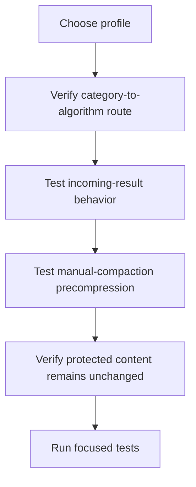

# hkask-condenser — How-to: Tune Compression and Manual Precompression

Use this procedure to change compression aggressiveness and verify both runtime
entry points without changing native summary persistence.

## Procedure

<!-- DIAGRAM_ALIGNMENT
id: DIAG-COND-002
verified_date: 2026-09-16
verified_against: kask/crates/hkask-condenser/src/types.rs:27-78; kask/crates/hkask-condenser/src/engine.rs:40-108; kask/crates/kask_bridge/src/condenser_bridge.rs:42-125; crates/agent/src/thread.rs:3594-3643
status: VERIFIED
-->

### 1. Choose a profile

Set `kask.condenser.profile` to one of the four values parsed by `Profile`
(`kask/crates/hkask-condenser/src/types.rs:27-104`):

| Profile | Retention | Maximum lines |
| --- | ---: | ---: |
| `heavy` | 10% | 30 |
| `normal` | 20% | 80 |
| `soft` | 60% | 200 |
| `light` | 95% | none |

The bridge defaults to `normal`; incoming-result compression defaults off
(`kask/crates/kask_bridge/src/settings.rs:289-319`). The composition root still
installs the condenser when that flag is false so manual precompression remains
available (`crates/zed/src/main.rs:2190-2202`).

### 2. Verify algorithm selection

Run a representative output through `CondenserEngine::compress`. Tool names are
classified by `classify_tool`, and the registry selects the category's static
default (`kask/crates/hkask-condenser/src/engine.rs:48-71`;
`kask/crates/hkask-condenser/src/algorithms.rs:516-546`). Expected routes are:

- shell/test/build → `rtk_style`;
- conversation/log → `word_rank`;
- file/structured/unknown → `flashrank`.

The mappings are declared at
`kask/crates/hkask-condenser/src/algorithms.rs:46-60,156-166,365-375`.

### 3. Test incoming tool-result compression

With `auto_compress_tool_results = false`, verify
`compress_tool_result(tool, output)` returns the original. Enable it and verify
the result is no larger than the source. The gate and dispatch are at
`kask/crates/kask_bridge/src/condenser_bridge.rs:42-73`; focused tests are at
`kask/crates/kask_bridge/src/condenser_bridge.rs:202-249`.

### 4. Test manual-compaction precompression

Invoke native manual compaction through `/compact` or the compact control. The
thread copies the request, excludes the final summarization instruction, and
calls `precompress_history` before native summary generation
(`crates/agent/src/thread.rs:3594-3643`).

This path is independent of incoming-result compression. Test it with that
setting disabled and confirm eligible older terminal/build output is replaced
by a smaller labelled excerpt
(`kask/crates/kask_bridge/src/condenser_bridge.rs:75-125,132-199`).

### 5. Verify preservation boundaries

Confirm the following remain byte-for-byte unchanged in the request copy:

- user and assistant prose;
- the latest user-led exchange;
- tools in `NO_COMPRESS_TOOLS`;
- failed results;
- valid JSON;
- non-text content and reasoning metadata.

The preservation logic is enforced at
`kask/crates/kask_bridge/src/condenser_bridge.rs:80-123`, and the protected tool
list is `crates/agent/src/thread.rs:160-185`. Also verify an error from
precompression prevents model dispatch and leaves history unchanged; the
regression test is
`crates/agent/src/thread.rs:9618-9649`.

### 6. Validate

Run focused tests for `hkask-condenser`, `kask_bridge` condenser behavior, and
the agent manual-compaction path. Inspect `CompressedOutput.reduction_pct` and
`health_signals`, defined at
`kask/crates/hkask-condenser/src/types.rs:152-192`. A smaller line-level output
is evidence of reduction, not proof that the provider's token ceiling is met.

## Further reading

- [Condenser explanation](./explanation.md)
- [Condenser reference](./reference.md)
