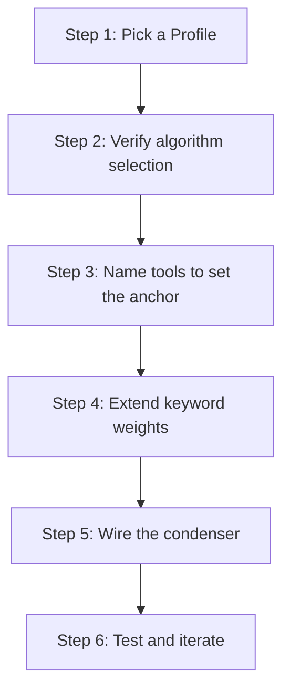

# hkask-condenser — How-to: Tune Compression and Saliency

This guide shows how to change which lines the condenser preserves by
selecting a `Profile`, naming tools to influence the `OntologyAnchor`,
extending the ontology keyword sets, and wiring the condenser into the
agent turn loop. The condenser scores each line of tool output against an
`OntologyAnchor` and a `Profile`-derived budget; higher-scoring lines are
kept, lower-scoring lines are dropped.

## Source citations

| Symbol | Location |
|--------|----------|
| `CondenserEngine::compress` | `kask/crates/hkask-condenser/src/engine.rs:48` |
| `CondenserEngine::set_profile` | `kask/crates/hkask-condenser/src/engine.rs:100` |
| `Profile` enum | `kask/crates/hkask-condenser/src/types.rs:29` |
| `Profile::retention_pct` | `kask/crates/hkask-condenser/src/types.rs:39` |
| `Profile::action_threshold` | `kask/crates/hkask-condenser/src/types.rs:62` |
| `Profile::max_lines` | `kask/crates/hkask-condenser/src/types.rs:71` |
| `RtkStyleAlgorithm` | `kask/crates/hkask-condenser/src/algorithms.rs:48` |
| `WordRankAlgorithm` | `kask/crates/hkask-condenser/src/algorithms.rs:115` |
| `FlashrankAlgorithm` | `kask/crates/hkask-condenser/src/algorithms.rs:319` |
| `AlgorithmRegistry` | `kask/crates/hkask-condenser/src/algorithms.rs:463` |
| `AlgorithmRegistry::select` | `kask/crates/hkask-condenser/src/algorithms.rs:483` |
| `classify_tool` | `kask/crates/hkask-condenser/src/algorithms.rs:518` |
| `KEYWORD_CATEGORIES` | `kask/crates/hkask-condenser/src/algorithms.rs:498` |
| `domain_saliency` | `kask/crates/hkask-condenser/src/algorithms.rs:224` |
| `anchor_keywords` | `kask/crates/hkask-condenser/src/ontology_graph.rs:284` |
| `OntologyGraph::build` | `kask/crates/hkask-condenser/src/ontology_graph.rs:48` |
| `graph_adjacency_bonus` | `kask/crates/hkask-condenser/src/ontology_graph.rs:260` |
| `BridgeThreadCondenser` | `kask/crates/kask_bridge/src/condenser_bridge.rs:22` |
| `KaskCondenserSettings` | `kask/crates/kask_bridge/src/settings.rs:253` |
| `set_thread_condenser` | `crates/agent/src/agent.rs:3136` |
| `NO_COMPRESS_TOOLS` | `crates/agent/src/thread.rs:185` |
| Proptest suite | `kask/crates/hkask-condenser/src/algorithms.rs:916-1019` |

## Procedure



<!-- DIAGRAM_ALIGNMENT
id: DIAG-COND-002
verified_date: 2026-08-28
verified_against: kask/crates/hkask-condenser/src/engine.rs:48,100; kask/crates/hkask-condenser/src/types.rs:29,39,62,71; kask/crates/hkask-condenser/src/algorithms.rs:224,498,518; kask/crates/hkask-condenser/src/ontology_graph.rs:284; kask/crates/kask_bridge/src/condenser_bridge.rs:22; kask/crates/kask_bridge/src/settings.rs:253; crates/agent/src/agent.rs:3136; crates/agent/src/thread.rs:185
status: VERIFIED
-->

### Step 1: Pick a Profile

The `Profile` enum (`types.rs:29`) has four variants. Each fixes three
knobs: `retention_pct` (`types.rs:39`), `action_threshold`
(`types.rs:62`), and `max_lines` (`types.rs:71`).

| Profile | Retention | Max lines | Action threshold | Use case |
|---------|-----------|-----------|------------------|----------|
| `Heavy` | 10% | 30 | 0.10 | Aggressive — minimal representation |
| `Normal` | 20% | 80 | 0.25 | Default — balanced |
| `Soft` | 60% | 200 | 0.50 | Light touch — preserves more context |
| `Light` | 95% | none | 0.90 | Near-passthrough — user sovereignty |

Set it on the engine via `set_profile` (`engine.rs:100`). In the wired
runtime, the profile comes from `KaskCondenserSettings.profile`
(`kask/crates/kask_bridge/src/settings.rs:259`), which defaults to
`"normal"` (`settings.rs:278`).

```rust
engine.set_profile(Profile::Heavy);
```

### Step 2: Verify algorithm selection

The `AlgorithmRegistry` (`algorithms.rs:463`) selects an algorithm per
compression via the static `default_for()` mapping walked in `select`
(`algorithms.rs:483`). There is no learning override — the previous
learning subsystem was removed (doc comment, `engine.rs:22-28`).

| Algorithm | Default categories | File |
|-----------|--------------------|------|
| `RtkStyleAlgorithm` | ShellCommand, TestOutput, BuildOutput | `algorithms.rs:48` |
| `WordRankAlgorithm` | ConversationHistory, LogOutput | `algorithms.rs:115` |
| `FlashrankAlgorithm` | FileContents, StructuredData, Unknown | `algorithms.rs:319` |

`FlashrankAlgorithm` is the universal fallback because it is registered
last and `select` returns the last algorithm when no `default_for()`
matches (`algorithms.rs:489-492`).

### Step 3: Name tools to set the anchor

The engine derives the anchor by calling `select_ontology_anchor`
(`kask/crates/hkask-bridge-ontology/src/axis.rs:210`) on the tool name
inside `compress` (`engine.rs:60`) — there is no separate wrapper
function. It maps a tool name to an `OntologyAnchor` (`axis.rs:126`) —
`Core`, `DualAxis` (PKO/DC+BIBO), or `DomainSupplement` (FIBO, SEPIO,
GOLEM, ML-Schema, SDMX, SUMO). You do not set the anchor directly; you
influence it by naming tools with a domain-signaling prefix
(`company_fundamentals`, `generate_image`, `training_run`). The keyword
arms and their dispatch order live in `select_ontology_anchor`
(`axis.rs:223-351`).

### Step 4: Extend keyword weights

The `domain_saliency` function (`algorithms.rs:224`) scores a line as
`direct + graph_bonus`:

- `direct` is a per-namespace keyword-containment score (FIBO, SUMO, PKO,
  GOLEM, ML-Schema match arms in the function body, `algorithms.rs:224`
  onward). To prioritize different terms, extend the containment checks
  in those match arms.
- `graph_bonus` is computed by `OntologyGraph::graph_adjacency_bonus`
  (`ontology_graph.rs:260`) using `anchor_keywords`
  (`ontology_graph.rs:284`). Each related concept found in the line adds
  0.15, capped at 0.5. To change which concepts count as related, extend
  the `edges` map in `OntologyGraph::build` (`ontology_graph.rs:48`).

Note: there is no persona-scoring function in the current crate —
`saliency.rs` contains only `word_frequencies` (`saliency.rs:13`). The
The `KaskCondenserSettings.persona_keywords` setting
(`kask/crates/kask_bridge/src/settings.rs:268`) is emitted to MCP servers
as `HKASK_CONDENSER_PERSONA_KEYWORDS`
(`kask/crates/kask_bridge/src/mcp_env.rs:76-85`) but nothing in
`hkask-condenser` reads it; the persona path is not yet enforced.

### Step 5: Wire the condenser

The runtime path is `BridgeThreadCondenser`
(`kask/crates/kask_bridge/src/condenser_bridge.rs:22`), which wraps a
`CondenserEngine` in a `Mutex` and gates compression on
`auto_compress_tool_results`. It is wired via the process-global
`set_thread_condenser` hook (`crates/agent/src/agent.rs:3136`) from the
deferred post-login task in `crates/zed/src/main.rs:2056-2060`,
conditional on `KaskCondenserSettings.auto_compress_tool_results`
(`settings.rs:263`), which defaults to `false` (`settings.rs:279`).

Code-reading tools bypass the condenser via `NO_COMPRESS_TOOLS`
(`crates/agent/src/thread.rs:185`): `read_file`, `grep`, `find_path`,
`list_directory`, `diagnostics`, `find_references`, `get_code_actions`,
`edit_file`. Their output passes through verbatim even when a condenser
is wired, because the condenser's line-level elision is destructive for
source code.

### Step 6: Test and iterate

Run the condenser on a sample tool output and inspect the
`CompressedOutput`'s `reduction_pct` and `health_signals`. Adjust the
profile or keyword weights and repeat until the output preserves the
right lines. The crate's proptest suite (`algorithms.rs:916-1019`)
checks `compression_is_idempotent` (`:931`), `compression_never_expands`
(`:959`), `flashrank_fallback_never_expands` (`:980`), and
`compute_budget_invariants` (`:1000`) — useful oracles when tuning.

## See also

- [hkask-condenser Reference](./reference.md): class diagram of algorithms
  and types.
- [hkask-condenser Tutorial](./tutorial.md): compressing your first tool
  output.
- [hkask-condenser Explanation](./explanation.md): the compression cycle
  and ontology anchoring rationale.

---

[^salience]: Itti, L., Koch, C., & Niebur, E. (1998). *A model of saliency-based visual attention for rapid scene analysis.* IEEE Transactions on Pattern Analysis and Machine Intelligence, 20(11), 1254–1259. <https://ieeexplore.ieee.org/document/730558>. The saliency model adapted for text compression.
