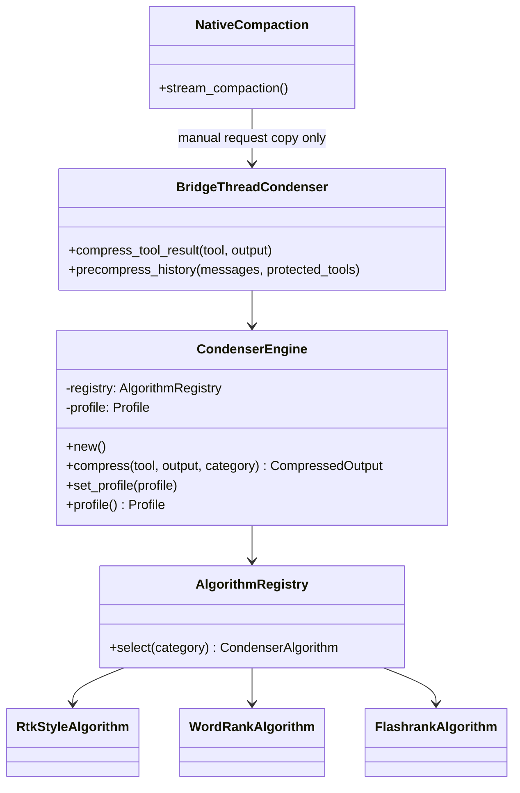

# hkask-condenser — Reference

`hkask-condenser` exposes synchronous compression domain logic. Public modules
are `engine` and `types`; algorithms, ontology graph, and saliency remain
crate-private (`kask/crates/hkask-condenser/src/hkask_condenser.rs:40-44`).

## Public types and methods

| Surface | Purpose | Evidence |
| --- | --- | --- |
| `CondenserEngine::new` | create a normal-profile engine | `kask/crates/hkask-condenser/src/engine.rs:40-46` |
| `CondenserEngine::compress` | classify, select, compress, and report metrics | `kask/crates/hkask-condenser/src/engine.rs:48-98` |
| `CondenserEngine::set_profile` / `profile` | mutate/read the active profile | `kask/crates/hkask-condenser/src/engine.rs:100-107` |
| `Profile` | heavy, normal, soft, light budgets | `kask/crates/hkask-condenser/src/types.rs:27-104` |
| `ContextCategory` | eight dispatch categories | `kask/crates/hkask-condenser/src/types.rs:107-149` |
| `CompressedOutput` | content, route, profile, size, reduction, signals | `kask/crates/hkask-condenser/src/types.rs:152-168` |
| `CondenserHealthSignal` | non-fatal algorithm anomaly data | `kask/crates/hkask-condenser/src/types.rs:170-192` |

## Class and integration diagram

<!-- DIAGRAM_ALIGNMENT
id: DIAG-COND-003
verified_date: 2026-09-16
verified_against: kask/crates/hkask-condenser/src/engine.rs:20-108; kask/crates/hkask-condenser/src/algorithms.rs:33-45; kask/crates/hkask-condenser/src/algorithms.rs:463-492; kask/crates/kask_bridge/src/condenser_bridge.rs:19-125; crates/agent/src/thread.rs:3594-3643
status: VERIFIED
-->

## Profiles

| Profile | Retention | Action threshold | Maximum lines | Evidence |
| --- | ---: | ---: | ---: | --- |
| `Heavy` | 0.10 | 0.10 | 30 | `kask/crates/hkask-condenser/src/types.rs:39-77` |
| `Normal` | 0.20 | 0.25 | 80 | `kask/crates/hkask-condenser/src/types.rs:39-77` |
| `Soft` | 0.60 | 0.50 | 200 | `kask/crates/hkask-condenser/src/types.rs:39-77` |
| `Light` | 0.95 | 0.90 | none | `kask/crates/hkask-condenser/src/types.rs:39-77` |

## Algorithm routes

| Algorithm | Default categories | Evidence |
| --- | --- | --- |
| `RtkStyleAlgorithm` | shell command, test output, build output | `kask/crates/hkask-condenser/src/algorithms.rs:46-60` |
| `WordRankAlgorithm` | conversation history, log output | `kask/crates/hkask-condenser/src/algorithms.rs:156-166` |
| `FlashrankAlgorithm` | file contents, structured data, unknown | `kask/crates/hkask-condenser/src/algorithms.rs:365-375` |

`classify_tool` performs exact token matching before substring fallback
(`kask/crates/hkask-condenser/src/algorithms.rs:516-546`). The engine derives
an ontology anchor from the tool name before invoking the selected algorithm
(`kask/crates/hkask-condenser/src/engine.rs:54-71`).

## Runtime bridge contract

`BridgeThreadCondenser` owns a mutex-protected engine and the incoming-result
auto-compression flag
(`kask/crates/kask_bridge/src/condenser_bridge.rs:19-39`). Its two methods have
different gates:

| Method | Gate | Mutation target | Evidence |
| --- | --- | --- | --- |
| `compress_tool_result` | `auto_compress_tool_results` must be true | incoming stored result text | `kask/crates/kask_bridge/src/condenser_bridge.rs:42-73` |
| `precompress_history` | manual compaction invokes it regardless of that flag | copied summary request only | `kask/crates/kask_bridge/src/condenser_bridge.rs:75-125`; `crates/agent/src/thread.rs:3609-3629` |

Manual precompression protects the latest exchange, prose, named source tools,
errors, JSON, and non-text results. It installs only a nonempty excerpt that is
smaller than the original (`kask/crates/kask_bridge/src/condenser_bridge.rs:80-123`).
The exact protected source-tool list is at `crates/agent/src/thread.rs:160-185`.

## Native manual-compaction lifecycle

Manual compaction obtains the global condenser, precompresses a background
request copy, plans zero or two halves, and then invokes native summary
collection and merge. Automatic compaction does not obtain the condenser
(`crates/agent/src/thread.rs:3594-3643`). The composition root installs the
bridge even when incoming-result compression is off
(`crates/zed/src/main.rs:2190-2202`).

## Diagnostics

The engine emits diagnostic `hkask.condenser` events for routing and reduction;
these are not `reg.*` feedback signals
(`kask/crates/hkask-condenser/src/engine.rs:8-14,63-97`). Health signals are
returned with content and describe anomalies rather than turning them into
compression failures (`kask/crates/hkask-condenser/src/types.rs:164-192`).

## Further reading

- [Condenser explanation](./explanation.md)
- [Condenser tuning procedure](./how-to.md)
